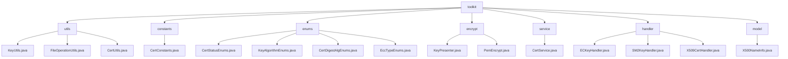

# 基础信息

|      |      |
|------|------|
| 名称 | toolkit |
| 编码语言 | .java |
| 代码路径 | WeFe/common/java/common-cert/src/main/java/com/webank/cert/toolkit |
| 包名 | docs.common.java.common-cert.src.main.java.com.webank.cert.toolkit |
| 概述说明 | 密码学工具集，含密钥管理、证书操作、文件处理。支持RSA/ECDSA/SM2算法，PFX/JKS解析，依赖BouncyCastle。适用PKI全周期管理，如密钥生成、证书签发、存储。含静态工具类如KeyUtils、CertUtils。 |

# 说明

## 概述  
该模块是密码学安全工具集，核心职责是密钥对管理、证书全生命周期操作和基础文件处理，类似轻量级PKI体系实现。接口规范涵盖密钥生成（支持RSA/ECDSA/SM2算法）、证书解析（PFX/JKS格式）、格式转换（PEM/PKCS#8）和X.500属性封装。关键数据结构包括SM2椭圆曲线参数、PKCS8私钥格式、CryptoKeyPair对象和X.500名称模型。外部依赖主要为BouncyCastle安全库和Lombok工具。例如KeyUtils实现SM2密钥生成，CertService处理根证书签发，X500NameInfo封装DN属性。

## 主要业务场景  
模块适用于数字证书全流程管理，典型场景包括：1)密钥对生成→证书签发→存储（如SSL证书部署）；2)证书状态跟踪（WAIT_VERIFY→VALID）；3)CRL吊销列表管理。交互模式采用静态工厂方法（如ECKeyHandler.generateECKeyPair()）和建造者模式（如X509CertHandler链式调用）。典型应用如国密场景：SM2密钥生成→SM3WITHSM2签名→PEM格式化存储。API类型覆盖密码学操作（ECDSA验证）、枚举查询（KeyAlgorithmEnums）和IO操作（原子化文件写入）。

### 包内部结构视图

该流程图展示了`toolkit`目录下的完整层级结构，包含7个主要子目录：utils、constants、enums、encrypt、service、handler和model。每个子目录下包含对应的工具类文件，如utils目录包含KeyUtils.java等文件，enums目录包含多个枚举类文件，handler目录包含不同类型的密钥处理器等。整体结构清晰展现了证书工具包的功能模块划分。

# 文件列表

| 名称   | 类型  | 说明 |
|-------|------|-------------|
| [constants](constants/_module.md) | package | CertConstants类定义了两个常量：默认签名算法为SHA256WITHRSA，默认有效期10年（毫秒表示）。 |
| [model](model/_module.md) | package | X500NameInfo类封装X.500名称属性，提供构建器模式设置CN、O、OU等字段，支持链式调用和toString输出。 |
| [handler](handler/_module.md) | package | ECKeyHandler类提供生成椭圆曲线密钥对的静态方法，支持无参生成或基于私钥创建。SM2KeyHandler类类似，提供生成SM2密钥对的静态方法。X509CertHandler类管理X.509证书和CRL，支持生成根/子证书、CSR、扩展项及吊销证书功能。 |
| [service](service/_module.md) | package | CertService类提供证书管理功能，包括生成RSA密钥对和CA证书、子证书、证书请求，以及证书吊销和验证。支持默认配置（SHA256WITHRSA算法，3650天有效期），可保存到指定路径。 |
| [encrypt](encrypt/_module.md) | package | KeyPresenter提供密钥格式转换功能，支持字节数组、十六进制字符串和大整数互转。PemEncrypt基于BouncyCastle实现椭圆曲线密钥加解密，支持密钥对生成、PEM格式转换和私钥还原。 |
| [enums](enums/_module.md) | package | CertStatusEnums枚举定义认证状态：无效、认证中、有效，含code和name属性及查找方法。KeyAlgorithmEnums枚举管理RSA、ECDSA、SM2密钥算法，含查找功能。CertDigestAlgEnums枚举定义三种证书摘要算法，含密钥算法和算法名称属性及查找方法。EccTypeEnums枚举定义两种椭圆曲线加密类型，含查找方法。 |
| [utils](utils/_module.md) | package | KeyUtils类支持RSA、ECDSA和SM2密钥对生成及转换。FileOperationUtils类提供文件存在检查和目录创建功能。CertUtils类处理证书密钥读写及转换，支持PFX、JKS和PEM格式。 |

