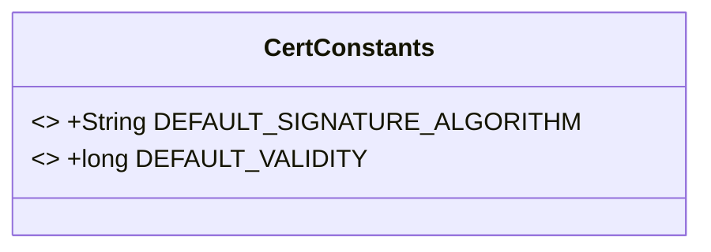
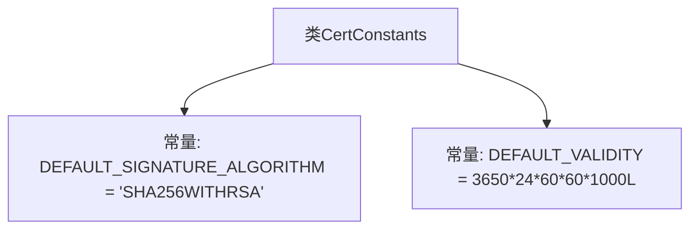

# 基础信息

|      |      |
|------|------|
| 名称 | CertConstants |
| 编码语言 | .java |
| 代码路径 | WeFe/common/java/common-cert/src/main/java/com/webank/cert/toolkit/constants/CertConstants.java |
| 包名 | com.webank.cert.toolkit.constants |
| 依赖项 | [] |
| 概述说明 | CertConstants类定义了两个常量：默认签名算法为SHA256WITHRSA，默认有效期10年（毫秒表示）。 |

# 说明

CertConstants类定义了两个与证书相关的常量。DEFAULT_SIGNATURE_ALGORITHM常量指定了默认的签名算法为"SHA256WITHRSA"。DEFAULT_VALIDITY常量定义了默认的有效期时长，计算方式为3650天（约10年）对应的毫秒数，通过24小时、60分钟、60秒和1000毫秒的连乘得出。这些常量用于证书生成时的默认参数设置。

# 类列表 Class Summary

| 名称   | 类型  | 说明 |
|-------|------|-------------|
| CertConstants | class | CertConstants类定义了两个常量：默认签名算法为SHA256WITHRSA，默认有效期3650天（毫秒表示）。 |

## 类 CertConstants

|      |      |
|------|------|
| 访问范围 | public |
| 类型 | class |
| 名称 | CertConstants |
| 说明 | CertConstants类定义了两个常量：默认签名算法为SHA256WITHRSA，默认有效期3650天（毫秒表示）。 |

### UML类图

这段代码定义了一个名为`CertConstants`的公共类，其中包含两个静态常量字段：`DEFAULT_SIGNATURE_ALGORITHM`和`DEFAULT_VALIDITY`。前者是一个字符串常量，指定了默认的签名算法为"SHA256WITHRSA"；后者是一个长整型常量，计算并存储了默认证书有效期（以毫秒为单位，约等于10年）。该类主要用于集中管理证书相关的常量配置，便于在代码中统一引用和维护。由于所有字段都是`public static final`的，因此该类不可被实例化且所有字段值不可修改。

### 内部方法调用关系图

该流程图展示了CertConstants类的结构，包含两个静态常量定义。DEFAULT_SIGNATURE_ALGORITHM常量存储默认签名算法名称字符串，DEFAULT_VALIDITY常量通过长整型乘法运算计算默认有效期毫秒值（约10年）。类仅作为常量容器使用，没有实例方法或构造器，体现了工具类的典型设计模式。

### 字段列表 Field List

| 名称  | 类型  | 说明 |
|-------|-------|------|
| DEFAULT_SIGNATURE_ALGORITHM = "SHA256WITHRSA" | String | 定义常量DEFAULT_SIGNATURE_ALGORITHM，值为SHA256WITHRSA，表示默认签名算法。 |
| DEFAULT_VALIDITY =  3650 * 24L * 60L * 60L * 1000L | long | 定义默认有效期常量，值为3650天的毫秒数。 |

### 方法列表

| 名称  | 类型  | 说明 |
|-------|-------|------|

