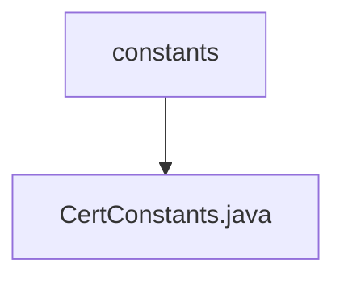

# 基础信息

|      |      |
|------|------|
| 名称 | constants |
| 编码语言 | .java |
| 代码路径 | WeFe/common/java/common-cert/src/main/java/com/webank/cert/toolkit/constants |
| 包名 | docs.common.java.common-cert.src.main.java.com.webank.cert.toolkit.constants |
| 概述说明 | CertConstants类定义了两个常量：默认签名算法为SHA256WITHRSA，默认有效期10年（毫秒表示）。 |

# 说明

CertConstants类定义了两个与证书相关的常量。DEFAULT_SIGNATURE_ALGORITHM常量指定了默认的签名算法为"SHA256WITHRSA"。DEFAULT_VALIDITY常量定义了默认的有效期时长，计算方式为3650天（约10年）对应的毫秒数，通过24小时、60分钟、60秒和1000毫秒的连乘得出。这些常量用于证书生成时的默认参数设置。

### 包内部结构视图

该流程图展示了路径层级关系，根节点为constants文件夹，包含一个子文件CertConstants.java。这是典型的Java项目结构，其中constants作为工具包目录存放常量定义文件，CertConstants.java实现具体的证书相关常量定义。

# 文件列表

| 名称   | 类型  | 说明 |
|-------|------|-------------|
| [CertConstants.java](CertConstants.md) | file | CertConstants类定义了两个常量：默认签名算法为SHA256WITHRSA，默认有效期10年（毫秒表示）。 |

