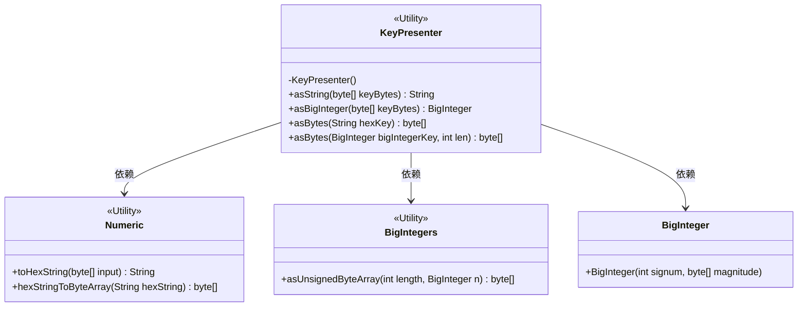
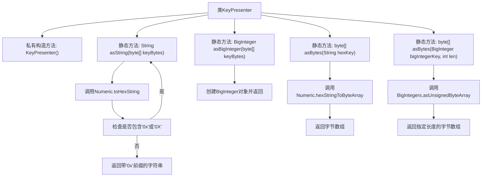

# 基础信息

|      |      |
|------|------|
| 名称 | KeyPresenter |
| 编码语言 | .java |
| 代码路径 | WeFe/common/java/common-cert/src/main/java/com/webank/cert/toolkit/encrypt/KeyPresenter.java |
| 包名 | com.webank.cert.toolkit.encrypt |
| 依赖项 | ['org.bouncycastle.util.BigIntegers', 'org.web3j.utils.Numeric', 'java.math.BigInteger'] |
| 概述说明 | KeyPresenter类提供密钥格式转换：字节数组转16进制字符串或大整数，16进制字符串或大整数转字节数组。私有构造禁止实例化。 |

# 说明

KeyPresenter是一个工具类，提供密钥格式转换功能。该类包含静态方法：asString将字节数组密钥转为十六进制字符串，自动添加0x前缀；asBigInteger将字节数组转为大整数；asBytes提供两种重载，分别将十六进制字符串或大整数转换为字节数组，后者可指定输出字节长度。所有方法均支持公私钥处理，类构造器私有化确保不可实例化。

# 类列表 Class Summary

| 名称   | 类型  | 说明 |
|-------|------|-------------|
| KeyPresenter | class | KeyPresenter工具类：提供密钥字节数组与十六进制字符串、BigInteger间的相互转换方法，支持公私钥处理。 |

## 类 KeyPresenter

|      |      |
|------|------|
| 访问范围 | public |
| 类型 | class |
| 名称 | KeyPresenter |
| 说明 | KeyPresenter工具类：提供密钥字节数组与十六进制字符串、BigInteger间的相互转换方法，支持公私钥处理。 |

### UML类图

这段代码展示了一个密钥表示工具类KeyPresenter，它提供了密钥在字节数组、十六进制字符串和大整数之间的转换功能。该类通过静态方法实现功能，依赖Numeric和BigIntegers工具类进行底层转换，同时与Java标准库的BigInteger类交互。所有方法均为静态工具方法，类被设计为不可实例化的工具类。

### 内部方法调用关系图

这段代码流程图展示了KeyPresenter类的结构和方法调用关系。该类提供了四种静态方法用于密钥格式转换：将字节数组转换为十六进制字符串(asString)、将字节数组转换为大整数(asBigInteger)、将十六进制字符串或大整数转换回字节数组(asBytes)。每个方法都有清晰的输入输出处理流程，特别是asString方法会检查并确保输出包含0x前缀。所有方法都是静态的，且类本身通过私有构造方法防止实例化。

### 字段列表 Field List

| 名称  | 类型  | 说明 |
|-------|-------|------|

### 方法列表

| 名称  | 类型  | 说明 |
|-------|-------|------|
| asBigInteger | BigInteger | 将字节数组转换为无符号大整数。 |
| asString | String | 将字节数组转为带0x前缀的十六进制字符串，若已有前缀则直接返回。 |
| asBytes | byte[] | 将十六进制字符串转换为字节数组的方法，输入为十六进制字符串，输出为对应的字节数组。 |
| asBytes | byte[] | 将BigInteger转为指定长度的无符号字节数组。 |

