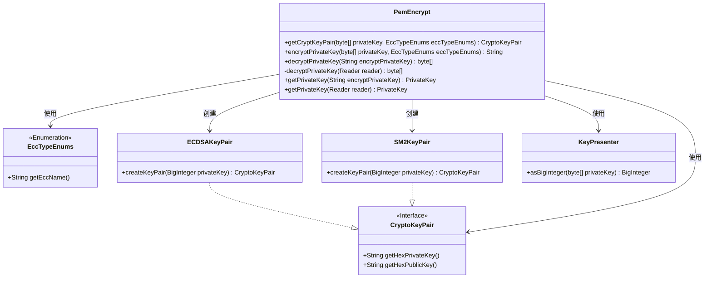
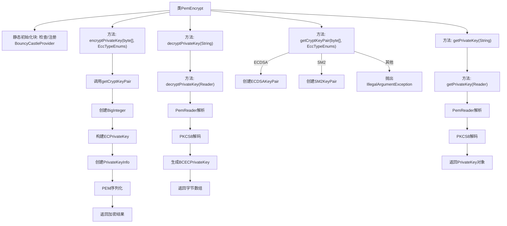

# 基础信息

|      |      |
|------|------|
| 名称 | PemEncrypt |
| 编码语言 | .java |
| 代码路径 | WeFe/common/java/common-cert/src/main/java/com/webank/cert/toolkit/encrypt/PemEncrypt.java |
| 包名 | com.webank.cert.toolkit.encrypt |
| 依赖项 | ['com.webank.cert.toolkit.enums.EccTypeEnums', 'org.bouncycastle.asn1.ASN1Object', 'org.bouncycastle.asn1.ASN1ObjectIdentifier', 'org.bouncycastle.asn1.DERBitString', 'org.bouncycastle.asn1.pkcs.PrivateKeyInfo', 'org.bouncycastle.asn1.sec.ECPrivateKey', 'org.bouncycastle.asn1.x509.AlgorithmIdentifier', 'org.bouncycastle.asn1.x9.X962Parameters', 'org.bouncycastle.asn1.x9.X9ObjectIdentifiers', 'org.bouncycastle.jcajce.provider.asymmetric.ec.BCECPrivateKey', 'org.bouncycastle.jcajce.provider.asymmetric.util.ECUtil', 'org.bouncycastle.jce.provider.BouncyCastleProvider', 'org.bouncycastle.util.io.pem.PemObject', 'org.bouncycastle.util.io.pem.PemReader', 'org.bouncycastle.util.io.pem.PemWriter', 'org.fisco.bcos.sdk.crypto.keypair.CryptoKeyPair', 'org.fisco.bcos.sdk.crypto.keypair.ECDSAKeyPair', 'org.fisco.bcos.sdk.crypto.keypair.SM2KeyPair', 'org.web3j.utils.Numeric', 'java.io.ByteArrayOutputStream', 'java.io.OutputStreamWriter', 'java.io.Reader', 'java.io.StringReader', 'java.math.BigInteger', 'java.security.KeyFactory', 'java.security.PrivateKey', 'java.security.Security', 'java.security.spec.PKCS8EncodedKeySpec'] |
| 概述说明 | PemEncrypt类提供PEM格式的ECC私钥加解密功能，支持ECDSA和SM2曲线，包含密钥对生成、PKCS8封装及解析方法。 |

# 说明

PemEncrypt类提供基于BouncyCastle的椭圆曲线密钥加解密功能。静态代码块确保BouncyCastle提供者已注册。主要功能包括：通过getCryptKeyPair方法根据ECC类型生成ECDSA或SM2密钥对；encryptPrivateKey方法将私钥转换为PKCS#8格式的PEM字符串；decryptPrivateKey方法从PEM字符串还原原始私钥字节；getPrivateKey方法直接获取PrivateKey对象。所有方法均支持异常处理并确保资源释放，核心流程涉及ASN.1编码、PEM格式转换及密钥工厂操作。

# 类列表 Class Summary

| 名称   | 类型  | 说明 |
|-------|------|-------------|
| PemEncrypt | class | PemEncrypt类提供加密解密功能，支持ECDSA和SM2算法，包括密钥对生成、私钥加密为PEM格式及解密还原私钥。 |

## 类 PemEncrypt

|      |      |
|------|------|
| 访问范围 | public |
| 类型 | class |
| 名称 | PemEncrypt |
| 说明 | PemEncrypt类提供加密解密功能，支持ECDSA和SM2算法，包括密钥对生成、私钥加密为PEM格式及解密还原私钥。 |

### UML类图

这段代码实现了一个基于椭圆曲线密码学的PEM格式密钥加密/解密工具类。PemEncrypt类提供了静态方法用于处理ECDSA和SM2两种椭圆曲线算法的密钥对生成、私钥加密(PEM格式)和解密功能。核心流程包括：通过getCryptKeyPair方法根据算法类型创建密钥对，使用BouncyCastle库进行PKCS#8格式的密钥编码/解码，并处理PEM格式的读写操作。类图中清晰地展示了与枚举类型、密钥对接口及其实现类的关系，以及关键的辅助工具类。

### 内部方法调用关系图

这段代码实现了一个基于椭圆曲线密码学的PEM格式密钥加解密工具类。主要功能包括：静态初始化时注册BouncyCastle加密提供者；支持ECDSA和SM2两种椭圆曲线算法的密钥对生成；提供私钥的PEM格式加密功能（包含曲线参数和公钥信息）；实现PEM格式私钥的解密还原；以及直接获取PrivateKey对象的功能。所有方法都包含完善的资源清理机制，通过try-finally确保Reader/PemWriter等资源正确关闭。

### 字段列表 Field List

| 名称  | 类型  | 说明 |
|-------|-------|------|

### 方法列表

| 名称  | 类型  | 说明 |
|-------|-------|------|
| getCryptKeyPair | CryptoKeyPair | 根据私钥和ECC类型生成密钥对，支持ECDSA和SM2，类型不符则抛出异常。 |
| getPrivateKey | PrivateKey | 静态方法getPrivateKey接收加密私钥字符串，返回PrivateKey对象，可能抛出异常。内部调用带StringReader参数的同名方法。 |
| encryptPrivateKey | String | 加密私钥方法：接收私钥字节数组和ECC类型，生成PKCS#8格式密钥对，序列化为DER编码后返回PEM字符串。 |
| decryptPrivateKey | byte[] | 该方法从PEM格式读取器中解密私钥，使用PKCS8编码和EC算法生成BCECPrivateKey，最终返回32字节的私钥数据。处理完成后关闭读取器。 |
| decryptPrivateKey | byte[] | 解密私钥方法：输入加密私钥字符串，返回解密后的字节数组。 |
| getPrivateKey | PrivateKey | 从PEM读取器获取EC私钥，使用PKCS8编码和BouncyCastle提供者生成私钥对象，最后关闭读取器。 |

