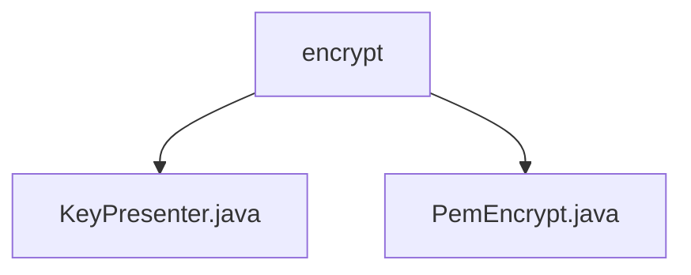

# 基础信息

|      |      |
|------|------|
| 名称 | encrypt |
| 编码语言 | .java |
| 代码路径 | WeFe/common/java/common-cert/src/main/java/com/webank/cert/toolkit/encrypt |
| 包名 | docs.common.java.common-cert.src.main.java.com.webank.cert.toolkit.encrypt |
| 概述说明 | KeyPresenter提供密钥格式转换功能，支持字节数组、十六进制字符串和大整数互转。PemEncrypt基于BouncyCastle实现椭圆曲线密钥加解密，支持密钥对生成、PEM格式转换和私钥还原。 |

# 说明

## 概述  
该模块核心职责是提供密钥格式转换与椭圆曲线密钥加解密功能，支持公私钥处理。接口规范包括：KeyPresenter提供字节数组与十六进制字符串/大整数互转方法；PemEncrypt提供密钥对生成、PEM格式加解密及PrivateKey对象获取。关键数据结构涉及PKCS#8格式PEM字符串、ASN.1编码数据及ECDSA/SM2密钥对。外部依赖为BouncyCastle加密库。例如，asBytes支持十六进制字符串转字节数组，encryptPrivateKey实现私钥PEM格式化。

## 主要业务场景  
模块适用于密钥生命周期管理场景，类似加密中间件功能。完整流程包括：生成ECC密钥对→转换密钥格式（如PEM字符串）→安全存储或传输→还原原始密钥。交互模式为静态方法调用，例如getCryptKeyPair生成密钥对后，通过encryptPrivateKey加密存储。典型应用如SM2证书签发场景，需组合使用KeyPresenter的格式转换与PemEncrypt的加解密能力。API类型涵盖密钥生成、格式转换及编解码操作。

### 包内部结构视图

该流程图展示了encrypt目录下的两个Java文件：KeyPresenter.java和PemEncrypt.java。这两个文件都直接位于encrypt目录下，没有更深层次的子目录结构。图表清晰地呈现了文件与父目录之间的层级关系，符合给定的路径信息要求。

# 文件列表

| 名称   | 类型  | 说明 |
|-------|------|-------------|
| [KeyPresenter.java](KeyPresenter.md) | file | KeyPresenter类提供密钥格式转换：字节数组转16进制字符串或大整数，16进制字符串或大整数转字节数组。私有构造禁止实例化。 |
| [PemEncrypt.java](PemEncrypt.md) | file | PemEncrypt类提供PEM格式的ECC私钥加解密功能，支持ECDSA和SM2曲线，包含密钥对生成、PKCS8封装及解析方法。 |

