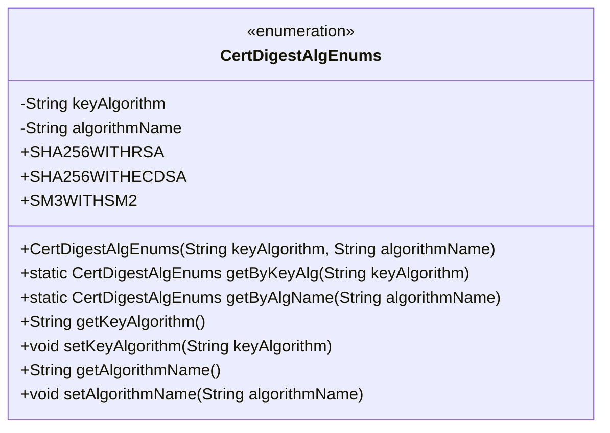
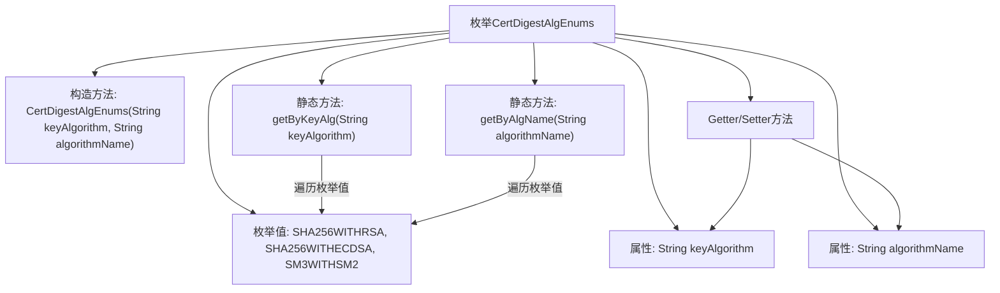

# 基础信息

|      |      |
|------|------|
| 名称 | CertDigestAlgEnums |
| 编码语言 | .java |
| 代码路径 | WeFe/common/java/common-cert/src/main/java/com/webank/cert/toolkit/enums/CertDigestAlgEnums.java |
| 包名 | com.webank.cert.toolkit.enums |
| 依赖项 | ['lombok.Getter', 'lombok.ToString', 'lombok.extern.slf4j.Slf4j'] |
| 概述说明 | CertDigestAlgEnums枚举定义了三种证书摘要算法：SHA256WITHRSA、SHA256WITHECDSA、SM3WITHSM2，提供根据密钥算法或算法名称查找枚举的方法。 |

# 说明

CertDigestAlgEnums是一个枚举类，定义了三种证书摘要算法：SHA256WITHRSA、SHA256WITHECDSA和SM3WITHSM2。每个枚举值包含两个属性：keyAlgorithm（密钥算法）和algorithmName（算法名称）。类提供了通过密钥算法或算法名称查找对应枚举值的方法getByKeyAlg和getByAlgName，以及属性的getter和setter方法。类使用了Lombok注解@Getter、@ToString和@Slf4j简化代码。

# 类列表 Class Summary

| 名称   | 类型  | 说明 |
|-------|------|-------------|
| CertDigestAlgEnums | enum | CertDigestAlgEnums枚举类定义了三种证书摘要算法：SHA256WITHRSA、SHA256WITHECDSA和SM3WITHSM2，包含密钥算法和算法名称属性，提供按密钥算法或算法名称查找的方法。 |

## 类 CertDigestAlgEnums

|      |      |
|------|------|
| 访问范围 | @Getter;@ToString;@Slf4j;public |
| 类型 | enum |
| 名称 | CertDigestAlgEnums |
| 说明 | CertDigestAlgEnums枚举类定义了三种证书摘要算法：SHA256WITHRSA、SHA256WITHECDSA和SM3WITHSM2，包含密钥算法和算法名称属性，提供按密钥算法或算法名称查找的方法。 |

### UML类图

该代码定义了一个枚举类`CertDigestAlgEnums`，表示证书摘要算法类型。枚举包含三个实例：SHA256WITHRSA、SHA256WITHECDSA和SM3WITHSM2，每个实例关联密钥算法和算法名称两个属性。类提供了通过密钥算法或算法名称查找枚举值的静态方法，以及属性的getter/setter方法。枚举类通过Lombok注解自动生成getter和toString方法，并包含日志记录能力。

### 内部方法调用关系图

该流程图展示了CertDigestAlgEnums枚举的核心结构，包含三个预定义枚举值、两个字符串属性、构造方法和关键操作方法。通过getByKeyAlg和getByAlgName两个静态方法实现按条件查找枚举值，同时通过Lombok注解自动生成getter/setter方法。流程图清晰呈现了枚举值的初始化过程、属性访问路径以及方法间的调用关系，特别突出了基于属性值查找枚举实例的遍历逻辑。

### 字段列表 Field List

| 名称  | 类型  | 说明 |
|-------|-------|------|

### 方法列表

| 名称  | 类型  | 说明 |
|-------|-------|------|

