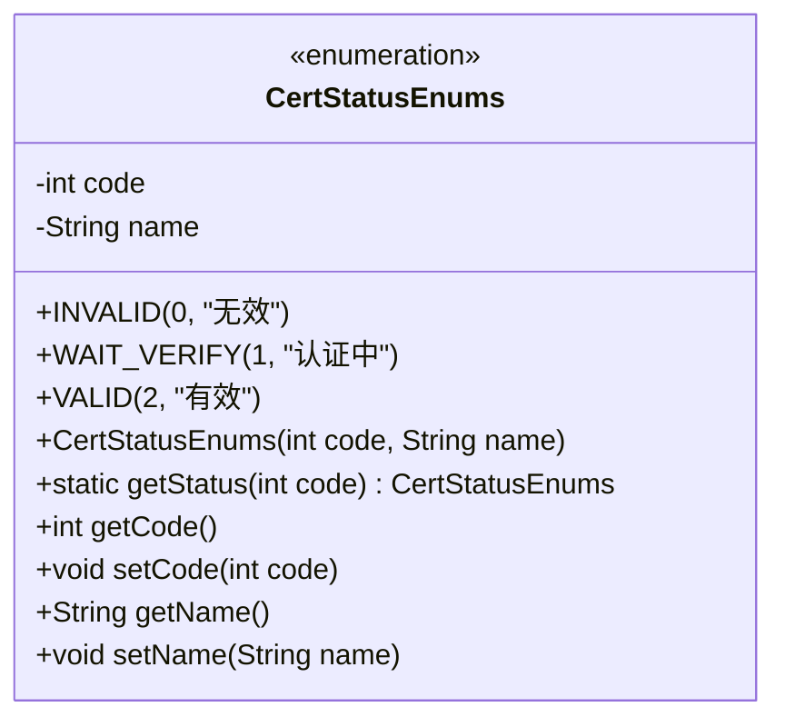
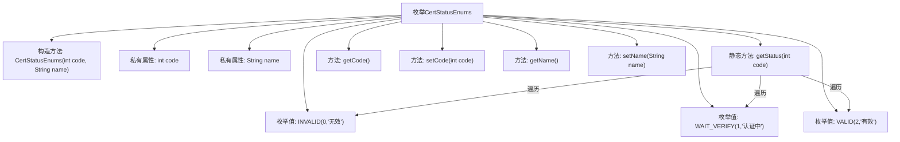

# 基础信息

|      |      |
|------|------|
| 名称 | CertStatusEnums |
| 编码语言 | .java |
| 代码路径 | WeFe/common/java/common-cert/src/main/java/com/webank/cert/toolkit/enums/CertStatusEnums.java |
| 包名 | com.webank.cert.toolkit.enums |
| 依赖项 | [] |
| 概述说明 | 枚举类CertStatusEnums定义了认证状态：0无效，1认证中，2有效，提供根据code获取状态的方法。 |

# 说明

CertStatusEnums枚举定义了认证状态的三种类型：INVALID（0，无效）、WAIT_VERIFY（1，认证中）、VALID（2，有效）。每个枚举项包含code和name属性，提供getter和setter方法。通过静态方法getStatus可根据code值获取对应枚举实例，未匹配时返回null。该枚举用于管理认证状态及其描述信息。

# 类列表 Class Summary

| 名称   | 类型  | 说明 |
|-------|------|-------------|
| CertStatusEnums | enum | 枚举类CertStatusEnums定义了认证状态：无效(0)、认证中(1)、有效(2)，提供根据code获取状态的方法。 |

## 类 CertStatusEnums

|      |      |
|------|------|
| 访问范围 | public |
| 类型 | enum |
| 名称 | CertStatusEnums |
| 说明 | 枚举类CertStatusEnums定义了认证状态：无效(0)、认证中(1)、有效(2)，提供根据code获取状态的方法。 |

### UML类图

这段代码定义了一个枚举类型`CertStatusEnums`，用于表示认证状态。枚举包含三个实例：`INVALID`（无效）、`WAIT_VERIFY`（认证中）和`VALID`（有效），每个实例都有对应的状态码和名称。类提供了通过状态码获取枚举实例的静态方法`getStatus`，以及获取和设置状态码和名称的方法。枚举类型常用于表示一组固定的常量值，确保类型安全和代码可读性。

### 内部方法调用关系图

该流程图展示了CertStatusEnums枚举的结构和功能关系。枚举定义了三种状态(INVALID/WAIT_VERIFY/VALID)，包含构造方法和私有属性(code/name)，提供了状态码查询的静态方法getStatus()以及标准的getter/setter方法。核心逻辑是通过遍历枚举值匹配状态码，体现了枚举类型作为状态容器的典型用法。

### 字段列表 Field List

| 名称  | 类型  | 说明 |
|-------|-------|------|

### 方法列表

| 名称  | 类型  | 说明 |
|-------|-------|------|

