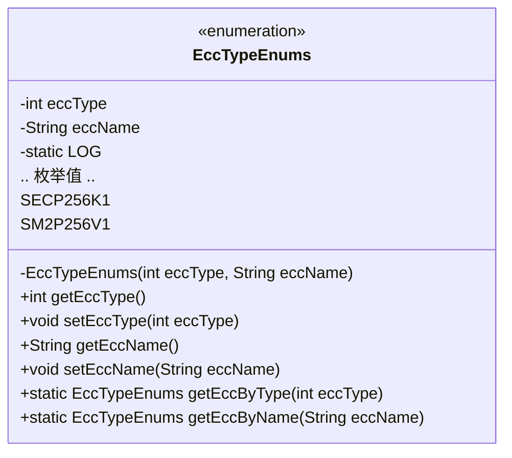
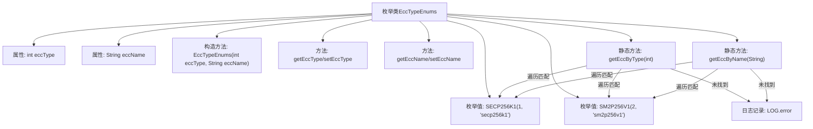

# 基础信息

|      |      |
|------|------|
| 名称 | EccTypeEnums |
| 编码语言 | .java |
| 代码路径 | WeFe/common/java/common-cert/src/main/java/com/webank/cert/toolkit/enums/EccTypeEnums.java |
| 包名 | com.webank.cert.toolkit.enums |
| 依赖项 | ['java.util.Objects', 'org.slf4j.Logger', 'org.slf4j.LoggerFactory'] |
| 概述说明 | 枚举EccTypeEnums定义两种ECC类型：SECP256K1和SM2P256V1，包含类型码和名称，提供按类型码或名称查找方法，查找失败记录错误日志。 |

# 说明

该枚举类EccTypeEnums定义了两种椭圆曲线加密算法类型：SECP256K1和SM2P256V1，分别对应数值1和2。类中包含私有属性eccType和eccName，通过构造方法初始化，并提供对应的getter和setter方法。此外，提供了两个静态方法：getEccByType根据数值查找枚举实例，getEccByName根据名称查找枚举实例，若未找到则记录错误日志并返回null。类中还包含一个静态日志记录器LOG用于错误日志输出。

# 类列表 Class Summary

| 名称   | 类型  | 说明 |
|-------|------|-------------|
| EccTypeEnums | enum | 枚举类EccTypeEnums定义两种ECC类型：SECP256K1和SM2P256V1，包含类型编号和名称，提供按编号或名称查找方法，查找失败时记录错误日志。 |

## 类 EccTypeEnums

|      |      |
|------|------|
| 访问范围 | public |
| 类型 | enum |
| 名称 | EccTypeEnums |
| 说明 | 枚举类EccTypeEnums定义两种ECC类型：SECP256K1和SM2P256V1，包含类型编号和名称，提供按编号或名称查找方法，查找失败时记录错误日志。 |

### UML类图

这段代码定义了一个名为`EccTypeEnums`的枚举类，用于表示不同类型的椭圆曲线加密算法。该类包含两个枚举常量`SECP256K1`和`SM2P256V1`，分别对应不同的加密算法类型和名称。类中提供了获取和设置算法类型及名称的方法，以及通过类型或名称查找对应枚举的静态方法。此外，还包含一个日志记录器用于错误处理。该枚举类主要用于在密码学应用中标识和管理不同的椭圆曲线加密算法类型。

### 内部方法调用关系图

该流程图展示了EccTypeEnums枚举类的结构，包含两个枚举值(SECP256K1和SM2P256V1)、私有属性(eccType和eccName)、构造方法、getter/setter方法，以及两个核心静态查找方法(getEccByType和getEccByName)。查找方法会遍历枚举值进行匹配，失败时记录错误日志。整个设计实现了ECC类型与名称的双向查找功能，具有完善的错误处理机制。

### 字段列表 Field List

| 名称  | 类型  | 说明 |
|-------|-------|------|

### 方法列表

| 名称  | 类型  | 说明 |
|-------|-------|------|

