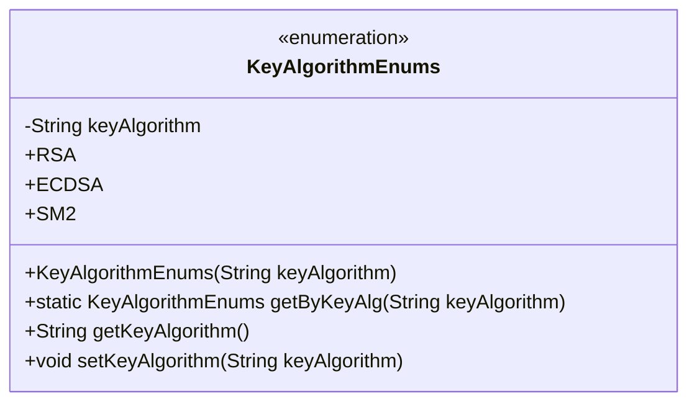
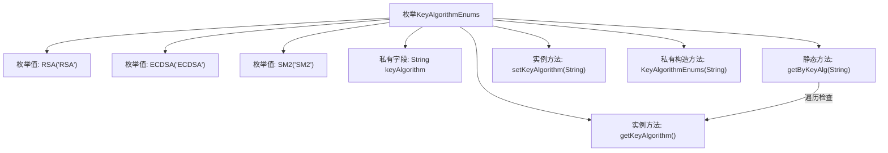

# 基础信息

|      |      |
|------|------|
| 名称 | KeyAlgorithmEnums |
| 编码语言 | .java |
| 代码路径 | WeFe/common/java/common-cert/src/main/java/com/webank/cert/toolkit/enums/KeyAlgorithmEnums.java |
| 包名 | com.webank.cert.toolkit.enums |
| 依赖项 | [] |
| 概述说明 | 枚举类KeyAlgorithmEnums定义了RSA、ECDSA、SM2三种密钥算法，提供根据名称获取枚举值的方法，包含获取和设置算法名称的功能。 |

# 说明

该代码定义了一个名为KeyAlgorithmEnums的枚举类，包含RSA、ECDSA和SM2三个枚举常量。每个枚举常量关联一个字符串类型的keyAlgorithm属性。类中提供了私有构造方法初始化该属性，并包含getter和setter方法。此外，还定义了一个静态方法getByKeyAlg，通过传入的keyAlgorithm字符串查找并返回对应的枚举实例，若未找到则返回null。整个枚举类用于管理密钥算法类型及其字符串表示。

# 类列表 Class Summary

| 名称   | 类型  | 说明 |
|-------|------|-------------|
| KeyAlgorithmEnums | enum | 枚举类定义三种密钥算法：RSA、ECDSA、SM2，提供根据名称获取枚举值的方法及属性访问器。 |

## 类 KeyAlgorithmEnums

|      |      |
|------|------|
| 访问范围 | public |
| 类型 | enum |
| 名称 | KeyAlgorithmEnums |
| 说明 | 枚举类定义三种密钥算法：RSA、ECDSA、SM2，提供根据名称获取枚举值的方法及属性访问器。 |

### UML类图

这段代码定义了一个名为KeyAlgorithmEnums的枚举类，包含RSA、ECDSA和SM2三个枚举常量，每个常量都关联一个字符串类型的keyAlgorithm属性。该类提供了通过字符串查找对应枚举的方法getByKeyAlg，以及获取和设置keyAlgorithm值的getter和setter方法。枚举类主要用于表示一组固定的密钥算法类型，便于在代码中安全地引用这些算法。

### 内部方法调用关系图

该流程图展示了KeyAlgorithmEnums枚举的结构，包含三个预定义枚举值(RSA/ECDSA/SM2)、一个私有字符串字段keyAlgorithm，以及相关的构造方法和访问方法。核心逻辑是静态方法getByKeyAlg通过遍历枚举值并比较keyAlgorithm字段来匹配对应的枚举实例，流程图清晰呈现了枚举定义与各方法间的调用关系。

### 字段列表 Field List

| 名称  | 类型  | 说明 |
|-------|-------|------|

### 方法列表

| 名称  | 类型  | 说明 |
|-------|-------|------|

