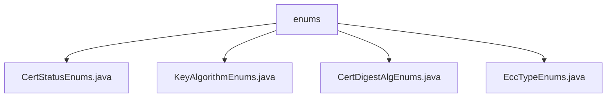

# 基础信息

|      |      |
|------|------|
| 名称 | enums |
| 编码语言 | .java |
| 代码路径 | WeFe/common/java/common-cert/src/main/java/com/webank/cert/toolkit/enums |
| 包名 | docs.common.java.common-cert.src.main.java.com.webank.cert.toolkit.enums |
| 概述说明 | CertStatusEnums枚举定义认证状态：无效、认证中、有效，含code和name属性及查找方法。KeyAlgorithmEnums枚举管理RSA、ECDSA、SM2密钥算法，含查找功能。CertDigestAlgEnums枚举定义三种证书摘要算法，含密钥算法和算法名称属性及查找方法。EccTypeEnums枚举定义两种椭圆曲线加密类型，含查找方法。 |

# 说明

## 概述  
该模块核心职责是提供证书管理相关的枚举定义，包括认证状态、密钥算法、摘要算法和椭圆曲线类型等标准化枚举值。接口规范统一采用静态工厂方法（如getByKeyAlg/getStatus）通过键值查找枚举实例，未匹配时返回null。关键数据结构包含CertStatusEnums（状态码）、KeyAlgorithmEnums（算法类型）、CertDigestAlgEnums（摘要算法）和EccTypeEnums（椭圆曲线）。外部依赖仅涉及Lombok注解（如@Getter）。例如SM2P256V1曲线类型通过eccType=2标识。

## 主要业务场景  
模块支持证书全生命周期管理，如CertStatusEnums跟踪认证状态（WAIT_VERIFY→VALID）。交互模式类似字典查询，通过算法名称/编码获取枚举项，例如KeyAlgorithmEnums.getByKeyAlg("RSA")。典型应用包括证书签发（选择SM3WITHSM2摘要算法）和密钥协商（指定SECP256K1曲线）。API类型均为静态查询方法，集成案例覆盖国密（SM2/SM3）和国际标准（RSA/ECDSA）。

### 包内部结构视图

该流程图展示了WeFe项目中common-cert模块下enums目录的层级结构。根节点为enums文件夹，包含四个枚举类文件：CertStatusEnums.java、KeyAlgorithmEnums.java、CertDigestAlgEnums.java和EccTypeEnums.java。这些枚举类用于处理证书状态、密钥算法、证书摘要算法和ECC类型等相关枚举定义。

# 文件列表

| 名称   | 类型  | 说明 |
|-------|------|-------------|
| [CertStatusEnums.java](CertStatusEnums.md) | file | 枚举类CertStatusEnums定义了认证状态：0无效，1认证中，2有效，提供根据code获取状态的方法。 |
| [KeyAlgorithmEnums.java](KeyAlgorithmEnums.md) | file | 枚举类KeyAlgorithmEnums定义了RSA、ECDSA、SM2三种密钥算法，提供根据名称获取枚举值的方法，包含获取和设置算法名称的功能。 |
| [CertDigestAlgEnums.java](CertDigestAlgEnums.md) | file | CertDigestAlgEnums枚举定义了三种证书摘要算法：SHA256WITHRSA、SHA256WITHECDSA、SM3WITHSM2，提供根据密钥算法或算法名称查找枚举的方法。 |
| [EccTypeEnums.java](EccTypeEnums.md) | file | 枚举EccTypeEnums定义两种ECC类型：SECP256K1和SM2P256V1，包含类型码和名称，提供按类型码或名称查找方法，查找失败记录错误日志。 |

