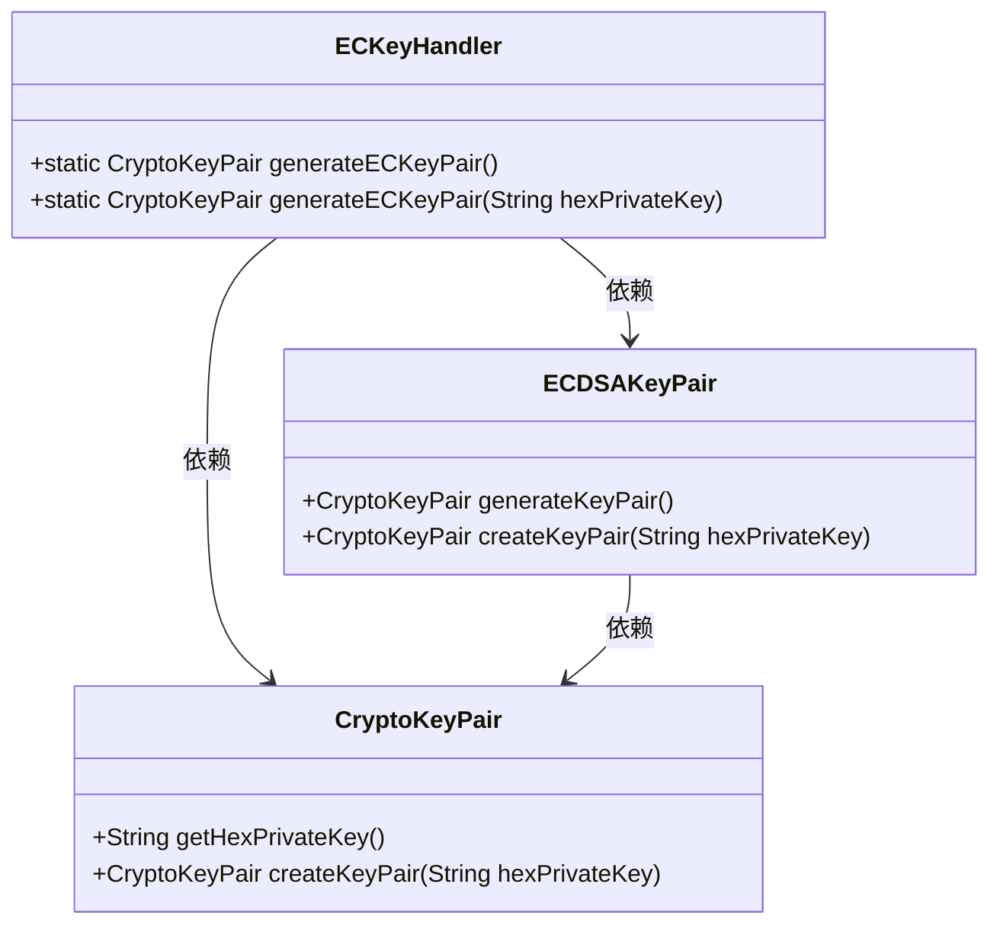
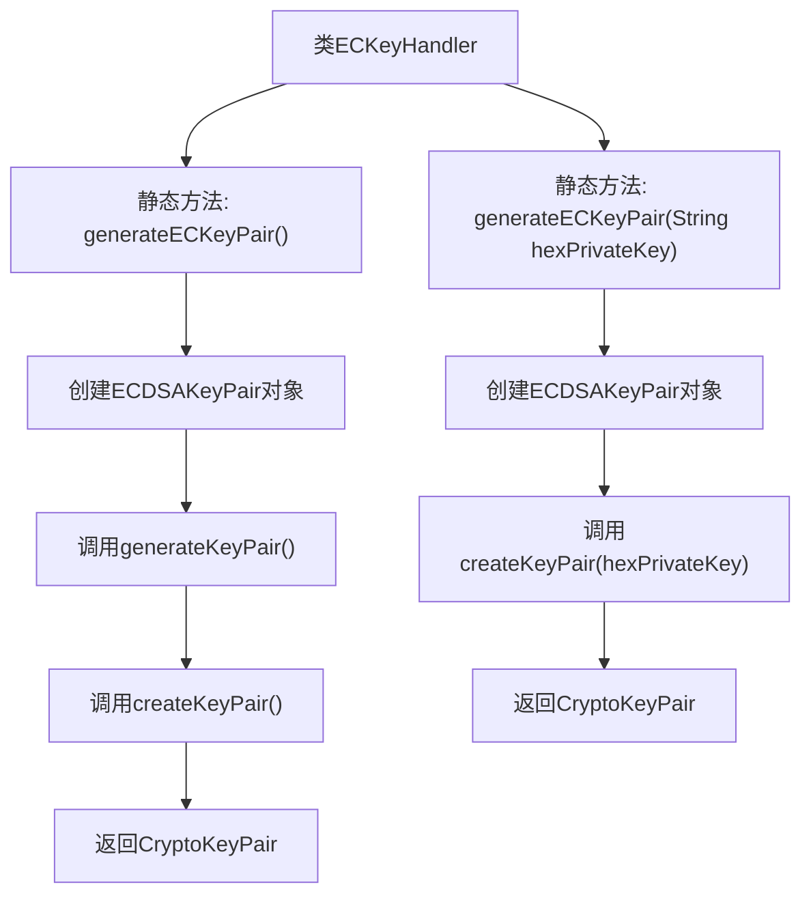

# 基础信息

|      |      |
|------|------|
| 名称 | ECKeyHandler |
| 编码语言 | .java |
| 代码路径 | WeFe/common/java/common-cert/src/main/java/com/webank/cert/toolkit/handler/ECKeyHandler.java |
| 包名 | com.webank.cert.toolkit.handler |
| 依赖项 | ['org.fisco.bcos.sdk.crypto.keypair.CryptoKeyPair', 'org.fisco.bcos.sdk.crypto.keypair.ECDSAKeyPair'] |
| 概述说明 | ECKeyHandler类提供两个静态方法：generateECKeyPair生成椭圆曲线密钥对，支持无参数生成或基于十六进制私钥创建。 |

# 说明

ECKeyHandler类提供了两个静态方法用于生成椭圆曲线密钥对。第一个方法generateECKeyPair无参，通过ECDSAKeyPair生成新的密钥对并返回包含十六进制私钥的CryptoKeyPair对象。第二个方法generateECKeyPair接收十六进制私钥字符串参数，直接基于该私钥创建并返回对应的密钥对。两者都调用了ECDSAKeyPair的createKeyPair方法完成核心功能。

# 类列表 Class Summary

| 名称   | 类型  | 说明 |
|-------|------|-------------|
| ECKeyHandler | class | ECKeyHandler类提供两个静态方法：generateECKeyPair生成椭圆曲线密钥对，支持无参生成或基于十六进制私钥创建。 |

## 类 ECKeyHandler

|      |      |
|------|------|
| 访问范围 | public |
| 类型 | class |
| 名称 | ECKeyHandler |
| 说明 | ECKeyHandler类提供两个静态方法：generateECKeyPair生成椭圆曲线密钥对，支持无参生成或基于十六进制私钥创建。 |

### UML类图

这段代码展示了一个椭圆曲线密钥处理器(ECKeyHandler)，提供两种生成密钥对的方式：随机生成或基于已有私钥生成。核心类包括ECKeyHandler（入口类）、ECDSAKeyPair（密钥对生成器）和CryptoKeyPair（密钥对容器）。ECKeyHandler通过调用ECDSAKeyPair的方法生成或重建密钥对，最终返回包含公私钥的CryptoKeyPair对象。整个设计采用静态方法提供简洁的API，支持密钥的生成和导入功能。

### 内部方法调用关系图

该流程图描述了ECKeyHandler类的两个静态方法逻辑。无参方法generateECKeyPair()通过ECDSAKeyPair生成密钥对后，用私钥十六进制字符串再次创建密钥对；有参方法generateECKeyPair(String)则直接使用输入的私钥字符串创建密钥对。两个方法最终均返回CryptoKeyPair对象，完整展现了椭圆曲线密钥对的生成和重构流程。

### 字段列表 Field List

| 名称  | 类型  | 说明 |
|-------|-------|------|

### 方法列表

| 名称  | 类型  | 说明 |
|-------|-------|------|
| generateECKeyPair | CryptoKeyPair | 生成ECDSA密钥对，输入为十六进制私钥字符串。 |
| generateECKeyPair | CryptoKeyPair | 生成ECDSA密钥对并返回十六进制私钥格式的密钥对。 |

