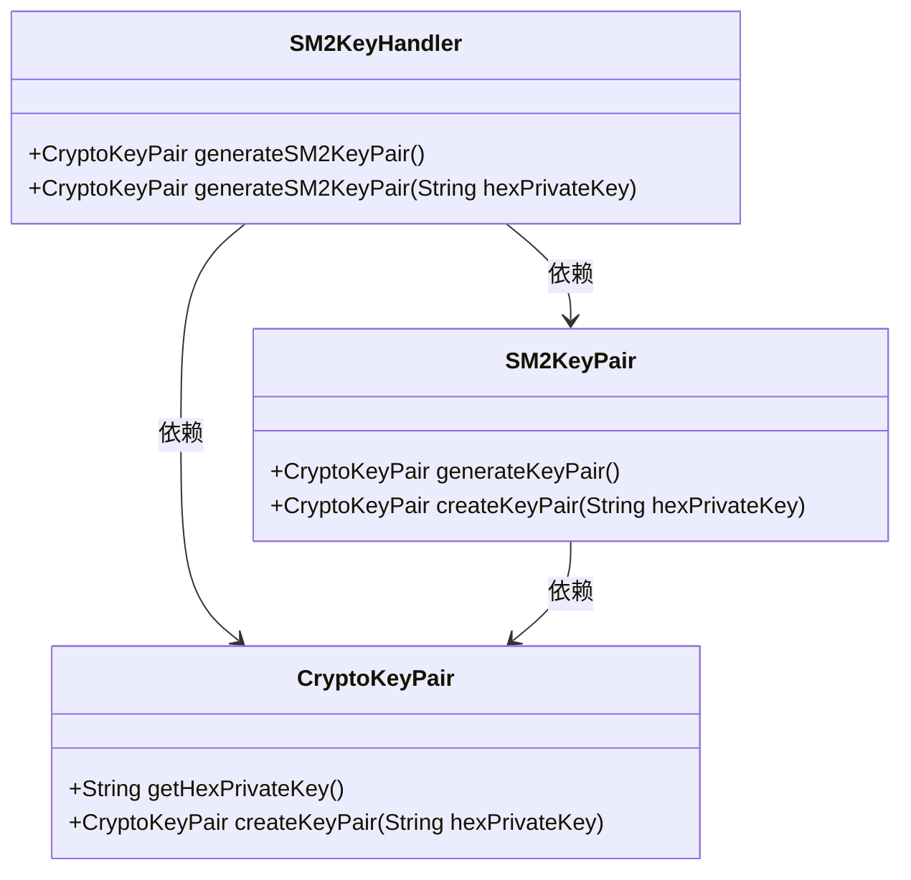
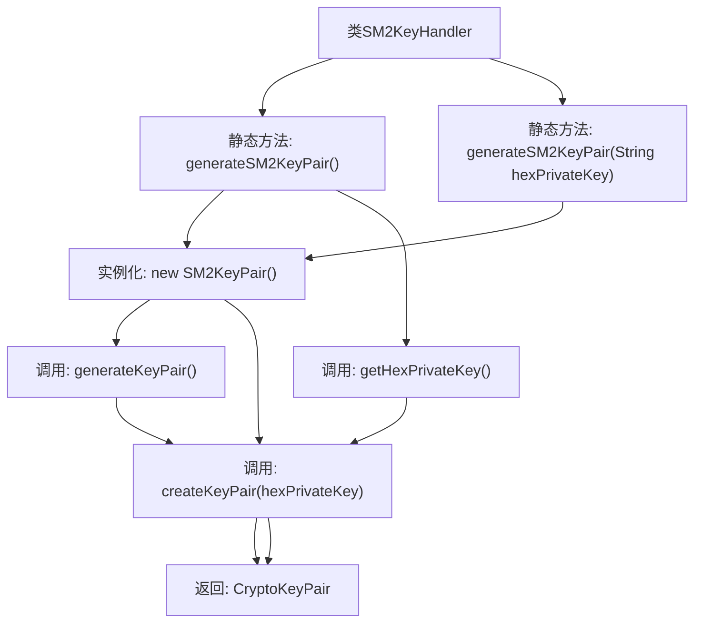

# 基础信息

|      |      |
|------|------|
| 名称 | SM2KeyHandler |
| 编码语言 | .java |
| 代码路径 | WeFe/common/java/common-cert/src/main/java/com/webank/cert/toolkit/handler/SM2KeyHandler.java |
| 包名 | com.webank.cert.toolkit.handler |
| 依赖项 | ['org.fisco.bcos.sdk.crypto.keypair.CryptoKeyPair', 'org.fisco.bcos.sdk.crypto.keypair.SM2KeyPair'] |
| 概述说明 | SM2KeyHandler类提供生成SM2密钥对功能，支持随机生成或指定私钥生成。 |

# 说明

SM2KeyHandler类提供了两个静态方法用于生成SM2密钥对。第一个方法generateSM2KeyPair无参，通过SM2KeyPair生成新的密钥对并返回。第二个方法generateSM2KeyPair接收十六进制私钥字符串参数，使用该私钥创建并返回对应的密钥对。两个方法均返回CryptoKeyPair类型对象。

# 类列表 Class Summary

| 名称   | 类型  | 说明 |
|-------|------|-------------|
| SM2KeyHandler | class | SM2KeyHandler类提供两个静态方法：generateSM2KeyPair生成SM2密钥对，或基于指定私钥生成密钥对。 |

## 类 SM2KeyHandler

|      |      |
|------|------|
| 访问范围 | public |
| 类型 | class |
| 名称 | SM2KeyHandler |
| 说明 | SM2KeyHandler类提供两个静态方法：generateSM2KeyPair生成SM2密钥对，或基于指定私钥生成密钥对。 |

### UML类图

这段类图展示了SM2KeyHandler类与CryptoKeyPair、SM2KeyPair之间的依赖关系。SM2KeyHandler提供了两个静态方法用于生成SM2密钥对，一个基于随机生成，另一个基于指定的16进制私钥。CryptoKeyPair类负责密钥对的创建和管理，SM2KeyPair类则实现了具体的SM2密钥生成逻辑。整个设计体现了密钥生成的封装性和灵活性。

### 内部方法调用关系图

该流程图描述了SM2KeyHandler类的两个静态方法生成SM2密钥对的逻辑流程。无参方法通过SM2KeyPair实例生成新密钥对后，提取私钥十六进制字符串并创建最终密钥对；有参方法直接使用输入的私钥字符串创建密钥对。两个方法最终均返回CryptoKeyPair对象，展现了密钥生成和转换的核心路径。

### 字段列表 Field List

| 名称  | 类型  | 说明 |
|-------|-------|------|

### 方法列表

| 名称  | 类型  | 说明 |
|-------|-------|------|
| generateSM2KeyPair | CryptoKeyPair | 生成SM2密钥对，支持传入16进制私钥。 |
| generateSM2KeyPair | CryptoKeyPair | 生成SM2密钥对：创建SM2KeyPair实例并返回十六进制私钥的密钥对。 |

