# 基础信息

|      |      |
|------|------|
| 名称 | X509CertHandler |
| 编码语言 | .java |
| 代码路径 | WeFe/common/java/common-cert/src/main/java/com/webank/cert/toolkit/handler/X509CertHandler.java |
| 包名 | com.webank.cert.toolkit.handler |
| 依赖项 | ['java.math.BigInteger', 'java.security.PrivateKey', 'java.security.PublicKey', 'java.security.Security', 'java.security.cert.CRLException', 'java.security.cert.X509CRL', 'java.security.cert.X509Certificate', 'java.util.ArrayList', 'java.util.Date', 'java.util.List', 'java.util.Random', 'org.bouncycastle.asn1.x500.X500Name', 'org.bouncycastle.asn1.x509.BasicConstraints', 'org.bouncycastle.asn1.x509.Extension', 'org.bouncycastle.asn1.x509.GeneralName', 'org.bouncycastle.asn1.x509.GeneralNames', 'org.bouncycastle.asn1.x509.KeyUsage', 'org.bouncycastle.cert.CertIOException', 'org.bouncycastle.cert.X509CRLHolder', 'org.bouncycastle.cert.X509v2CRLBuilder', 'org.bouncycastle.cert.X509v3CertificateBuilder', 'org.bouncycastle.cert.jcajce.JcaX509CRLConverter', 'org.bouncycastle.cert.jcajce.JcaX509CertificateConverter', 'org.bouncycastle.cert.jcajce.JcaX509v3CertificateBuilder', 'org.bouncycastle.jce.provider.BouncyCastleProvider', 'org.bouncycastle.operator.ContentSigner', 'org.bouncycastle.operator.OperatorCreationException', 'org.bouncycastle.operator.jcajce.JcaContentSignerBuilder', 'org.bouncycastle.pkcs.PKCS10CertificationRequest', 'org.bouncycastle.pkcs.PKCS10CertificationRequestBuilder', 'org.bouncycastle.pkcs.jcajce.JcaPKCS10CertificationRequest', 'org.bouncycastle.pkcs.jcajce.JcaPKCS10CertificationRequestBuilder'] |
| 概述说明 | X509CertHandler类提供X509证书操作功能，包括创建根证书、子证书、CSR请求及吊销证书。使用BouncyCastle库实现密钥扩展和签名。 |

# 说明

X509CertHandler类提供了X.509证书和CRL的生成与管理功能。静态初始化块确保BouncyCastle安全提供者已注册。主要功能包括：创建根证书和子证书，支持设置CA标志、密钥用法、有效期等属性；生成证书签名请求(CSR)；构建证书扩展项如基本约束、密钥用法和主题备用名称；以及吊销证书并生成CRL。所有操作均基于BouncyCastle库实现，支持自定义签名算法和密钥对。

# 类列表 Class Summary

| 名称   | 类型  | 说明 |
|-------|------|-------------|
| X509CertHandler | class | X509CertHandler类提供X509证书操作功能，包括创建根证书、子证书、CSR请求和吊销证书列表。使用BouncyCastle库实现，支持自定义签名算法、有效期、密钥用途等参数。 |

## 类 X509CertHandler

|      |      |
|------|------|
| 访问范围 | public |
| 类型 | class |
| 名称 | X509CertHandler |
| 说明 | X509CertHandler类提供X509证书操作功能，包括创建根证书、子证书、CSR请求和吊销证书列表。使用BouncyCastle库实现，支持自定义签名算法、有效期、密钥用途等参数。 |

### UML类图

```mermaid
classDiagram
    class X509CertHandler {
        <<static>>
        +createRootCert(String signAlg, X500Name subject, KeyUsage keyUsage, Date startDate, Date endDate, PublicKey publicKey, PrivateKey privateKey) X509Certificate
        +createChildCert(boolean isCaCert, String signAlg, X509Certificate parentCertificate, PKCS10CertificationRequest request, KeyUsage keyUsage, Date startDate, Date endDate, PrivateKey privateKey) X509Certificate
        +createCert(boolean isCaCert, String signAlg, X500Name subject, X500Name issuer, KeyUsage keyUsage, PublicKey publicKey, PrivateKey privateKey, Date startDate, Date endDate) X509Certificate
        +createCSR(X500Name subject, PublicKey pubKey, PrivateKey priKey, String signAlg) PKCS10CertificationRequest
        +revokeCert(X509Certificate caCertificate, PrivateKey caPrivateKey, List~X509Certificate~ revokeCertificates, String signAlg, int reason, Date period) X509CRL
        -buildCertExtension(X509v3CertificateBuilder v3CertGen, boolean isCaCert, KeyUsage keyUsage) void
        -makeContentSignerBuilder(String signAlg) JcaContentSignerBuilder
    }

    class BouncyCastleProvider {
        <<static>> +PROVIDER_NAME: String
    }

    class X509v3CertificateBuilder {
        +addExtension(Extension extension, boolean critical, ASN1Encodable value) void
        +build(ContentSigner signer) X509CertificateHolder
    }

    class JcaX509CertificateConverter {
        +setProvider(String provider) JcaX509CertificateConverter
        +getCertificate(X509CertificateHolder holder) X509Certificate
    }

    class JcaContentSignerBuilder {
        +setProvider(String provider) JcaContentSignerBuilder
        +build(PrivateKey privateKey) ContentSigner
    }

    class PKCS10CertificationRequest {
        +getSubject() X500Name
    }

    class X509v2CRLBuilder {
        +addCRLEntry(BigInteger serialNumber, Date revocationDate, int reason) void
        +setNextUpdate(Date nextUpdate) void
        +build(ContentSigner signer) X509CRLHolder
    }

    class JcaX509CRLConverter {
        +setProvider(String provider) JcaX509CRLConverter
        +getCRL(X509CRLHolder holder) X509CRL
    }

    X509CertHandler --> BouncyCastleProvider : 依赖
    X509CertHandler --> X509v3CertificateBuilder : 使用
    X509CertHandler --> JcaX509CertificateConverter : 使用
    X509CertHandler --> JcaContentSignerBuilder : 使用
    X509CertHandler --> PKCS10CertificationRequest : 使用
    X509CertHandler --> X509v2CRLBuilder : 使用
    X509CertHandler --> JcaX509CRLConverter : 使用
```

该代码是一个X509证书处理工具类，主要功能包括创建根证书、子证书、证书签名请求(CSR)以及证书吊销列表(CRL)。类图中展示了X509CertHandler与BouncyCastleProvider、X509v3CertificateBuilder等关键类的依赖关系，其中X509CertHandler通过静态方法提供证书生成和吊销的核心功能，而BouncyCastleProvider作为加密服务提供者被隐式依赖。类图清晰地反映了证书生成过程中各组件间的协作方式，包括证书构建器、签名生成器和格式转换器等关键角色。

### 内部方法调用关系图

```mermaid
graph TD
    A["类X509CertHandler"]
    B["静态块: 注册BouncyCastleProvider"]
    C["方法: createRootCert"]
    D["方法: createChildCert"]
    E["方法: createCert"]
    F["方法: buildCertExtension"]
    G["方法: createCSR"]
    H["方法: makeContentSignerBuilder"]
    I["方法: revokeCert"]
    J["调用: Security.getProvider('BC')"]
    K["调用: Security.addProvider"]
    L["调用: createCert"]
    M["调用: JcaPKCS10CertificationRequest"]
    N["调用: getPublicKey"]
    O["调用: X500Name.getInstance"]
    P["调用: JcaX509v3CertificateBuilder"]
    Q["调用: buildCertExtension"]
    R["调用: makeContentSignerBuilder"]
    S["调用: JcaX509CertificateConverter"]
    T["调用: addExtension"]
    U["调用: new JcaContentSignerBuilder"]
    V["调用: PKCS10CertificationRequestBuilder"]
    W["调用: X509v2CRLBuilder"]
    X["调用: addCRLEntry"]
    Y["调用: JcaX509CRLConverter"]

    A --> B
    B --> J
    J -->|null| K
    A --> C
    C --> L
    A --> D
    D --> M
    M --> N
    D --> O
    D --> L
    A --> E
    E --> P
    E --> Q
    E --> R
    E --> S
    A --> F
    F --> T
    A --> G
    G --> U
    G --> V
    A --> H
    A --> I
    I --> W
    I --> X
    I --> Y
```

这段代码是X509CertHandler类，主要用于处理X.509证书的创建、签名、扩展属性设置以及证书撤销列表(CRL)的生成。静态块确保BouncyCastleProvider被注册，核心方法包括创建根证书(createRootCert)、子证书(createChildCert)和通用证书(createCert)，其中createCert方法通过构建X509v3证书并添加扩展属性(如密钥用法、主题备用名等)来完成证书生成。此外还提供了创建证书签名请求(createCSR)和撤销证书(revokeCert)的功能，整体流程涉及多个BouncyCastle库的API调用和证书参数处理。

### 字段列表 Field List

| 名称  | 类型  | 说明 |
|-------|-------|------|

### 方法列表

| 名称  | 类型  | 说明 |
|-------|-------|------|
| createCert | X509Certificate | 该方法用于创建X509证书，支持CA证书和普通证书，指定签名算法、主题、颁发者、密钥用途、公钥、私钥及有效期，使用BouncyCastle库实现。 |
| createChildCert | X509Certificate | 该方法用于创建子证书，接收CA标志、签名算法、父证书、请求、密钥用途、日期和私钥等参数，返回X509证书。 |
| buildCertExtension | void | 构建证书扩展方法，设置基本约束、密钥用途和主题备用名称。若为CA证书则添加相应约束，密钥用途默认为数字签名，可自定义。主题备用名称为指定域名。 |
| makeContentSignerBuilder | JcaContentSignerBuilder | 创建JcaContentSignerBuilder实例，设置签名算法和BouncyCastle提供者后返回。 |
| revokeCert | X509CRL | 该方法用于撤销X509证书，生成CRL列表。输入CA证书、私钥、待撤销证书列表、签名算法、原因码和有效期，返回X509CRL对象。核心步骤包括构建CRL、添加撤销条目、签名并转换格式。 |
| createCSR | PKCS10CertificationRequest | 创建CSR方法：传入主题、公钥、私钥和签名算法，使用BouncyCastle生成签名请求。 |
| createRootCert | X509Certificate | 创建根证书方法：接收签名算法、主题、密钥用途、有效期、公私钥，调用内部方法生成自签名根证书。 |

