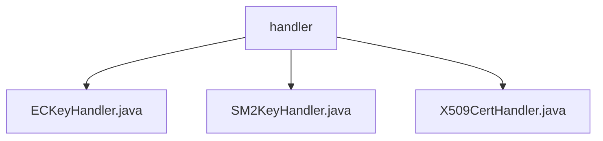

# 基础信息

|      |      |
|------|------|
| 名称 | handler |
| 编码语言 | .java |
| 代码路径 | WeFe/common/java/common-cert/src/main/java/com/webank/cert/toolkit/handler |
| 包名 | docs.common.java.common-cert.src.main.java.com.webank.cert.toolkit.handler |
| 概述说明 | ECKeyHandler类提供生成椭圆曲线密钥对的静态方法，支持无参生成或基于私钥创建。SM2KeyHandler类类似，提供生成SM2密钥对的静态方法。X509CertHandler类管理X.509证书和CRL，支持生成根/子证书、CSR、扩展项及吊销证书功能。 |

# 说明

## 概述  
该模块核心职责是提供密码学密钥与证书管理功能，包括椭圆曲线(ECDSA/SM2)密钥对生成和X.509证书全生命周期管理。接口规范统一采用静态方法设计，例如ECKeyHandler.generateECKeyPair()支持传入私钥或自动生成，SM2KeyHandler采用相同模式，X509CertHandler则通过链式调用设置证书属性。关键数据结构为CryptoKeyPair，包含十六进制格式的密钥对。外部依赖仅为BouncyCastle安全库，用于底层算法实现。

## 主要业务场景  
典型应用包括：1)快速生成国密SM2或国际标准ECDSA密钥对，例如基于现存私钥恢复密钥对；2)构建完整PKI体系，如创建带CA标志的根证书、签发带扩展项的子证书；3)证书吊销管理，类似CRL发布流程。交互模式采用工厂方法（密钥生成）和建造者模式（证书定制），支持算法可插拔，例如X509CertHandler可配置SHA256WithECDSA等签名算法。

### 包内部结构视图

该流程图展示了common-cert项目中handler目录下的三个Java文件：ECKeyHandler.java、SM2KeyHandler.java和X509CertHandler.java。这些文件都属于加密证书工具包的处理程序模块，用于处理不同类型的密钥和证书操作，包括EC密钥、SM2密钥和X509证书的处理功能。

# 文件列表

| 名称   | 类型  | 说明 |
|-------|------|-------------|
| [ECKeyHandler.java](ECKeyHandler.md) | file | ECKeyHandler类提供两个静态方法：generateECKeyPair生成椭圆曲线密钥对，支持无参数生成或基于十六进制私钥创建。 |
| [SM2KeyHandler.java](SM2KeyHandler.md) | file | SM2KeyHandler类提供生成SM2密钥对功能，支持随机生成或指定私钥生成。 |
| [X509CertHandler.java](X509CertHandler.md) | file | X509CertHandler类提供X509证书操作功能，包括创建根证书、子证书、CSR请求及吊销证书。使用BouncyCastle库实现密钥扩展和签名。 |

