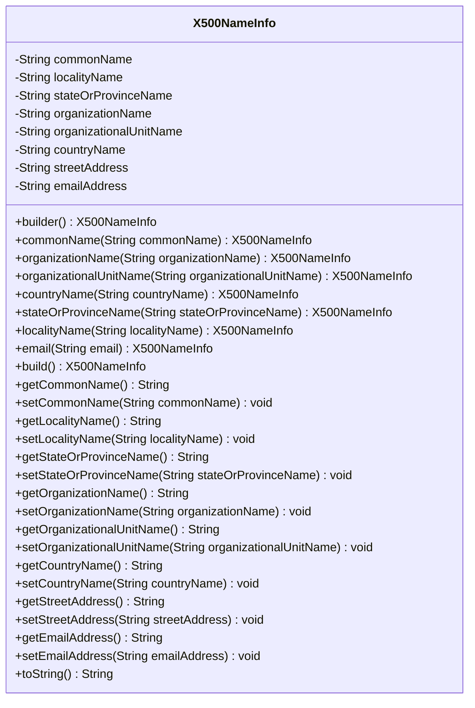
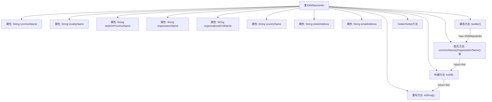

# 基础信息

|      |      |
|------|------|
| 名称 | X500NameInfo |
| 编码语言 | .java |
| 代码路径 | WeFe/common/java/common-cert/src/main/java/com/webank/cert/toolkit/model/X500NameInfo.java |
| 包名 | com.webank.cert.toolkit.model |
| 依赖项 | [] |
| 概述说明 | X500NameInfo类封装X.500名称属性，提供构建器模式设置CN、O、OU等字段，支持链式调用和toString输出。 |

# 说明

X500NameInfo类用于封装X.500标准的名称信息，包含常用名、地区名、省份名、组织名、部门名、国家名、街道地址和电子邮件地址等属性。提供builder模式构建对象，支持链式调用设置各属性值。包含各属性的getter和setter方法，以及toString方法将对象转换为符合X.500格式的字符串表示。

# 类列表 Class Summary

| 名称   | 类型  | 说明 |
|-------|------|-------------|
| X500NameInfo | class | X500NameInfo类用于构建和存储X.500名称信息，包含常用名、组织名、单位名、国家、省、市、街道和邮箱等属性，提供链式设置方法和toString格式化输出。 |

## 类 X500NameInfo

|      |      |
|------|------|
| 访问范围 | public |
| 类型 | class |
| 名称 | X500NameInfo |
| 说明 | X500NameInfo类用于构建和存储X.500名称信息，包含常用名、组织名、单位名、国家、省、市、街道和邮箱等属性，提供链式设置方法和toString格式化输出。 |

### UML类图

这段代码定义了一个X500NameInfo类，用于构建和表示X.500标准的名称信息，包含常见字段如通用名(CN)、组织名(O)、组织单元名(OU)等。类采用建造者模式设计，提供链式调用的设置方法，并实现了toString()方法以生成符合X.500格式的字符串表示。所有字段都有对应的getter和setter方法，允许灵活地构建和修改X.500名称对象。

### 内部方法调用关系图

该流程图展示了X500NameInfo类的完整结构，这是一个采用Builder模式的X.500名称信息构建类。核心包含8个字符串属性、1个静态构建入口(builder)、7个链式配置方法、1个终结构建方法(build)以及标准的Getter/Setter。特别展示了链式调用从builder()开始，通过各配置方法最后到达build()和toString()的完整流程，其中每个配置方法都返回this以实现链式调用。toString()方法会按X.500标准格式拼接所有非空属性。

### 字段列表 Field List

| 名称  | 类型  | 说明 |
|-------|-------|------|
| streetAddress | String | 定义私有字符串变量streetAddress，用于存储街道地址信息。 |
| localityName | String | 私有字符串变量localityName，用于存储地区名称。 |
| stateOrProvinceName | String | 私有字符串变量，用于存储州或省份名称。 |
| emailAddress | String | 私有字符串类型变量，用于存储电子邮件地址。 |
| organizationName | String | 私有字符串变量，存储组织名称。 |
| countryName | String | 私有字符串变量，存储国家名称。 |
| organizationalUnitName | String | 组织单元名称字符串变量 |
| commonName | String | 私有字符串变量commonName。 |

### 方法列表

| 名称  | 类型  | 说明 |
|-------|-------|------|
| getCommonName | String | 获取公共名称的方法，返回字符串类型的commonName。 |
| getStateOrProvinceName | String | 获取州或省份名称的方法，返回字符串类型的状态或省份名称。 |
| setCommonName | void | 这是一个Java方法，用于设置对象的commonName属性值。方法接收一个字符串参数commonName，并将其赋值给当前对象的同名成员变量。 |
| getOrganizationName | String | 获取组织名称的方法，返回字符串类型的organizationName。 |
| setStateOrProvinceName | void | 设置州或省名称的方法，将输入参数赋值给类的对应成员变量。 |
| commonName | X500NameInfo | 方法设置通用名并返回当前对象实例。 |
| organizationName | X500NameInfo | 这是一个Java方法，用于设置X500NameInfo类的organizationName属性并返回当前对象实例，支持链式调用。 |
| builder | X500NameInfo | 静态方法builder()返回一个新的X500NameInfo实例。 |
| organizationalUnitName | X500NameInfo | 方法设置组织单位名称并返回当前对象实例。 |
| email | X500NameInfo | 方法设置邮箱地址并返回当前对象实例。 |
| setOrganizationalUnitName | void | 设置组织单位名称的方法，将输入参数赋给类变量organizationalUnitName。 |
| stateOrProvinceName | X500NameInfo | 方法设置省份名称并返回当前对象实例。 |
| setLocalityName | void | 设置地点名称的方法，将参数localityName赋值给类的同名成员变量。 |
| countryName | X500NameInfo | 方法设置国家名并返回当前对象实例。 |
| getOrganizationalUnitName | String | 获取组织单位名称的方法，返回字符串类型的organizationalUnitName字段值。 |
| build | X500NameInfo | 构建方法直接返回当前X500NameInfo实例。 |
| getLocalityName | String | 获取地区名称的方法，返回字符串类型的localityName。 |
| setOrganizationName | void | 设置组织名称的方法，将输入参数赋值给类变量organizationName。 |
| localityName | X500NameInfo | 方法设置并返回X500NameInfo对象的localityName属性。 |
| getCountryName | String | 获取国家名称的方法，返回字符串类型变量countryName。 |
| setCountryName | void | 设置国家名称的方法，将输入参数赋值给类的countryName变量。 |
| getStreetAddress | String | 获取街道地址的方法，返回字符串类型的streetAddress。 |
| setStreetAddress | void | 设置街道地址的方法，将输入参数赋给类的成员变量。 |
| getEmailAddress | String | 获取emailAddress字符串的方法。 |
| toString | String | 重写toString方法，拼接非空字段如CN、O、OU、L、ST、C、STREET和emailAddress，以逗号分隔。 |
| setEmailAddress | void | 这是一个Java方法，用于设置类的emailAddress属性值。方法接收一个字符串参数emailAddress，并将其赋值给类的同名成员变量。 |

