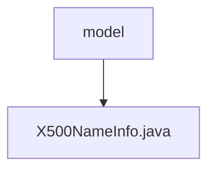

# 基础信息

|      |      |
|------|------|
| 名称 | model |
| 编码语言 | .java |
| 代码路径 | WeFe/common/java/common-cert/src/main/java/com/webank/cert/toolkit/model |
| 包名 | docs.common.java.common-cert.src.main.java.com.webank.cert.toolkit.model |
| 概述说明 | X500NameInfo类封装X.500名称属性，提供构建器模式设置CN、O、OU等字段，支持链式调用和toString输出。 |

# 说明

X500NameInfo类用于封装X.500标准的名称信息，包含常用名、地区名、省份名、组织名、部门名、国家名、街道地址和电子邮件地址等属性。提供builder模式构建对象，支持链式调用设置各属性值。包含各属性的getter和setter方法，以及toString方法将对象转换为符合X.500格式的字符串表示。

### 包内部结构视图

该流程图展示了model目录与X500NameInfo.java文件之间的层级关系。model作为父级目录，包含一个具体的Java类文件X500NameInfo.java，体现了Java项目中典型的包结构与类文件的从属关系。整个结构简洁清晰，符合Maven项目标准目录布局。

# 文件列表

| 名称   | 类型  | 说明 |
|-------|------|-------------|
| [X500NameInfo.java](X500NameInfo.md) | file | X500NameInfo类封装X.500名称属性，提供构建器模式设置CN、O、OU等字段，支持链式调用和toString输出。 |

