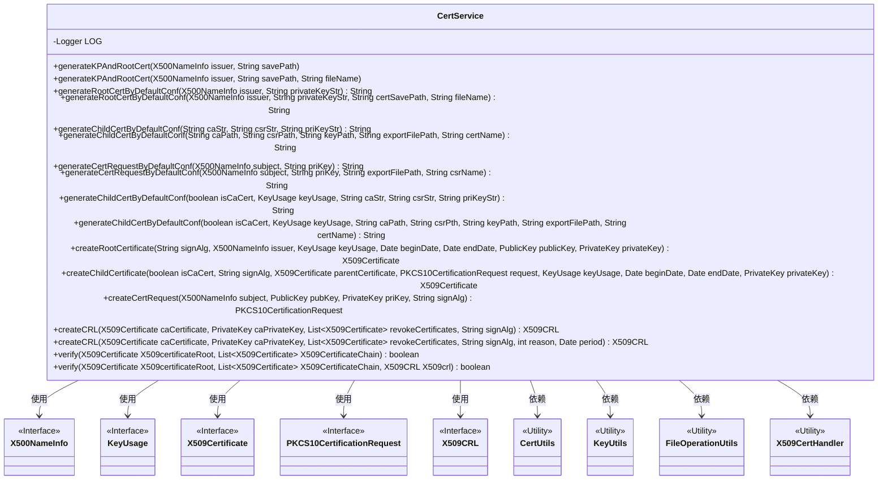

# 基础信息

|      |      |
|------|------|
| 名称 | CertService |
| 编码语言 | .java |
| 代码路径 | WeFe/common/java/common-cert/src/main/java/com/webank/cert/toolkit/service/CertService.java |
| 包名 | com.webank.cert.toolkit.service |
| 依赖项 | ['java.io.FileNotFoundException', 'java.math.BigInteger', 'java.security.KeyPair', 'java.security.Principal', 'java.security.PrivateKey', 'java.security.PublicKey', 'java.security.cert.CRLException', 'java.security.cert.X509CRL', 'java.security.cert.X509CRLEntry', 'java.security.cert.X509Certificate', 'java.util.ArrayList', 'java.util.Date', 'java.util.List', 'java.util.Set', 'org.bouncycastle.asn1.x500.X500Name', 'org.bouncycastle.asn1.x509.KeyUsage', 'org.bouncycastle.operator.OperatorCreationException', 'org.bouncycastle.pkcs.PKCS10CertificationRequest', 'org.slf4j.Logger', 'org.slf4j.LoggerFactory', 'com.webank.cert.toolkit.constants.CertConstants', 'com.webank.cert.toolkit.handler.X509CertHandler', 'com.webank.cert.toolkit.model.X500NameInfo', 'com.webank.cert.toolkit.utils.CertUtils', 'com.webank.cert.toolkit.utils.FileOperationUtils', 'com.webank.cert.toolkit.utils.KeyUtils'] |
| 概述说明 | CertService类提供证书管理功能，包括生成RSA密钥对和CA证书、子证书、证书请求，以及证书吊销和验证。支持默认配置（SHA256WITHRSA算法，3650天有效期），可保存到指定路径。 |

# 说明

CertService类提供证书管理功能，包括生成密钥对、根证书、子证书、证书请求及证书吊销列表。主要方法包括：generateKPAndRootCert生成RSA密钥对和根证书，默认使用SHA256WITHRSA签名算法，有效期3650天；generateRootCertByDefaultConf根据私钥生成根证书；generateChildCertByDefaultConf生成子证书；generateCertRequestByDefaultConf生成证书请求；createCRL创建证书吊销列表；verify验证证书链有效性。所有操作支持文件路径或字符串参数，并包含错误处理和日志记录。

# 类列表 Class Summary

| 名称   | 类型  | 说明 |
|-------|------|-------------|
| CertService | class | CertService类提供证书管理功能，包括生成RSA密钥对、根证书、子证书、证书请求及撤销证书，支持默认配置（SHA256WITHRSA算法，有效期3650天），并包含证书验证逻辑。 |

## 类 CertService

|      |      |
|------|------|
| 访问范围 | public |
| 类型 | class |
| 名称 | CertService |
| 说明 | CertService类提供证书管理功能，包括生成RSA密钥对、根证书、子证书、证书请求及撤销证书，支持默认配置（SHA256WITHRSA算法，有效期3650天），并包含证书验证逻辑。 |

### UML类图

该代码实现了一个证书服务类CertService，主要功能包括生成密钥对和根证书、生成子证书、生成证书请求、创建证书撤销列表(CRL)以及验证证书链。类图中展示了CertService与多个接口(如X500NameInfo、KeyUsage等)和工具类(如CertUtils、KeyUtils等)的依赖关系。CertService提供了丰富的证书操作功能，包括文件保存、默认配置生成、证书链验证等，是一个完整的PKI证书管理服务实现。

### 内部方法调用关系图

```mermaid
graph TD
    A["类CertService"]
    B["属性: Logger LOG"]
    C["方法: generateKPAndRootCert(X500NameInfo, String)"]
    D["方法: generateKPAndRootCert(X500NameInfo, String, String)"]
    E["方法: generateRootCertByDefaultConf(X500NameInfo, String)"]
    F["方法: generateRootCertByDefaultConf(X500NameInfo, String, String, String)"]
    G["方法: generateChildCertByDefaultConf(String, String, String)"]
    H["方法: generateChildCertByDefaultConf(String, String, String, String, String)"]
    I["方法: generateCertRequestByDefaultConf(X500NameInfo, String)"]
    J["方法: generateCertRequestByDefaultConf(X500NameInfo, String, String, String)"]
    K["方法: createRootCertificate"]
    L["方法: createChildCertificate"]
    M["方法: createCertRequest"]
    N["方法: createCRL"]
    O["方法: verify"]

    A --> B
    A --> C
    A --> D
    A --> E
    A --> F
    A --> G
    A --> H
    A --> I
    A --> J
    A --> K
    A --> L
    A --> M
    A --> N
    A --> O

    C --> D
    E --> F
    G --> H
    I --> J
    K -->|调用| X509CertHandler.createRootCert
    L -->|调用| X509CertHandler.createChildCert
    M -->|调用| X509CertHandler.createCSR
    N -->|调用| X509CertHandler.revokeCert
```

该流程图展示了CertService类的核心结构和主要方法调用关系。类包含证书生成、密钥对创建、证书签名请求(CSR)处理、证书撤销列表(CRL)生成以及证书验证等功能。关键方法通过调用X509CertHandler类实现底层证书操作，包括createRootCert、createChildCert等核心功能。流程展示了方法间的重载关系和关键依赖，如generateKPAndRootCert的两个版本通过参数重载实现不同功能，验证流程包含证书链验证和CRL检查等关键步骤。

### 字段列表 Field List

| 名称  | 类型  | 说明 |
|-------|-------|------|
| LOG = LoggerFactory.getLogger(CertService.class) | Logger | CertService类中定义了一个受保护的静态final日志对象LOG。 |

### 方法列表

| 名称  | 类型  | 说明 |
|-------|-------|------|
| createCertRequest | PKCS10CertificationRequest | 该方法用于创建PKCS10证书请求，接收主题信息、公钥、私钥和签名算法参数，调用X509CertHandler.createCSR生成请求，异常时记录错误日志并返回null。 |
| generateChildCertByDefaultConf | String | 生成子证书方法：检查输入参数，转换证书、请求和密钥，验证转换结果，创建子证书并返回PEM字符串。 |
| generateChildCertByDefaultConf | String | 该方法通过默认配置生成子证书，接收CA证书、CSR和私钥字符串，调用内部方法处理并返回结果。 |
| generateRootCertByDefaultConf | String | 生成根证书的默认配置方法，接受颁发者信息和私钥字符串作为参数，调用重载方法并传递空值。 |
| createChildCertificate | X509Certificate | 创建子证书方法，参数包括CA标识、签名算法、父证书、请求、密钥用途、起止日期和私钥，异常时记录错误并返回证书。 |
| generateChildCertByDefaultConf | String | 生成子证书方法：检查CA、CSR、密钥路径，创建有效期内的子证书并导出，返回PEM格式字符串。异常时记录日志并返回null。 |
| generateRootCertByDefaultConf | String | 生成根证书方法：检查私钥非空，创建目录，设置有效期，生成RSA密钥对，创建并保存X509证书，返回PEM格式字符串。出错返回null。 |
| generateKPAndRootCert | void | 生成密钥对和根证书，保存到指定路径，默认前缀为"ca"。 |
| generateKPAndRootCert | void | 生成密钥对和根证书，保存私钥、公钥及证书文件到指定路径，记录日志。出错时捕获异常并记录。 |
| createRootCertificate | X509Certificate | 方法创建X509根证书，使用指定签名算法、颁发者、密钥用途、有效期、公私钥，异常时记录错误日志并返回证书。 |
| generateCertRequestByDefaultConf | String | 该方法根据默认配置生成证书请求：验证并创建导出路径，使用RSA密钥对生成PKCS10请求，可选导出为.csr文件或返回PEM字符串，异常时记录错误并返回null。 |
| generateCertRequestByDefaultConf | String | 生成证书请求的默认配置方法，接收主题和私钥参数，调用重载方法处理。 |
| generateChildCertByDefaultConf | String | 生成子证书的默认配置方法，参数包括CA路径、CSR路径、密钥路径、导出文件路径和证书名称。 |
| createCRL | X509CRL | 创建X509CRL方法，参数包括CA证书、私钥、吊销证书列表和签名算法，调用重载方法并设置默认版本和扩展项。 |
| createCRL | X509CRL | 该方法用于创建X509证书撤销列表（CRL），需提供CA证书、私钥、待撤销证书列表、签名算法、撤销原因及有效期。调用X509CertHandler.revokeCert处理，异常时记录日志并返回null。 |
| verify | boolean | 验证X509证书链，调用重载方法并传入空参数。 |
| verify | boolean | 验证X509证书链和CRL，检查链完整性、吊销状态及有效期。 |

