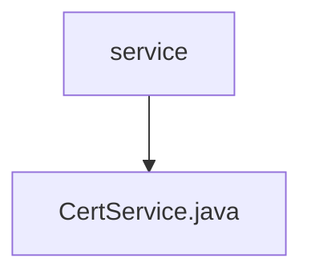

# 基础信息

|      |      |
|------|------|
| 名称 | service |
| 编码语言 | .java |
| 代码路径 | WeFe/common/java/common-cert/src/main/java/com/webank/cert/toolkit/service |
| 包名 | docs.common.java.common-cert.src.main.java.com.webank.cert.toolkit.service |
| 概述说明 | CertService类提供证书管理功能，包括生成RSA密钥对和CA证书、子证书、证书请求，以及证书吊销和验证。支持默认配置（SHA256WITHRSA算法，3650天有效期），可保存到指定路径。 |

# 说明

CertService类提供证书管理功能，包括生成密钥对、根证书、子证书、证书请求及证书吊销列表。主要方法包括：generateKPAndRootCert生成RSA密钥对和根证书，默认使用SHA256WITHRSA签名算法，有效期3650天；generateRootCertByDefaultConf根据私钥生成根证书；generateChildCertByDefaultConf生成子证书；generateCertRequestByDefaultConf生成证书请求；createCRL创建证书吊销列表；verify验证证书链有效性。所有操作支持文件路径或字符串参数，并包含错误处理和日志记录。

### 包内部结构视图

该流程图展示了service目录与CertService.java文件之间的层级关系。service作为父节点，CertService.java作为其子节点，表示该Java文件位于service目录下。这是一个简单的单层文件结构，仅包含一个服务接口文件。

# 文件列表

| 名称   | 类型  | 说明 |
|-------|------|-------------|
| [CertService.java](CertService.md) | file | CertService类提供证书管理功能，包括生成RSA密钥对和CA证书、子证书、证书请求，以及证书吊销和验证。支持默认配置（SHA256WITHRSA算法，3650天有效期），可保存到指定路径。 |

