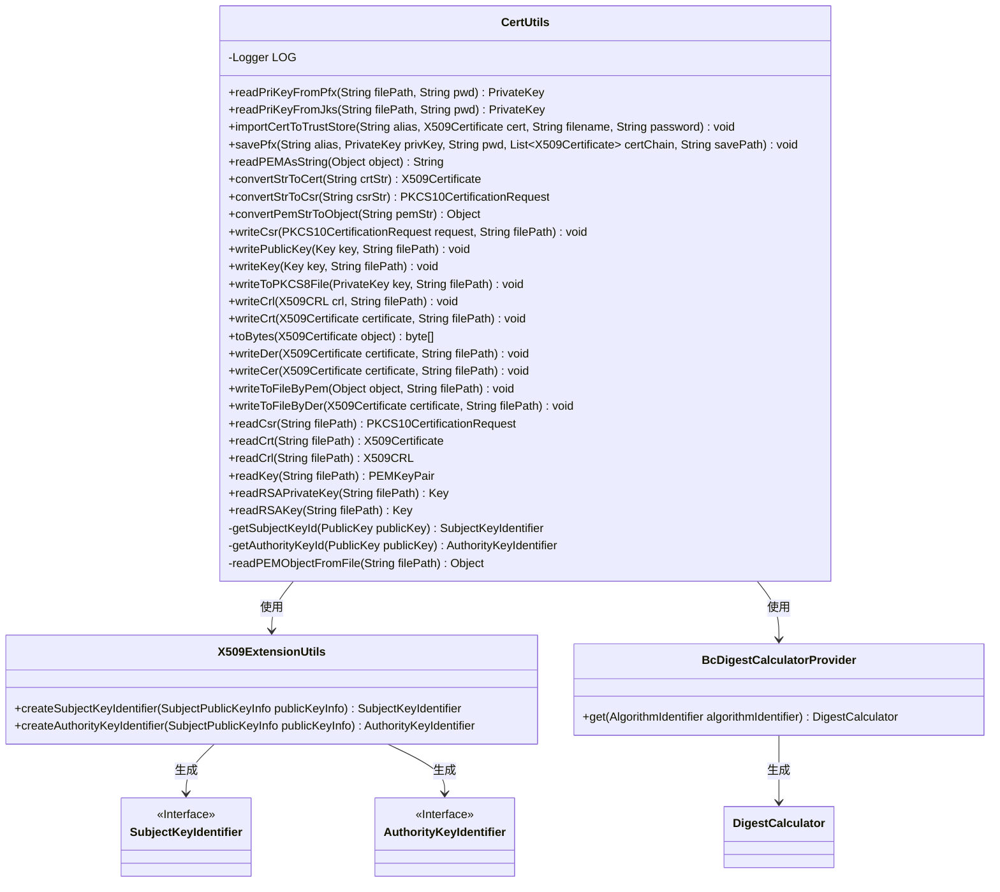

# 基础信息

|      |      |
|------|------|
| 名称 | CertUtils |
| 编码语言 | .java |
| 代码路径 | WeFe/common/java/common-cert/src/main/java/com/webank/cert/toolkit/utils/CertUtils.java |
| 包名 | com.webank.cert.toolkit.utils |
| 依赖项 | ['java.io.ByteArrayOutputStream', 'java.io.File', 'java.io.FileInputStream', 'java.io.FileNotFoundException', 'java.io.FileOutputStream', 'java.io.FileReader', 'java.io.FileWriter', 'java.io.IOException', 'java.io.InputStream', 'java.io.OutputStream', 'java.io.OutputStreamWriter', 'java.io.StringReader', 'java.io.StringWriter', 'java.security.Key', 'java.security.KeyFactory', 'java.security.KeyStore', 'java.security.KeyStoreException', 'java.security.NoSuchAlgorithmException', 'java.security.PrivateKey', 'java.security.PublicKey', 'java.security.Security', 'java.security.cert.CRLException', 'java.security.cert.CertificateEncodingException', 'java.security.cert.CertificateException', 'java.security.cert.X509CRL', 'java.security.cert.X509Certificate', 'java.security.spec.PKCS8EncodedKeySpec', 'java.util.Enumeration', 'java.util.List', 'org.apache.commons.lang3.StringUtils', 'org.bouncycastle.asn1.oiw.OIWObjectIdentifiers', 'org.bouncycastle.asn1.pkcs.PrivateKeyInfo', 'org.bouncycastle.asn1.x509.AlgorithmIdentifier', 'org.bouncycastle.asn1.x509.AuthorityKeyIdentifier', 'org.bouncycastle.asn1.x509.SubjectKeyIdentifier', 'org.bouncycastle.asn1.x509.SubjectPublicKeyInfo', 'org.bouncycastle.cert.X509CRLHolder', 'org.bouncycastle.cert.X509CertificateHolder', 'org.bouncycastle.cert.X509ExtensionUtils', 'org.bouncycastle.cert.jcajce.JcaX509CRLConverter', 'org.bouncycastle.cert.jcajce.JcaX509CertificateConverter', 'org.bouncycastle.jce.provider.BouncyCastleProvider', 'org.bouncycastle.openssl.PEMKeyPair', 'org.bouncycastle.openssl.PEMParser', 'org.bouncycastle.openssl.jcajce.JcaPEMWriter', 'org.bouncycastle.openssl.jcajce.JcaPKCS8Generator', 'org.bouncycastle.operator.DigestCalculator', 'org.bouncycastle.operator.OperatorCreationException', 'org.bouncycastle.operator.bc.BcDigestCalculatorProvider', 'org.bouncycastle.pkcs.PKCS10CertificationRequest', 'org.bouncycastle.util.io.pem.PemReader', 'org.slf4j.Logger', 'org.slf4j.LoggerFactory'] |
| 概述说明 | CertUtils类提供证书和密钥操作功能，包括读取PFX/JKS私钥、生成密钥标识符、导入导出证书、PEM/DER格式转换等。支持BouncyCastle加密库，处理X509证书、PKCS10请求和CRL列表。 |

# 说明

CertUtils类是一个用于处理证书和密钥的工具类，提供了多种功能。它使用BouncyCastle作为安全提供者，支持从PFX和JKS文件中读取私钥，生成主题密钥标识符和授权密钥标识符。类中还包含将证书、私钥、证书请求等对象以PEM或DER格式写入文件的方法，以及从文件中读取这些对象的功能。此外，它还支持将对象转换为PEM编码的字符串，以及处理证书吊销列表。工具类提供了全面的异常处理和日志记录功能，确保操作的安全性和可靠性。

# 类列表 Class Summary

| 名称   | 类型  | 说明 |
|-------|------|-------------|
| CertUtils | class | CertUtils类提供证书和密钥操作功能，包括读取PFX/JKS私钥、生成密钥标识、导入导出证书、PEM/DER格式转换等。 |

## 类 CertUtils

|      |      |
|------|------|
| 访问范围 | public |
| 类型 | class |
| 名称 | CertUtils |
| 说明 | CertUtils类提供证书和密钥操作功能，包括读取PFX/JKS私钥、生成密钥标识、导入导出证书、PEM/DER格式转换等。 |

### UML类图

该图展示了CertUtils工具类及其相关依赖关系。CertUtils主要提供证书和密钥的读写、转换功能，包括PFX/JKS密钥库操作、PEM/DER格式转换、CSR处理等。它依赖于X509ExtensionUtils生成密钥标识符，使用BcDigestCalculatorProvider创建摘要计算器。类图中清晰地展示了这些类之间的协作关系，其中SubjectKeyIdentifier和AuthorityKeyIdentifier作为接口标记。

### 内部方法调用关系图

该流程图展示了CertUtils类的完整结构，包含静态初始化块、2个私有密钥处理方法、15个公开证书操作方法和1个核心私有文件读取方法。主要功能分为四大模块：1)密钥/证书读取(如readPriKeyFromPfx)；2)证书存储管理(如importCertToTrustStore)；3)PEM格式转换(如convertStrToCert)；4)文件读写操作(如writeToPKCS8File)。所有方法都通过readPEMObjectFromFile实现基础PEM解析，形成完整的证书工具链。

### 字段列表 Field List

| 名称  | 类型  | 说明 |
|-------|-------|------|
| LOG = LoggerFactory.getLogger(CertUtils.class) | Logger | CertUtils类中定义了一个受保护的静态final日志对象LOG。 |

### 方法列表

| 名称  | 类型  | 说明 |
|-------|-------|------|
| getAuthorityKeyId | AuthorityKeyIdentifier | 该方法通过公钥生成权威密钥标识符：将公钥转为SubjectPublicKeyInfo实例，使用SHA1算法创建摘要计算器，最后通过X509ExtensionUtils生成标识符。 |
| writeToFileByPem | void | 静态方法writeToFileByPem将对象写入PEM格式文件，自动处理Base64编码，异常时记录错误日志。 |
| savePfx | void | 该方法将私钥和证书链保存为PKCS12格式文件。参数包括别名、私钥、密码、证书链和保存路径。创建密钥库并存储到指定路径，最后关闭输出流。 |
| writeCer | void | 该方法将X509证书以DER格式写入指定文件路径，可能抛出证书编码异常。 |
| importCertToTrustStore | void | 将X509证书导入指定密钥库文件，若密码为空则使用默认值，自动创建目录并保存。 |
| getSubjectKeyId | SubjectKeyIdentifier | 该方法通过公钥生成主题密钥标识符，使用SHA1算法计算摘要，返回X509扩展工具生成的标识符。 |
| readPriKeyFromPfx | PrivateKey | 从PFX文件读取私钥的静态方法，支持密码为空时自动处理，返回PrivateKey对象。 |
| writeCrt | void | 该方法将X509证书以PEM格式写入指定文件路径。 |
| convertStrToCert | X509Certificate | 该方法将PEM格式字符串转换为X509证书对象，若输入为X509CertificateHolder类型则返回对应证书，否则返回null。 |
| readPEMAsString | String | 静态方法readPEMAsString将对象转为PEM格式字符串，使用JcaPEMWriter写入StringWriter，处理异常后返回结果字符串。 |
| convertPemStrToObject | Object | 该方法将PEM格式字符串转换为对象，使用PemReader和PEMParser读取内容，捕获并记录异常，最后关闭资源。 |
| writeToFileByDer | void | 将X509证书以DER编码格式写入指定文件路径，处理可能的证书编码和IO异常。 |
| writePublicKey | void | 静态方法writePublicKey将密钥以PEM格式写入指定文件路径。 |
| readCrt | X509Certificate | 读取PEM文件中的X509证书，若为X509CertificateHolder类型则转换为X509Certificate，否则返回null。 |
| writeCsr | void | 静态方法writeCsr将PKCS10证书请求写入指定文件路径，调用writeToFileByPem实现。 |
| writeToPKCS8File | void | 该方法将私钥写入PKCS8格式文件，使用JcaPEMWriter处理IO异常并记录错误日志。 |
| writeKey | void | 废弃方法writeKey：通过PEM格式将密钥写入指定文件路径。 |
| convertStrToCsr | PKCS10CertificationRequest | 将PEM格式的CSR字符串转换为PKCS10CertificationRequest对象，若转换失败则返回null。 |
| writeCrl | void | 该方法将X509CRL对象以PEM格式写入指定文件路径。 |
| readRSAPrivateKey | Key | 读取RSA私钥文件，若为PrivateKeyInfo类型则返回PKCS8格式的私钥，否则返回null。 |
| readKey | PEMKeyPair | 静态方法readKey从文件路径读取PEM密钥对，若对象是PEMKeyPair类型则返回，否则返回null。可能抛出FileNotFoundException异常。 |
| readPriKeyFromJks | PrivateKey | 从JKS文件中读取私钥，处理空密码情况，返回首个别名的私钥。 |
| readRSAKey | Key | 从PEM文件读取RSA私钥，使用密钥工厂生成私钥对象，若文件非密钥对则返回空。 |
| readPEMObjectFromFile | Object | 该方法从文件读取PEM对象，检查文件存在性后使用PemReader和PEMParser解析内容，异常时记录日志并返回解析结果或null。 |
| readCrl | X509CRL | 读取PEM文件中的X509CRL证书吊销列表，若文件内容为X509CRLHolder类型则转换为X509CRL对象返回，否则返回null。 |
| writeDer | void | Java方法：将X509证书以DER格式写入指定文件路径，可能抛出证书编码异常。 |
| toBytes | byte[] | 将X509Certificate对象转换为字节数组，使用JcaPEMWriter写入ByteArrayOutputStream，异常时记录错误日志。 |
| readCsr | PKCS10CertificationRequest | 读取文件中的PKCS10证书请求，若格式正确则返回对象，否则返回空。 |

