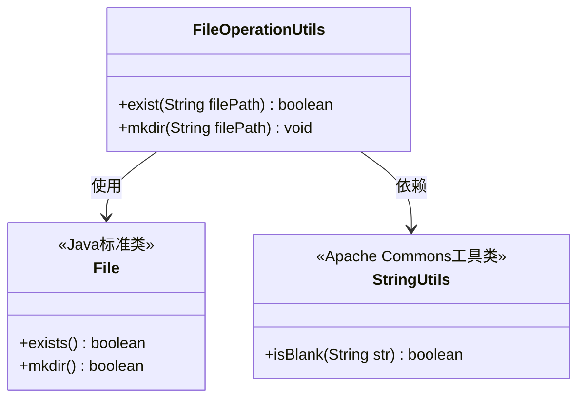
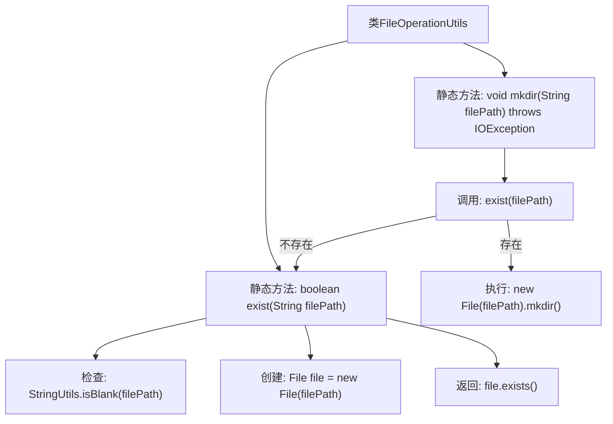

# 基础信息

|      |      |
|------|------|
| 名称 | FileOperationUtils |
| 编码语言 | .java |
| 代码路径 | WeFe/common/java/common-cert/src/main/java/com/webank/cert/toolkit/utils/FileOperationUtils.java |
| 包名 | com.webank.cert.toolkit.utils |
| 依赖项 | ['lombok.extern.slf4j.Slf4j', 'org.apache.commons.lang3.StringUtils', 'java.io.File', 'java.io.IOException'] |
| 概述说明 | FileOperationUtils类提供文件存在检查和创建目录功能，包含exist和mkdir方法。 |

# 说明

这是一个名为FileOperationUtils的Java工具类，提供了两个静态方法用于文件操作。exist方法检查给定路径的文件是否存在，若路径为空则返回false。mkdir方法用于创建目录，若目录已存在则不执行操作，否则创建新目录。类使用了Lombok的@Slf4j注解生成日志对象。

# 类列表 Class Summary

| 名称   | 类型  | 说明 |
|-------|------|-------------|
| FileOperationUtils | class | FileOperationUtils类提供文件存在检查和创建目录功能，包含exist和mkdir方法。exist检查文件路径是否存在，mkdir创建目录（若不存在）。 |

## 类 FileOperationUtils

|      |      |
|------|------|
| 访问范围 | @Slf4j;public |
| 类型 | class |
| 名称 | FileOperationUtils |
| 说明 | FileOperationUtils类提供文件存在检查和创建目录功能，包含exist和mkdir方法。exist检查文件路径是否存在，mkdir创建目录（若不存在）。 |

### UML类图

类图描述：FileOperationUtils 是一个文件操作工具类，提供检查文件是否存在(exist)和创建目录(mkdir)的静态方法。它依赖于Java标准类File进行底层文件操作，并使用Apache Commons的StringUtils工具类进行字符串空值检查。exist方法先校验路径非空再检查文件存在性；mkdir方法在目录不存在时才创建，体现了防御性编程思想。

### 内部方法调用关系图

流程图描述：该流程图展示了FileOperationUtils类的两个核心方法。exist()方法首先检查文件路径是否为空，然后创建File对象并返回是否存在；mkdir()方法先调用exist()检查路径存在性，仅在路径不存在时创建目录。流程清晰展现了方法间的调用关系和条件判断逻辑，体现了对文件操作的安全性和异常处理机制。

### 字段列表 Field List

| 名称  | 类型  | 说明 |
|-------|-------|------|

### 方法列表

| 名称  | 类型  | 说明 |
|-------|-------|------|
| mkdir | void | 静态方法mkdir检查文件路径是否存在，不存在则创建目录。若路径已存在则直接返回。可能抛出IOException。 |
| exist | boolean | 检查文件路径是否存在，空路径返回false。 |

