# 基础信息

|      |      |
|------|------|
| 名称 | KeyUtils |
| 编码语言 | .java |
| 代码路径 | WeFe/common/java/common-cert/src/main/java/com/webank/cert/toolkit/utils/KeyUtils.java |
| 包名 | com.webank.cert.toolkit.utils |
| 依赖项 | ['java.io.ByteArrayOutputStream', 'java.io.IOException', 'java.io.OutputStreamWriter', 'java.math.BigInteger', 'java.security.InvalidAlgorithmParameterException', 'java.security.KeyFactory', 'java.security.KeyPair', 'java.security.KeyPairGenerator', 'java.security.NoSuchAlgorithmException', 'java.security.NoSuchProviderException', 'java.security.PrivateKey', 'java.security.PublicKey', 'java.security.SecureRandom', 'java.security.interfaces.ECPrivateKey', 'java.security.spec.ECGenParameterSpec', 'java.security.spec.ECParameterSpec', 'java.security.spec.ECPoint', 'java.security.spec.ECPublicKeySpec', 'java.security.spec.InvalidKeySpecException', 'java.security.spec.PKCS8EncodedKeySpec', 'java.security.spec.RSAPrivateKeySpec', 'java.security.spec.RSAPublicKeySpec', 'java.security.spec.X509EncodedKeySpec', 'java.util.Collections', 'org.apache.commons.codec.binary.Base64', 'org.bouncycastle.crypto.AsymmetricCipherKeyPair', 'org.bouncycastle.crypto.generators.ECKeyPairGenerator', 'org.bouncycastle.crypto.params.ECDomainParameters', 'org.bouncycastle.crypto.params.ECKeyGenerationParameters', 'org.bouncycastle.jcajce.provider.asymmetric.ec.BCECPrivateKey', 'org.bouncycastle.jce.provider.BouncyCastleProvider', 'org.bouncycastle.math.ec.custom.gm.SM2P256V1Curve', 'org.bouncycastle.openssl.PEMKeyPair', 'org.bouncycastle.util.io.pem.PemObject', 'org.bouncycastle.util.io.pem.PemWriter', 'org.slf4j.Logger', 'org.slf4j.LoggerFactory'] |
| 概述说明 | KeyUtils类提供多种密钥生成与转换功能，包括RSA、ECDSA、SM2密钥对生成，PKCS8与PEM格式转换，以及公私钥提取与处理。 |

# 说明

KeyUtils类是一个用于生成和管理密钥对的工具类，支持多种加密算法包括RSA、ECDSA和SM2。该类定义了SM2椭圆曲线参数，包括曲线、基点、阶数和余因子，并提供了生成RSA、ECDSA和SM2密钥对的方法。此外，还包含将PKCS8格式的私钥转换为EC私钥或PEM格式的功能，以及从PEM字符串或私钥生成公钥的方法。类中还实现了获取RSA和EC密钥对的功能，支持从PEM字符串解析密钥对，并提供了相关的辅助方法如查找命名曲线参数等。

# 类列表 Class Summary

| 名称   | 类型  | 说明 |
|-------|------|-------------|
| KeyUtils | class | KeyUtils类提供多种密钥生成与转换功能，包括RSA、ECDSA、SM2密钥对生成，PKCS8转PEM格式，以及公私钥转换等操作。 |

## 类 KeyUtils

|      |      |
|------|------|
| 访问范围 | public |
| 类型 | class |
| 名称 | KeyUtils |
| 说明 | KeyUtils类提供多种密钥生成与转换功能，包括RSA、ECDSA、SM2密钥对生成，PKCS8转PEM格式，以及公私钥转换等操作。 |

### UML类图

```mermaid
classDiagram
    class KeyUtils {
        +SM2P256V1Curve CURVE
        +BigInteger SM2_ECC_GX
        +BigInteger SM2_ECC_GY
        +BigInteger SM2_ECC_N
        +BigInteger SM2_ECC_H
        +ECPoint G_POINT
        +ECDomainParameters DOMAIN_PARAMS
        -String PEM_STRING_ECPRIVATEKEY
        -SecureRandom random
        -Logger LOG
        +KeyPair generateKeyPair()
        +KeyPair generateECDSAKeyPair() throws NoSuchProviderException, NoSuchAlgorithmException, InvalidAlgorithmParameterException
        +KeyPair generateSM2KeyPair() throws NoSuchProviderException, NoSuchAlgorithmException, InvalidAlgorithmParameterException
        +AsymmetricCipherKeyPair generateSM2KeyPairParameter()
        +KeyPair generateECKeyPair(ECDomainParameters domainParameters, SecureRandom random) throws NoSuchProviderException, NoSuchAlgorithmException, InvalidAlgorithmParameterException
        +AsymmetricCipherKeyPair generateKeyPairParameter(ECDomainParameters domainParameters, SecureRandom random)
        +BCECPrivateKey convertPKCS8ToECPrivateKey(byte[] pkcs8Key) throws NoSuchAlgorithmException, NoSuchProviderException, InvalidKeySpecException
        +String convertECPrivateKeyPKCS8ToPEM(byte[] encodedKey) throws IOException
        -String convertEncodedDataToPEM(String type, byte[] encodedData) throws IOException
        +PublicKey getRSAPublicKey(String key) throws Exception
        +PrivateKey getRSAPrivateKey(String key) throws Exception
        +PublicKey getRSAPublicKey(PrivateKey privateKey) throws Exception
        +KeyPair getECKeyPair(String privateStr) throws Exception
        +KeyPair getRSAKeyPair(String privateStr) throws Exception
        +PublicKey getPublicKey(ECPrivateKey privateKey) throws InvalidKeySpecException, NoSuchAlgorithmException, NoSuchProviderException
        -ECParameterSpec tryFindNamedCurveSpec(ECParameterSpec params)
    }

    class SM2P256V1Curve {
        <<External>>
    }

    class ECDomainParameters {
        <<External>>
    }

    class SecureRandom {
        <<External>>
    }

    class Logger {
        <<Interface>>
    }

    class KeyPairGenerator {
        <<External>>
    }

    class ECGenParameterSpec {
        <<External>>
    }

    class BouncyCastleProvider {
        <<External>>
    }

    class PKCS8EncodedKeySpec {
        <<External>>
    }

    class KeyFactory {
        <<External>>
    }

    class PemWriter {
        <<External>>
    }

    class X509EncodedKeySpec {
        <<External>>
    }

    class RSAPrivateKeySpec {
        <<External>>
    }

    class RSAPublicKeySpec {
        <<External>>
    }

    class PEMKeyPair {
        <<External>>
    }

    class ECPrivateKey {
        <<Interface>>
    }

    class ECPublicKeySpec {
        <<External>>
    }

    KeyUtils --> SM2P256V1Curve : 使用
    KeyUtils --> ECDomainParameters : 使用
    KeyUtils --> SecureRandom : 使用
    KeyUtils --> Logger : 使用
    KeyUtils --> KeyPairGenerator : 使用
    KeyUtils --> ECGenParameterSpec : 使用
    KeyUtils --> BouncyCastleProvider : 使用
    KeyUtils --> PKCS8EncodedKeySpec : 使用
    KeyUtils --> KeyFactory : 使用
    KeyUtils --> PemWriter : 使用
    KeyUtils --> X509EncodedKeySpec : 使用
    KeyUtils --> RSAPrivateKeySpec : 使用
    KeyUtils --> RSAPublicKeySpec : 使用
    KeyUtils --> PEMKeyPair : 使用
    KeyUtils --> ECPrivateKey : 使用
    KeyUtils --> ECPublicKeySpec : 使用
```

这段类图展示了KeyUtils工具类的结构和它与其他外部类的关系。KeyUtils是一个功能丰富的密钥工具类，主要用于生成各种加密算法的密钥对（RSA、ECDSA、SM2等），以及进行密钥格式转换（如PKCS8到PEM的转换）。它依赖于多个外部加密相关类（如SM2P256V1Curve、ECDomainParameters等）和Java安全API（如KeyPairGenerator、KeyFactory等）。该类通过静态方法和常量提供密钥操作功能，同时使用BouncyCastle加密库实现部分功能。类图中清晰地展示了KeyUtils与这些外部组件的依赖关系。

### 内部方法调用关系图

```mermaid
graph TD
    A["类KeyUtils"]
    B["常量: SM2P256V1Curve CURVE"]
    C["常量: BigInteger SM2_ECC_GX/GY/N/H"]
    D["常量: ECPoint G_POINT"]
    E["常量: ECDomainParameters DOMAIN_PARAMS"]
    F["方法: KeyPair generateKeyPair()"]
    G["方法: KeyPair generateECDSAKeyPair()"]
    H["方法: KeyPair generateSM2KeyPair()"]
    I["方法: AsymmetricCipherKeyPair generateSM2KeyPairParameter()"]
    J["方法: KeyPair generateECKeyPair()"]
    K["方法: AsymmetricCipherKeyPair generateKeyPairParameter()"]
    L["方法: BCECPrivateKey convertPKCS8ToECPrivateKey()"]
    M["方法: String convertECPrivateKeyPKCS8ToPEM()"]
    N["方法: PublicKey getRSAPublicKey()"]
    O["方法: PrivateKey getRSAPrivateKey()"]
    P["方法: KeyPair getECKeyPair()"]
    Q["方法: KeyPair getRSAKeyPair()"]
    R["方法: PublicKey getPublicKey()"]
    S["私有方法: ECParameterSpec tryFindNamedCurveSpec()"]

    A --> B
    A --> C
    A --> D
    A --> E
    A --> F
    A --> G
    A --> H
    A --> I
    A --> J
    A --> K
    A --> L
    A --> M
    A --> N
    A --> O
    A --> P
    A --> Q
    A --> R
    R --> S
```

这段代码是KeyUtils工具类，主要用于生成和管理各种加密算法的密钥对，包括RSA、ECDSA、SM2等。它提供了密钥生成、转换和PEM格式处理功能，使用BouncyCastle库实现椭圆曲线加密相关操作。类中包含多个静态方法，可处理PKCS8标准的私钥转换、PEM格式转换以及从私钥推导公钥等操作，同时定义了SM2算法的标准曲线参数和域参数。

### 字段列表 Field List

| 名称  | 类型  | 说明 |
|-------|-------|------|
| SM2_ECC_N = CURVE.getOrder() | BigInteger | 定义SM2椭圆曲线算法的阶为常量SM2_ECC_N，其值取自CURVE对象的阶属性。 |
| SM2_ECC_GX = new BigInteger(			"32C4AE2C1F1981195F9904466A39C9948FE30BBFF2660BE1715A4589334C74C7", 16) | BigInteger | 定义SM2椭圆曲线参数GX的16进制常量值。 |
| SM2_ECC_H = CURVE.getCofactor() | BigInteger | 该代码定义了一个不可变的静态BigInteger常量SM2_ECC_H，其值为椭圆曲线CURVE的余因子。 |
| G_POINT = CURVE.createPoint(SM2_ECC_GX, SM2_ECC_GY) | org.bouncycastle.math.ec.ECPoint | 定义SM2椭圆曲线基点G，使用给定坐标(GX, GY)创建ECPoint对象。 |
| LOG = LoggerFactory.getLogger(KeyUtils.class) | Logger | KeyUtils类中定义了一个受保护的静态final日志对象LOG，用于记录日志。 |
| CURVE = new SM2P256V1Curve() | SM2P256V1Curve | 定义了一个静态不可变的SM2P256V1椭圆曲线对象CURVE。 |
| PEM_STRING_ECPRIVATEKEY = "EC PRIVATE KEY" | String | 定义常量字符串"EC PRIVATE KEY"用于标识EC私钥。 |
| DOMAIN_PARAMS = new ECDomainParameters(CURVE, G_POINT,			SM2_ECC_N, SM2_ECC_H) | ECDomainParameters | 定义SM2椭圆曲线域参数：曲线、基点、阶和余因子。 |
| SM2_ECC_GY = new BigInteger(			"BC3736A2F4F6779C59BDCEE36B692153D0A9877CC62A474002DF32E52139F0A0", 16) | BigInteger | SM2椭圆曲线参数GY，16进制值BC3736A2F4F6779C59BDCEE36B692153D0A9877CC62A474002DF32E52139F0A0。 |
| random = new SecureRandom() | SecureRandom | 声明一个私有静态不可变的SecureRandom实例random，用于生成安全随机数。 |

### 方法列表

| 名称  | 类型  | 说明 |
|-------|-------|------|
| generateECKeyPair | KeyPair | 该方法使用BouncyCastle库生成基于椭圆曲线参数的密钥对，包括初始化密钥生成器并返回密钥对。 |
| generateSM2KeyPairParameter | AsymmetricCipherKeyPair | 生成SM2密钥对参数，调用generateKeyPairParameter方法，传入预设参数和随机数。 |
| generateKeyPair | KeyPair | 生成2048位RSA密钥对，捕获NoSuchAlgorithmException异常并记录错误日志。 |
| convertECPrivateKeyPKCS8ToPEM | String | 将PKCS8格式的EC私钥转换为PEM格式。输入为字节数组，输出为PEM字符串。 |
| generateECDSAKeyPair | KeyPair | 生成ECDSA密钥对，使用secp256k1曲线和Bouncy Castle提供者。 |
| generateKeyPairParameter | AsymmetricCipherKeyPair | 生成ECDSA密钥对：使用域参数和随机数初始化密钥生成器，生成并返回非对称密钥对。 |
| getRSAPublicKey | PublicKey | 该方法将Base64编码的RSA公钥字符串转换为PublicKey对象，使用X509标准解码并生成密钥。 |
| convertEncodedDataToPEM | String | 将字节数组编码数据转换为PEM格式字符串，使用指定类型并确保资源关闭。 |
| convertPKCS8ToECPrivateKey | BCECPrivateKey | 将PKCS8格式的私钥转换为EC私钥，使用BouncyCastle提供者处理异常。 |
| generateSM2KeyPair | KeyPair | 生成SM2密钥对的方法，使用BouncyCastleProvider和sm2p256v1参数，返回KeyPair对象。 |
| getRSAPrivateKey | PrivateKey | Java方法：从字符串获取RSA私钥，移除头尾标记后Base64解码，通过PKCS8规范生成私钥对象。 |
| getRSAPublicKey | PublicKey | 该方法通过RSA私钥生成对应的公钥，使用固定指数65537和私钥模数创建公钥规范，最终返回公钥实例。 |
| getECKeyPair | KeyPair | 该方法通过PEM字符串生成EC密钥对：解析PEM字符串为对象，使用EC算法从私钥信息生成私钥，再基于私钥生成公钥，最后返回密钥对。 |
| getRSAKeyPair | KeyPair | 该方法通过PEM字符串生成RSA密钥对，包括私钥和公钥。若PEM转换失败则抛出异常，成功则返回密钥对。 |
| getPublicKey | PublicKey | 该方法通过EC私钥生成对应公钥：转换参数规格，计算曲线点，构建公钥规范并返回EC公钥实例。处理中可能抛出无效密钥、算法或提供者异常。 |
| tryFindNamedCurveSpec | ECParameterSpec | 方法尝试将ECParameterSpec转换为命名曲线规格，通过比较参数匹配后返回对应的ECNamedCurveSpec，否则返回原参数。 |

