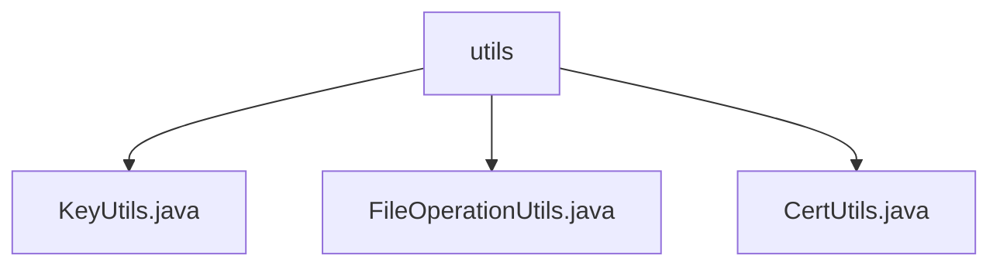

# 基础信息

|      |      |
|------|------|
| 名称 | utils |
| 编码语言 | .java |
| 代码路径 | WeFe/common/java/common-cert/src/main/java/com/webank/cert/toolkit/utils |
| 包名 | docs.common.java.common-cert.src.main.java.com.webank.cert.toolkit.utils |
| 概述说明 | KeyUtils类支持RSA、ECDSA和SM2密钥对生成及转换。FileOperationUtils类提供文件存在检查和目录创建功能。CertUtils类处理证书密钥读写及转换，支持PFX、JKS和PEM格式。 |

# 说明

## 概述  
该模块是密码学安全工具集，核心职责是密钥对管理、证书操作和基础文件处理。接口规范涵盖密钥生成（支持RSA/ECDSA/SM2算法）、证书解析（PFX/JKS格式）、文件操作（存在性检查/目录创建）等。关键数据结构包括SM2椭圆曲线参数、PKCS8私钥格式和PEM编码对象。外部依赖主要为BouncyCastle安全库和Lombok日志工具。例如KeyUtils实现SM2密钥对生成，CertUtils处理PFX证书解析，FileOperationUtils提供原子化文件操作。

## 主要业务场景  
模块适用于数字证书全生命周期管理，类似PKI体系的轻量级实现。业务流程包括：密钥生成→证书签发→持久化存储，支持国密SM2和国际标准算法。交互模式通过工具类静态方法暴露，如CertUtils.readPfx()读取证书链。典型应用如SSL证书部署，需组合使用KeyUtils生成密钥对、CertUtils转换格式、FileOperationUtils创建目录。API类型涵盖密码学操作（如ECDSA签名验证）和IO操作（如PEM文件写入）。

### 包内部结构视图

该流程图展示了`utils`目录下的三个工具类文件：`KeyUtils.java`、`FileOperationUtils.java`和`CertUtils.java`。所有文件均直接隶属于`utils`目录，没有更深层级的嵌套结构，呈现了清晰的平级关系。这种结构常用于存放功能相关的工具类集合。

# 文件列表

| 名称   | 类型  | 说明 |
|-------|------|-------------|
| [KeyUtils.java](KeyUtils.md) | file | KeyUtils类提供多种密钥生成与转换功能，包括RSA、ECDSA、SM2密钥对生成，PKCS8与PEM格式转换，以及公私钥提取与处理。 |
| [FileOperationUtils.java](FileOperationUtils.md) | file | FileOperationUtils类提供文件存在检查和创建目录功能，包含exist和mkdir方法。 |
| [CertUtils.java](CertUtils.md) | file | CertUtils类提供证书和密钥操作功能，包括读取PFX/JKS私钥、生成密钥标识符、导入导出证书、PEM/DER格式转换等。支持BouncyCastle加密库，处理X509证书、PKCS10请求和CRL列表。 |

