# 基础信息

|      |      |
|------|------|
| 名称 | welab |
| 编码语言 | .java |
| 代码路径 | WeFe/common/java/common-data-mongodb/src/main/java/com/welab |
| 包名 | docs.common.java.common-data-mongodb.src.main.java.com.welab |
| 概述说明 | MongoDB数据访问层提供CRUD和复杂查询功能，支持逻辑删除和时间戳约束。包含短信业务分类、供应商枚举管理。工具集支持链式查询构建和聚合操作。联邦学习平台实现日志、证书和数据治理。统一查询管理数据集和成员认证。连接管理模块动态注册MongoDB组件。 |

# 说明

## 概述  
该模块是联邦学习平台的核心数据管理组件，基于MongoDB实现多领域数据的统一存储与操作，类似数据总线模式。核心职责包括：1) 通过标准化CRUD接口管理20+业务实体（如证书、数据集）；2) 提供复杂查询构建工具和聚合操作支持；3) 统一连接管理与事务控制。  

接口规范分层设计：基础层（AbstractMongoModel/Repo）定义主键和序列化规则，业务层扩展特定操作（如版本控制）。关键数据结构含分页对象PageOutput、证书PEM内容、数据集权限模型等。外部依赖包括Spring Data MongoDB、QueryBuilder和MongoDB驱动。例如RealnameAuthAgreementTemplateMongoRepo实现乐观锁更新，QueryBuilder支持范围筛选。  

## 主要业务场景  
模块支撑四大典型场景：1) 数据治理（如DataSet权限控制），类似RBAC模型；2) 操作审计（记录API调用日志）；3) 联邦资源检索（多条件分页查询）；4) 证书全生命周期管理。业务流程涵盖：通过枚举选择短信模板、链式构建更新条件、聚合管道处理数据集权限。  

交互模式以DTO传输和API组合为主，例如ImageDataSetMongoReop联合标签表查询，AccountMongoRepo实现活跃度检测。功能完整性体现在覆盖数据全生命周期（元数据→使用统计），典型应用包括任务配置时的资源选择器、节点资质校验等。API类型含CRUD操作（如certStatus更新）和配置类（@Configuration），集成案例可见区块同步服务的高度记录。

### 包内部结构视图

```mermaid
graph TD
    wefe --> common
    common --> data
    data --> mongodb
    mongodb --> repo
    mongodb --> constant
    mongodb --> util
    mongodb --> entity
    mongodb --> dto
    mongodb --> config
    repo --> RealnameAuthAgreementTemplateMongoRepo.java
    repo --> DataSetDefaultTagMongoRepo.java
    repo --> BlockSyncDetailInfoMongoRepo.java
    repo --> TrustCertsMongoRepo.java
    repo --> UnionOperationLogMongoRepo.java
    repo --> MemberFileInfoMongoRepo.java
    repo --> BlockSyncContractHeightMongoRepo.java
    repo --> CertRequestInfoRepo.java
    repo --> TableDataSetMongoReop.java
    repo --> ImageDataSetMongoReop.java
    repo --> AbstractDataSetMongoRepo.java
    repo --> DataResourceDefaultTagMongoRepo.java
    repo --> CertKeyInfoRepo.java
    repo --> DataSetMongoReop.java
    repo --> MemberServiceMongoReop.java
    repo --> UnionNodeConfigMongoRepo.java
    repo --> MemberAuthTypeMongoRepo.java
    repo --> DataSetMemberPermissionMongoRepo.java
    repo --> UnionNodeMongoRepo.java
    repo --> ManagerOperationLogMongoRepo.java
    repo --> DataResourceMongoReop.java
    repo --> AccountMongoRepo.java
    repo --> BlockSyncHeightMongoReop.java
    repo --> AbstractOperationLogMongoRepo.java
    repo --> MemberMongoReop.java
    repo --> DataResourceLazyUpdateModelMongoReop.java
    repo --> AbstractMongoRepo.java
    repo --> BloomFilterMongoReop.java
    repo --> CertInfoRepo.java
    constant --> SmsBusinessType.java
    constant --> SmsSupplierEnum.java
    constant --> MongodbTable.java
    util --> UpdateBuilder.java
    util --> AddFieldsOperation.java
    util --> QueryBuilder.java
    entity --> common
    entity --> manager
    entity --> union
    entity --> base
    common --> OperationLog.java
    manager --> CertInfo.java
    manager --> CertRequestInfo.java
    manager --> Account.java
    manager --> CertKeyInfo.java
    union --> ext
    union --> DataResourceDefaultTag.java
    union --> TableDataSet.java
    union --> TrustCerts.java
    union --> RealnameAuthAgreementTemplate.java
    union --> DataResourceLazyUpdateModel.java
    union --> MemberFileInfo.java
    union --> DataSet.java
    union --> BloomFilter.java
    union --> BlockSyncHeight.java
    union --> UnionNode.java
    union --> BlockSyncDetailInfo.java
    union --> BlockSyncContractHeight.java
    union --> DataResource.java
    union --> TransactionResponseDetailInfo.java
    union --> MemberAuthType.java
    union --> DataSetMemberPermission.java
    union --> ImageDataSet.java
    union --> MemberService.java
    union --> Member.java
    union --> DataSetDefaultTag.java
    union --> UnionNodeSm2Config.java
    ext --> DataSetDefaultTagExtJSON.java
    ext --> MemberServiceExtJSON.java
    ext --> MemberAuthTypeExtJSON.java
    ext --> TableDataSetExtJSON.java
    ext --> RealnameAuthAgreementTemplateExtJSON.java
    ext --> BloomFilterExtJSON.java
    ext --> MemberExtJSON.java
    ext --> DataSetMemberPermissionExtJSON.java
    ext --> ImageDataSetExtJSON.java
    ext --> UnionNodeExtJSON.java
    ext --> RealnameAuthFileInfo.java
    ext --> MemberFileInfoExtJSON.java
    ext --> DataResourceDefaultTagExtJSON.java
    ext --> DataResourceExtJSON.java
    ext --> TrustCertsExtJSON.java
    ext --> DataSetExtJSON.java
    base --> AbstractBlockChainBusinessModel.java
    base --> AbstractMongoModel.java
    base --> AbstractUnionNodeConfigMongoModel.java
    base --> AbstractNormalMongoModel.java
    dto --> dataresource
    dto --> dataset
    dto --> member
    dto --> PageOutput.java
    dto --> PageInput.java
    dto --> AbstractQueryOutput.java
    dataresource --> DataResourceQueryInput.java
    dataresource --> DataResourceQueryOutput.java
    dataset --> ImageDataSetQueryOutput.java
    dataset --> DataSetQueryOutput.java
    dataset --> DataSetQueryInput.java
    dataset --> TableDataSetQueryInput.java
    dataset --> DataSetTagsQueryOutput.java
    dataset --> ImageDataSetQueryInput.java
    member --> RealnameAuthInfoQueryOutput.java
    member --> MemberAuthQueryOutput.java
    member --> MemberServiceQueryOutput.java
    config --> MongoManagerConfig.java
    config --> AbstractConfig.java
    config --> MongoUnionConfig.java
```

该流程图展示了WeFe项目中common-data-mongodb模块的完整层级结构，从顶层包wefe开始逐级展开，包含repo、constant、util、entity、dto和config等主要子模块。其中entity模块进一步细分为common、manager、union和base等子模块，union模块又包含ext扩展模块。整个结构清晰地呈现了MongoDB相关代码的组织方式，包含大量实体类、仓库接口和工具类。

# 文件列表

| 名称   | 类型  | 说明 |
|-------|------|-------------|
| [wefe](wefe/_module.md) | package | MongoDB数据访问层提供CRUD和复杂查询功能，支持逻辑删除和时间戳约束。包含短信业务分类、供应商枚举管理。工具集支持链式查询构建和聚合操作。联邦学习平台实现日志、证书和数据治理。统一查询管理数据集和成员认证。连接管理模块动态注册MongoDB组件。 |

