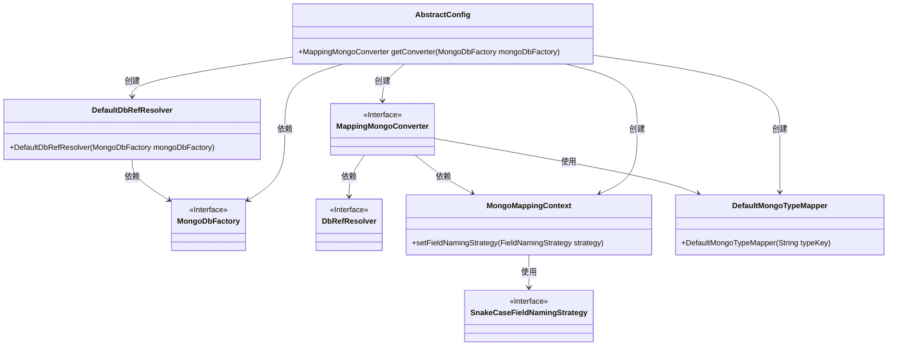
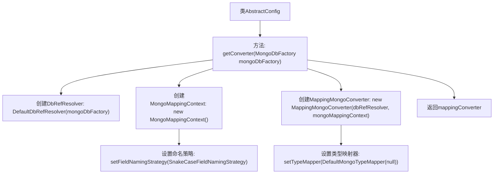

# 基础信息

|      |      |
|------|------|
| 名称 | AbstractConfig |
| 编码语言 | .java |
| 代码路径 | WeFe/common/java/common-data-mongodb/src/main/java/com/welab/wefe/common/data/mongodb/config/AbstractConfig.java |
| 包名 | com.welab.wefe.common.data.mongodb.config |
| 依赖项 | ['org.springframework.data.mapping.model.SnakeCaseFieldNamingStrategy', 'org.springframework.data.mongodb.MongoDbFactory', 'org.springframework.data.mongodb.core.convert.DbRefResolver', 'org.springframework.data.mongodb.core.convert.DefaultDbRefResolver', 'org.springframework.data.mongodb.core.convert.DefaultMongoTypeMapper', 'org.springframework.data.mongodb.core.convert.MappingMongoConverter', 'org.springframework.data.mongodb.core.mapping.MongoMappingContext'] |
| 概述说明 | 抽象配置类提供获取MongoDB转换器方法，包含引用解析器、映射上下文（设置蛇形命名策略），并移除默认_class字段以优化存储视图。 |

# 说明

这段内容描述了一个名为AbstractConfig的类中的方法getConverter，该方法用于创建并配置一个MappingMongoConverter对象。方法接收一个MongoDbFactory参数，首先创建一个DbRefResolver和MongoMappingContext实例。MongoMappingContext设置了字段命名策略为SnakeCaseFieldNamingStrategy，实现下划线到驼峰命名的转换。接着使用这些组件初始化MappingMongoConverter，并通过设置DefaultMongoTypeMapper为null来禁用默认的_class字段添加功能，以避免影响视觉效果。最后返回配置好的MappingMongoConverter实例。

# 类列表 Class Summary

| 名称   | 类型  | 说明 |
|-------|------|-------------|
| AbstractConfig | class | 抽象配置类提供方法创建MongoDB转换器，设置字段命名策略为下划线转驼峰，并移除默认的_class字段以保持数据简洁。 |

## 类 AbstractConfig

|      |      |
|------|------|
| 访问范围 | public |
| 类型 | class |
| 名称 | AbstractConfig |
| 说明 | 抽象配置类提供方法创建MongoDB转换器，设置字段命名策略为下划线转驼峰，并移除默认的_class字段以保持数据简洁。 |

### UML类图

这段代码展示了一个抽象配置类`AbstractConfig`，它负责创建并配置一个`MappingMongoConverter`对象。该转换器用于MongoDB的数据映射，通过`DefaultDbRefResolver`解析数据库引用，使用`MongoMappingContext`设置字段命名策略（蛇形转驼峰），并通过`DefaultMongoTypeMapper`移除默认的`_class`字段。类图清晰地展示了各组件间的依赖关系和创建流程。

### 内部方法调用关系图

这段流程图展示了AbstractConfig类中getConverter方法的执行流程。方法首先创建DbRefResolver和MongoMappingContext实例，然后为映射上下文设置蛇形命名策略，接着创建MappingMongoConverter并配置类型映射器以移除默认的_class字段，最后返回配置好的转换器。整个过程清晰地呈现了MongoDB数据转换器的初始化配置步骤。

### 字段列表 Field List

| 名称  | 类型  | 说明 |
|-------|-------|------|

### 方法列表

| 名称  | 类型  | 说明 |
|-------|-------|------|
| getConverter | MappingMongoConverter | 创建MongoDB转换器，使用下划线转驼峰命名策略，并移除默认的_class字段。 |

