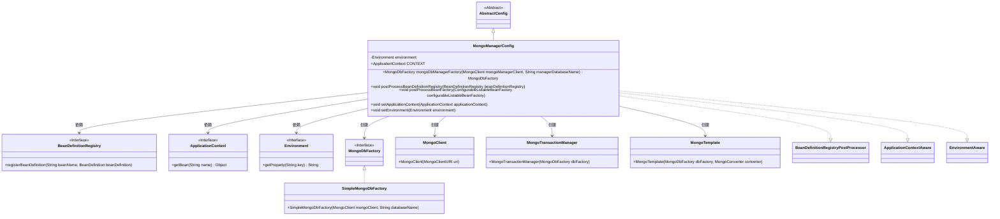

# 基础信息

|      |      |
|------|------|
| 名称 | MongoManagerConfig |
| 编码语言 | .java |
| 代码路径 | WeFe/common/java/common-data-mongodb/src/main/java/com/welab/wefe/common/data/mongodb/config/MongoManagerConfig.java |
| 包名 | com.welab.wefe.common.data.mongodb.config |
| 依赖项 | ['com.mongodb.MongoClient', 'com.mongodb.MongoClientURI', 'org.apache.commons.lang3.StringUtils', 'org.springframework.beans.BeansException', 'org.springframework.beans.factory.config.BeanDefinition', 'org.springframework.beans.factory.config.ConfigurableListableBeanFactory', 'org.springframework.beans.factory.support.BeanDefinitionBuilder', 'org.springframework.beans.factory.support.BeanDefinitionRegistry', 'org.springframework.beans.factory.support.BeanDefinitionRegistryPostProcessor', 'org.springframework.context.ApplicationContext', 'org.springframework.context.ApplicationContextAware', 'org.springframework.context.EnvironmentAware', 'org.springframework.context.annotation.Configuration', 'org.springframework.core.env.Environment', 'org.springframework.data.mongodb.MongoDbFactory', 'org.springframework.data.mongodb.MongoTransactionManager', 'org.springframework.data.mongodb.core.MongoTemplate', 'org.springframework.data.mongodb.core.SimpleMongoDbFactory'] |
| 概述说明 | MongoDB配置类，注册MongoClient、事务管理器和模板Bean，通过环境变量获取连接信息。 |

# 说明

该配置类MongoManagerConfig继承AbstractConfig并实现多个Spring接口，用于管理MongoDB相关Bean的注册和配置。它通过环境变量获取MongoDB连接URI和数据库名，动态注册MongoClient、MongoTransactionManager和MongoTemplate等Bean。类中包含工厂方法创建MongoDbFactory实例，并通过ApplicationContext和Environment进行依赖注入与配置管理。

# 类列表 Class Summary

| 名称   | 类型  | 说明 |
|-------|------|-------------|
| MongoManagerConfig | class | MongoManagerConfig类配置MongoDB客户端、工厂、事务管理和模板，通过环境变量初始化并注册为Spring Bean。 |

## 类 MongoManagerConfig

|      |      |
|------|------|
| 访问范围 | @Configuration;public |
| 类型 | class |
| 名称 | MongoManagerConfig |
| 说明 | MongoManagerConfig类配置MongoDB客户端、工厂、事务管理和模板，通过环境变量初始化并注册为Spring Bean。 |

### UML类图

这段代码是Spring配置类MongoManagerConfig，继承AbstractConfig并实现多个接口，用于管理MongoDB相关Bean的注册和配置。它通过环境变量获取MongoDB连接信息，动态创建MongoClient、事务管理器和MongoTemplate等核心组件，并注册到Spring容器中。类图展示了配置类与各种Spring接口、MongoDB组件之间的依赖和创建关系，体现了Spring容器启动时对MongoDB资源的初始化过程。

### 内部方法调用关系图

这段代码是Spring配置类，用于初始化MongoDB相关组件。主要流程包括：继承抽象类并实现多个接口，通过环境变量配置MongoDB连接信息，动态注册MongoClient、MongoTransactionManager和MongoTemplate等Bean。核心方法是postProcessBeanDefinitionRegistry，它会检查配置有效性后依次创建并注册这些组件，形成完整的MongoDB事务管理链。

### 字段列表 Field List

| 名称  | 类型  | 说明 |
|-------|-------|------|
| CONTEXT = null | ApplicationContext | 声明一个公共静态变量CONTEXT，类型为ApplicationContext，初始值为null。 |
| environment | Environment | 私有环境变量对象。 |

### 方法列表

| 名称  | 类型  | 说明 |
|-------|-------|------|
| postProcessBeanDefinitionRegistry | void | 该方法根据配置动态注册MongoDB相关Bean：MongoClient、MongoTransactionManager和MongoTemplate，需提供manager.uri和databaseName参数。 |
| postProcessBeanFactory | void | 重写postProcessBeanFactory方法，处理BeanFactory配置，可能抛出BeansException异常。 |
| mongoDbManagerFactory | MongoDbFactory | 该方法创建MongoDbFactory实例，接收MongoClient和数据库名参数。若客户端为空则返回null，否则返回基于参数的新SimpleMongoDbFactory实例。 |
| setApplicationContext | void | 该方法重写setApplicationContext，将传入的Spring应用上下文赋值给静态变量CONTEXT。 |
| setEnvironment | void | 重写setEnvironment方法，将传入的environment赋值给当前实例的同名变量。 |

