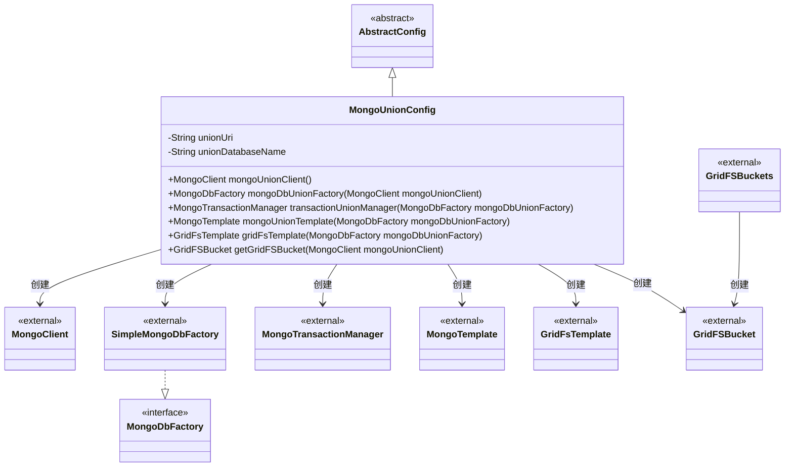
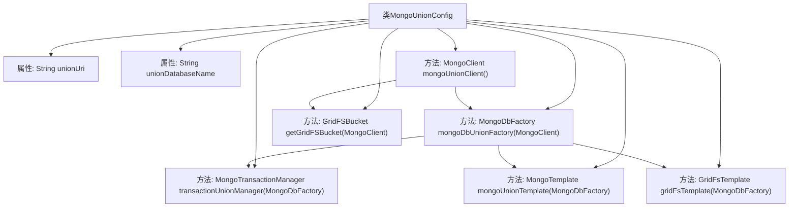

# 基础信息

|      |      |
|------|------|
| 名称 | MongoUnionConfig |
| 编码语言 | .java |
| 代码路径 | WeFe/common/java/common-data-mongodb/src/main/java/com/welab/wefe/common/data/mongodb/config/MongoUnionConfig.java |
| 包名 | com.welab.wefe.common.data.mongodb.config |
| 依赖项 | ['com.mongodb.MongoClient', 'com.mongodb.MongoClientURI', 'com.mongodb.client.MongoDatabase', 'com.mongodb.client.gridfs.GridFSBucket', 'com.mongodb.client.gridfs.GridFSBuckets', 'org.springframework.beans.factory.annotation.Value', 'org.springframework.context.annotation.Bean', 'org.springframework.context.annotation.Configuration', 'org.springframework.data.mongodb.MongoDbFactory', 'org.springframework.data.mongodb.MongoTransactionManager', 'org.springframework.data.mongodb.core.MongoTemplate', 'org.springframework.data.mongodb.core.SimpleMongoDbFactory', 'org.springframework.data.mongodb.gridfs.GridFsTemplate'] |
| 概述说明 | MongoUnionConfig类配置MongoDB连接，包括客户端、工厂、事务管理、模板和GridFS存储。 |

# 说明

该配置类定义了MongoDB联合数据库的连接和操作组件。通过外部配置注入数据库URI和名称，创建MongoClient实例连接数据库。提供MongoDbFactory工厂类管理数据库连接，并配置事务管理器支持事务操作。同时创建MongoTemplate和GridFsTemplate用于数据库操作，以及GridFSBucket处理文件存储功能。所有组件均基于注入的配置参数构建。

# 类列表 Class Summary

| 名称   | 类型  | 说明 |
|-------|------|-------------|
| MongoUnionConfig | class | MongoUnionConfig类配置MongoDB连接，包括客户端、数据库工厂、事务管理、模板及GridFS存储功能。 |

## 类 MongoUnionConfig

|      |      |
|------|------|
| 访问范围 | @Configuration;public |
| 类型 | class |
| 名称 | MongoUnionConfig |
| 说明 | MongoUnionConfig类配置MongoDB连接，包括客户端、数据库工厂、事务管理、模板及GridFS存储功能。 |

### UML类图

该图展示了MongoUnionConfig类继承自AbstractConfig，并创建多个MongoDB相关组件的过程。MongoUnionConfig通过@Value注入配置参数，定义了6个@Bean方法分别创建MongoClient、MongoDbFactory(由SimpleMongoDbFactory实现)、事务管理器、MongoTemplate、GridFsTemplate和GridFSBucket。这些组件之间存在明确的创建依赖关系，形成一个完整的MongoDB数据访问配置体系。

### 内部方法调用关系图

这段代码是一个Spring配置类，用于配置MongoDB的连接和操作相关的Bean。它通过注入URI和数据库名称属性，创建MongoClient连接，并基于此构建MongoDbFactory、事务管理器、MongoTemplate、GridFsTemplate和GridFSBucket等组件。这些组件之间具有明确的依赖关系，如MongoDbFactory依赖于MongoClient，而其他模板和组件又依赖于MongoDbFactory。整个配置流程清晰，确保了MongoDB相关操作的完整性和一致性。

### 字段列表 Field List

| 名称  | 类型  | 说明 |
|-------|-------|------|
| unionDatabaseName | String | 从Spring配置注入MongoDB联合数据库名称到私有变量unionDatabaseName。 |
| unionUri | String | 从Spring配置注入MongoDB联合数据源URI到私有变量unionUri。 |

### 方法列表

| 名称  | 类型  | 说明 |
|-------|-------|------|
| mongoUnionClient | MongoClient | 创建MongoDB客户端Bean，通过指定URI连接数据库。 |
| mongoDbUnionFactory | MongoDbFactory | 定义Spring Bean，创建MongoDB工厂实例，使用指定MongoClient和数据库名称初始化SimpleMongoDbFactory。 |
| transactionUnionManager | MongoTransactionManager | 定义一个MongoDB事务管理器Bean，使用指定的MongoDbFactory实例进行初始化。 |
| mongoUnionTemplate | MongoTemplate | 定义Spring Bean，创建MongoTemplate实例，使用指定MongoDbFactory和转换器。 |
| gridFsTemplate | GridFsTemplate | 定义一个Spring Bean，用于创建GridFsTemplate实例，依赖MongoDbFactory和转换器。 |
| getGridFSBucket | GridFSBucket | 创建GridFSBucket Bean，通过MongoClient获取数据库并生成存储桶实例。 |

