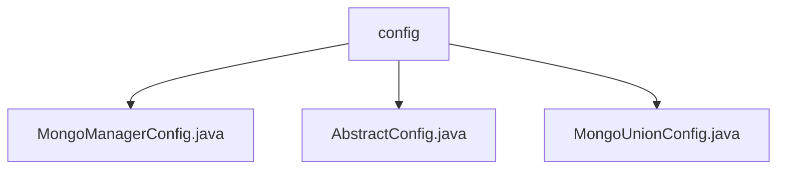

# 基础信息

|      |      |
|------|------|
| 名称 | config |
| 编码语言 | .java |
| 代码路径 | WeFe/common/java/common-data-mongodb/src/main/java/com/welab/wefe/common/data/mongodb/config |
| 包名 | docs.common.java.common-data-mongodb.src.main.java.com.welab.wefe.common.data.mongodb.config |
| 概述说明 | MongoManagerConfig类管理MongoDB Bean注册，动态创建MongoClient等组件。AbstractConfig类的getConverter方法配置MappingMongoConverter，禁用_class字段。MongoUnionConfig类定义MongoDB连接组件，支持事务和文件存储。 |

# 说明

## 概述  
该模块核心职责是统一管理MongoDB连接与操作组件，通过Spring配置动态注册各类Bean。主要实现MongoClient、事务管理器及模板类的创建，支持数据库连接、事务操作和文件存储功能。接口规范包括环境变量注入、工厂方法创建实例（如MongoDbFactory）和类型转换器配置（如禁用_class字段）。关键数据结构含MongoMappingContext（采用SnakeCase命名策略）和DefaultMongoTypeMapper。外部依赖为Spring框架（ApplicationContext/Environment）和MongoDB驱动。例如通过MongoUnionConfig集成GridFSBucket处理文件存储。

## 主要业务场景  
模块适用于需要统一管理MongoDB连接的场景，类似数据库连接池模式。业务流程包括：解析环境变量→创建连接工厂→初始化事务管理器→生成操作模板（如MongoTemplate）。交互模式通过Spring依赖注入实现组件联动，例如MongoManagerConfig组合MongoTransactionManager与MongoTemplate。典型应用如配置多数据源时，通过AbstractConfig的getConverter方法统一字段命名规则。API类型涵盖配置类（@Configuration）和工厂方法，集成案例包括动态构建GridFsTemplate文件操作实例。

### 包内部结构视图

该流程图展示了MongoDB配置模块的文件结构关系。config文件夹下包含三个Java配置文件：MongoManagerConfig.java负责MongoDB连接管理，AbstractConfig.java是抽象配置基类，MongoUnionConfig.java处理联合数据库配置。这些文件共同构成了MongoDB数据访问层的核心配置组件。

# 文件列表

| 名称   | 类型  | 说明 |
|-------|------|-------------|
| [MongoManagerConfig.java](MongoManagerConfig.md) | file | MongoDB配置类，注册MongoClient、事务管理器和模板Bean，通过环境变量获取连接信息。 |
| [AbstractConfig.java](AbstractConfig.md) | file | 抽象配置类提供获取MongoDB转换器方法，包含引用解析器、映射上下文（设置蛇形命名策略），并移除默认_class字段以优化存储视图。 |
| [MongoUnionConfig.java](MongoUnionConfig.md) | file | MongoUnionConfig类配置MongoDB连接，包括客户端、工厂、事务管理、模板和GridFS存储。 |

