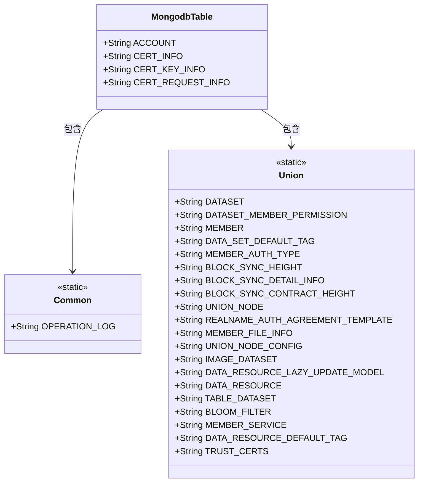

# 基础信息

|      |      |
|------|------|
| 名称 | MongodbTable |
| 编码语言 | .java |
| 代码路径 | WeFe/common/java/common-data-mongodb/src/main/java/com/welab/wefe/common/data/mongodb/constant/MongodbTable.java |
| 包名 | com.welab.wefe.common.data.mongodb.constant |
| 依赖项 | [] |
| 概述说明 | MongodbTable类定义了MongoDB集合名称常量，包含通用操作日志、联盟数据集、成员权限、节点配置等关键表名。 |

# 说明

该代码定义了一个名为MongodbTable的Java类，包含多个静态内部类和常量字符串字段，用于表示MongoDB集合名称。Common内部类包含操作日志集合名称，Union内部类包含数据集、成员权限、节点配置等20多个集合名称常量。类还直接定义了账户、证书信息等4个集合名称字符串常量。这些常量用于统一管理MongoDB集合命名，避免硬编码。

# 类列表 Class Summary

| 名称   | 类型  | 说明 |
|-------|------|-------------|
| MongodbTable | class | MongodbTable类定义了MongoDB集合名称，包含Common、Union两个内部类及四个独立字段，涵盖操作日志、数据集、成员权限、区块同步等核心数据表。 |

## 类 MongodbTable

|      |      |
|------|------|
| 访问范围 | public |
| 类型 | class |
| 名称 | MongodbTable |
| 说明 | MongodbTable类定义了MongoDB集合名称，包含Common、Union两个内部类及四个独立字段，涵盖操作日志、数据集、成员权限、区块同步等核心数据表。 |

### UML类图

这段代码定义了一个MongodbTable类，包含两个静态内部类Common和Union，以及四个静态字符串常量。Common类定义了操作日志表名，Union类则定义了20多个与数据集、成员权限、区块链同步等相关的MongoDB集合名称。整个结构用于集中管理MongoDB集合名称，便于统一维护和使用。类图清晰地展示了MongodbTable与两个内部类的包含关系，以及所有公开常量的定义。

### 内部方法调用关系图

```mermaid
graph TD
    A["类MongodbTable"]
    B["嵌套类Common"]
    C["嵌套类Union"]
    D["常量String: OPERATION_LOG"]
    E["常量String: DATASET"]
    F["常量String: DATASET_MEMBER_PERMISSION"]
    G["常量String: MEMBER"]
    H["常量String: DATA_SET_DEFAULT_TAG"]
    I["常量String: MEMBER_AUTH_TYPE"]
    J["常量String: BLOCK_SYNC_HEIGHT"]
    K["常量String: BLOCK_SYNC_DETAIL_INFO"]
    L["常量String: BLOCK_SYNC_CONTRACT_HEIGHT"]
    M["常量String: UNION_NODE"]
    N["常量String: REALNAME_AUTH_AGREEMENT_TEMPLATE"]
    O["常量String: MEMBER_FILE_INFO"]
    P["常量String: UNION_NODE_CONFIG"]
    Q["常量String: IMAGE_DATASET"]
    R["常量String: DATA_RESOURCE_LAZY_UPDATE_MODEL"]
    S["常量String: DATA_RESOURCE"]
    T["常量String: TABLE_DATASET"]
    U["常量String: BLOOM_FILTER"]
    V["常量String: MEMBER_SERVICE"]
    W["常量String: DATA_RESOURCE_DEFAULT_TAG"]
    X["常量String: TRUST_CERTS"]
    Y["类级常量: ACCOUNT"]
    Z["类级常量: CERT_INFO"]
    AA["类级常量: CERT_KEY_INFO"]
    AB["类级常量: CERT_REQUEST_INFO"]

    A --> B
    A --> C
    A --> Y
    A --> Z
    A --> AA
    A --> AB
    B --> D
    C --> E
    C --> F
    C --> G
    C --> H
    C --> I
    C --> J
    C --> K
    C --> L
    C --> M
    C --> N
    C --> O
    C --> P
    C --> Q
    C --> R
    C --> S
    C --> T
    C --> U
    C --> V
    C --> W
    C --> X
```

该流程图展示了MongodbTable类的完整结构，包含两个嵌套静态类Common和Union，以及四个类级常量。Common类包含OPERATION_LOG常量，Union类包含21个不同用途的数据库表名常量。整体结构清晰地反映了该类作为MongoDB表名集中管理的设计意图，通过嵌套类对表名进行了逻辑分组，便于在项目中统一维护和使用数据库表名。

### 字段列表 Field List

| 名称  | 类型  | 说明 |
|-------|-------|------|
| CERT_REQUEST_INFO = "certRequestInfo" | String | 定义静态常量字符串CERT_REQUEST_INFO，值为"certRequestInfo"。 |
| CERT_INFO = "certInfo" | String | 定义静态常量CERT_INFO，值为"certInfo"。 |
| ACCOUNT = "account" | String | 定义静态常量ACCOUNT，值为"account"。 |
| CERT_KEY_INFO = "certKeyInfo" | String | 定义静态常量CERT_KEY_INFO，值为"certKeyInfo"。 |

### 方法列表

| 名称  | 类型  | 说明 |
|-------|-------|------|

