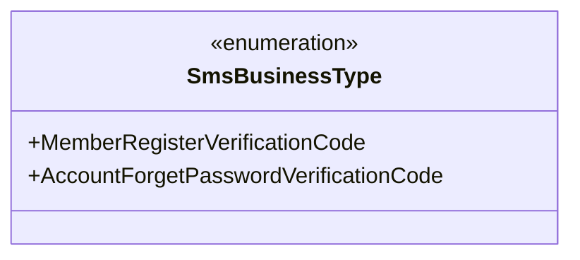
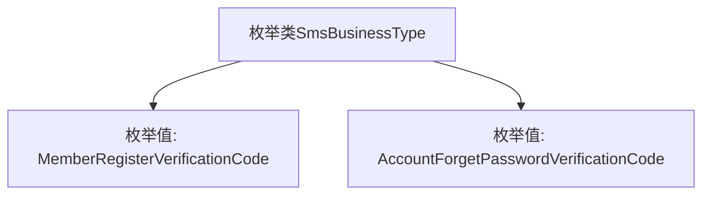

# 基础信息

|      |      |
|------|------|
| 名称 | SmsBusinessType |
| 编码语言 | .java |
| 代码路径 | WeFe/common/java/common-data-mongodb/src/main/java/com/welab/wefe/common/data/mongodb/constant/SmsBusinessType.java |
| 包名 | com.welab.wefe.common.data.mongodb.constant |
| 依赖项 | [] |
| 概述说明 | 枚举SmsBusinessType定义两种短信业务类型：会员注册验证码和账户忘记密码验证码。 |

# 说明

该内容定义了一个名为SmsBusinessType的公共枚举类型，包含两个枚举值：MemberRegisterVerificationCode和AccountForgetPasswordVerificationCode。这两个枚举值分别表示会员注册验证码和账户忘记密码验证码的业务类型，用于区分短信发送的不同场景。

# 类列表 Class Summary

| 名称   | 类型  | 说明 |
|-------|------|-------------|
| SmsBusinessType | enum | 短信业务类型枚举，包含会员注册验证码和账户忘记密码验证码两种类型。 |

## 类 SmsBusinessType

|      |      |
|------|------|
| 访问范围 | public |
| 类型 | enum |
| 名称 | SmsBusinessType |
| 说明 | 短信业务类型枚举，包含会员注册验证码和账户忘记密码验证码两种类型。 |

### UML类图

该枚举类图展示了一个短信业务类型分类系统，定义了两种固定业务场景：会员注册验证码和账户忘记密码验证码。作为枚举类型，它通过预定义的常量值确保类型安全，适用于需要严格限定短信业务场景的系统中，如用户注册、密码找回等需要短信验证的功能模块。枚举成员均为公有静态实例，可直接通过类名访问。

### 内部方法调用关系图

这段代码定义了一个名为SmsBusinessType的枚举类，包含两个枚举值：MemberRegisterVerificationCode（会员注册验证码）和AccountForgetPasswordVerificationCode（账户忘记密码验证码）。该枚举用于表示短信业务类型，通过限定固定值来规范业务场景中的短信类型使用，避免字符串硬编码带来的维护问题。每个枚举值对应一种特定的短信验证场景，便于在代码中明确区分不同业务逻辑。

### 字段列表 Field List

| 名称  | 类型  | 说明 |
|-------|-------|------|

### 方法列表

| 名称  | 类型  | 说明 |
|-------|-------|------|

