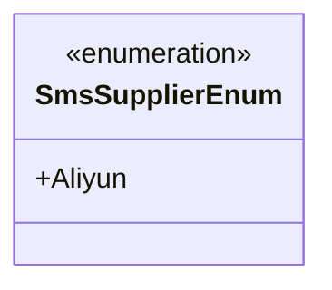
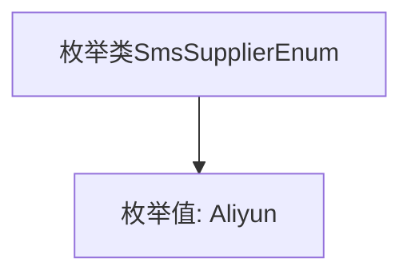

# 基础信息

|      |      |
|------|------|
| 名称 | SmsSupplierEnum |
| 编码语言 | .java |
| 代码路径 | WeFe/common/java/common-data-mongodb/src/main/java/com/welab/wefe/common/data/mongodb/constant/SmsSupplierEnum.java |
| 包名 | com.welab.wefe.common.data.mongodb.constant |
| 依赖项 | [] |
| 概述说明 | 枚举SmsSupplierEnum定义了一个短信供应商Aliyun。 |

# 说明

该内容定义了一个名为SmsSupplierEnum的公共枚举类型，其中包含一个枚举值Aliyun。枚举用于表示短信服务供应商，当前仅支持阿里云供应商。结构简洁明了，为后续扩展其他供应商预留了空间。

# 类列表 Class Summary

| 名称   | 类型  | 说明 |
|-------|------|-------------|
| SmsSupplierEnum | enum | 枚举类型SmsSupplierEnum定义了一个短信服务供应商Aliyun。 |

## 类 SmsSupplierEnum

|      |      |
|------|------|
| 访问范围 | public |
| 类型 | enum |
| 名称 | SmsSupplierEnum |
| 说明 | 枚举类型SmsSupplierEnum定义了一个短信服务供应商Aliyun。 |

### UML类图

这段代码定义了一个名为SmsSupplierEnum的枚举类型，目前仅包含一个枚举值Aliyun。枚举是一种特殊的类，用于表示固定数量的常量值。在这个例子中，SmsSupplierEnum可能用于表示短信服务提供商，当前只支持阿里云(Aliyun)这一种供应商。枚举类型通常用于替代常量定义，提供更好的类型安全性和可读性。该枚举结构简单，未来可以扩展添加其他短信服务供应商的枚举值。

### 内部方法调用关系图

这段代码定义了一个名为`SmsSupplierEnum`的枚举类，其中包含一个枚举值`Aliyun`。枚举类用于表示一组固定的常量，这里可能代表短信服务供应商的标识。流程图展示了类与唯一枚举值的从属关系，结构简单明确，适用于需要类型安全地管理有限选项的场景。

### 字段列表 Field List

| 名称  | 类型  | 说明 |
|-------|-------|------|

### 方法列表

| 名称  | 类型  | 说明 |
|-------|-------|------|

