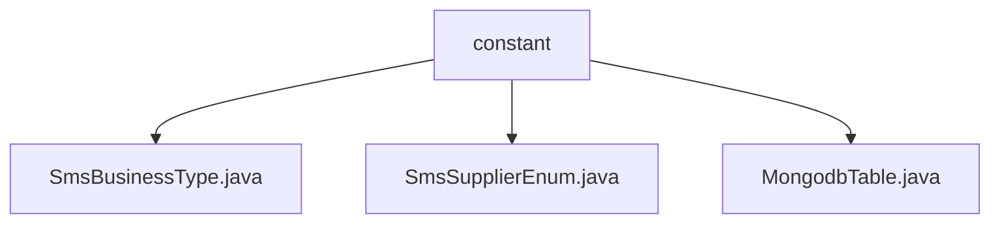

# 基础信息

|      |      |
|------|------|
| 名称 | constant |
| 编码语言 | .java |
| 代码路径 | WeFe/common/java/common-data-mongodb/src/main/java/com/welab/wefe/common/data/mongodb/constant |
| 包名 | docs.common.java.common-data-mongodb.src.main.java.com.welab.wefe.common.data.mongodb.constant |
| 概述说明 | SmsBusinessType枚举定义会员注册和忘记密码验证码类型。SmsSupplierEnum枚举目前仅支持阿里云短信供应商。MongodbTable类管理MongoDB集合名称常量，包含操作日志、数据集等20多个集合命名。 |

# 说明

## 概述  
该模块核心职责是提供短信业务类型分类、供应商枚举及MongoDB集合命名规范管理。接口规范包括SmsBusinessType区分会员注册/密码找回验证码场景，SmsSupplierEnum目前仅支持阿里云供应商。关键数据结构涉及两个枚举类型和包含20+集合名称常量的MongodbTable类。外部依赖仅为MongoDB数据库。例如通过MemberRegisterVerificationCode枚举值标识注册场景，通过Aliyun枚举值指定短信供应商。

## 主要业务场景  
模块支撑短信服务全流程管理，类似配置中心的角色。典型场景包括：通过业务类型枚举选择短信模板，如AccountForgetPasswordVerificationCode触发密码重置流程；通过供应商枚举切换短信平台；通过MongodbTable常量统一访问数据集、权限等集合。例如Union内部类管理联邦学习相关集合名称，实现跨模块命名一致性。整体采用静态常量池模式，避免系统硬编码风险。

### 包内部结构视图

该流程图展示了MongoDB数据模块中常量包的结构关系。顶层节点为constant目录，包含三个枚举类文件：SmsBusinessType、SmsSupplierEnum和MongodbTable，这些文件均位于同一层级，用于定义不同的业务常量类型。整个结构简洁清晰，体现了常量定义的集中管理方式。

# 文件列表

| 名称   | 类型  | 说明 |
|-------|------|-------------|
| [SmsBusinessType.java](SmsBusinessType.md) | file | 枚举SmsBusinessType定义两种短信业务类型：会员注册验证码和账户忘记密码验证码。 |
| [SmsSupplierEnum.java](SmsSupplierEnum.md) | file | 枚举SmsSupplierEnum定义了一个短信供应商Aliyun。 |
| [MongodbTable.java](MongodbTable.md) | file | MongodbTable类定义了MongoDB集合名称常量，包含通用操作日志、联盟数据集、成员权限、节点配置等关键表名。 |

