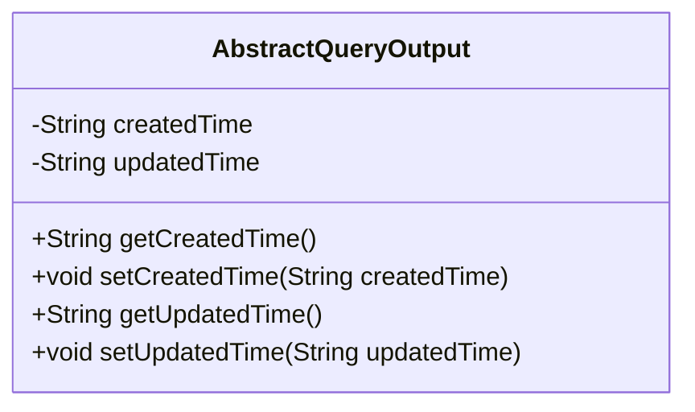
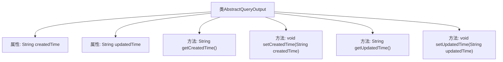

# 基础信息

|      |      |
|------|------|
| 名称 | AbstractQueryOutput |
| 编码语言 | .java |
| 代码路径 | WeFe/common/java/common-data-mongodb/src/main/java/com/welab/wefe/common/data/mongodb/dto/AbstractQueryOutput.java |
| 包名 | com.welab.wefe.common.data.mongodb.dto |
| 依赖项 | [] |
| 概述说明 | AbstractQueryOutput类包含创建时间和更新时间属性，提供对应的getter和setter方法。 |

# 说明

AbstractQueryOutput是一个抽象查询输出类，包含两个受保护的字符串类型属性createdTime和updatedTime，分别表示创建时间和更新时间。该类提供了四个公共方法：getCreatedTime和setCreatedTime用于获取和设置创建时间，getUpdatedTime和setUpdatedTime用于获取和设置更新时间。这些方法允许外部代码访问和修改这两个时间属性。

# 类列表 Class Summary

| 名称   | 类型  | 说明 |
|-------|------|-------------|
| AbstractQueryOutput | class | AbstractQueryOutput类包含创建时间和更新时间属性，提供对应的getter和setter方法。 |

## 类 AbstractQueryOutput

|      |      |
|------|------|
| 访问范围 | public |
| 类型 | class |
| 名称 | AbstractQueryOutput |
| 说明 | AbstractQueryOutput类包含创建时间和更新时间属性，提供对应的getter和setter方法。 |

### UML类图

这段类图描述了一个抽象查询输出类AbstractQueryOutput，它包含两个受保护的字符串类型成员变量createdTime和updatedTime，分别表示创建时间和更新时间。类中提供了四个公有方法：获取创建时间、设置创建时间、获取更新时间和设置更新时间。这个类可能作为其他具体查询输出类的基类，用于统一管理时间相关的属性和操作。

### 内部方法调用关系图

这段代码定义了一个名为AbstractQueryOutput的类，包含两个字符串类型的属性createdTime和updatedTime，分别表示创建时间和更新时间。类中提供了四个方法：getCreatedTime()和getUpdatedTime()用于获取对应时间，setCreatedTime()和setUpdatedTime()用于设置对应时间。这是一个典型的数据封装类，用于存储和操作时间相关的数据。

### 字段列表 Field List

| 名称  | 类型  | 说明 |
|-------|-------|------|
| createdTime | String | 声明一个受保护的字符串变量createdTime，用于存储创建时间。 |
| updatedTime | String | 声明一个受保护的字符串变量updatedTime，用于存储更新时间。 |

### 方法列表

| 名称  | 类型  | 说明 |
|-------|-------|------|
| setUpdatedTime | void | 这是一个Java方法，用于设置对象的updatedTime属性值。方法接收一个字符串参数updatedTime，并将其赋值给对象的同名成员变量。 |
| setCreatedTime | void | 设置对象创建时间的方法，参数为字符串类型的createdTime。 |
| getCreatedTime | String | 获取创建时间的方法，返回字符串类型的createdTime变量值。 |
| getUpdatedTime | String | 获取更新时间的方法，返回字符串类型变量updatedTime。 |

