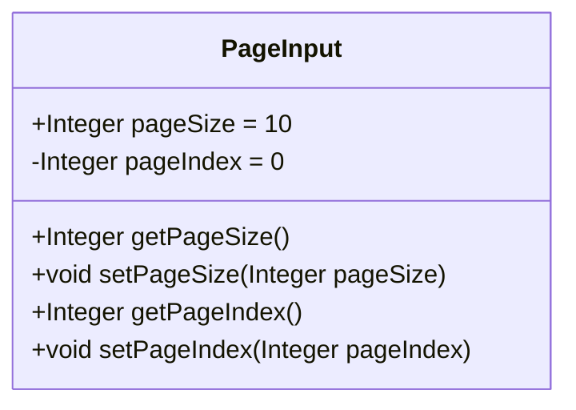
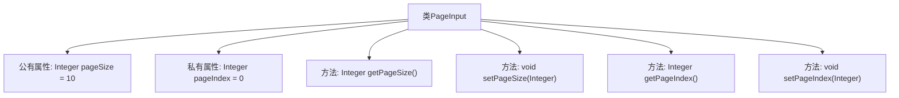

# 基础信息

|      |      |
|------|------|
| 名称 | PageInput |
| 编码语言 | .java |
| 代码路径 | WeFe/common/java/common-data-mongodb/src/main/java/com/welab/wefe/common/data/mongodb/dto/PageInput.java |
| 包名 | com.welab.wefe.common.data.mongodb.dto |
| 依赖项 | [] |
| 概述说明 | 分页输入类，包含页大小和页索引属性及get/set方法。 |

# 说明

PageInput类是一个用于分页输入的Java类，包含两个整型属性：pageSize和pageIndex。pageSize表示每页大小，默认值为10，是公开属性；pageIndex表示页码，默认值为0，是私有属性。类提供了四个方法：获取和设置pageSize的公共方法，以及获取和设置pageIndex的公共方法。这些方法允许外部代码访问和修改这两个属性值。

# 类列表 Class Summary

| 名称   | 类型  | 说明 |
|-------|------|-------------|
| PageInput | class | PageInput类定义分页参数，默认每页10条，页索引0，提供get/set方法。 |

## 类 PageInput

|      |      |
|------|------|
| 访问范围 | public |
| 类型 | class |
| 名称 | PageInput |
| 说明 | PageInput类定义分页参数，默认每页10条，页索引0，提供get/set方法。 |

### UML类图

这段代码定义了一个名为`PageInput`的类，用于管理分页参数。类中包含两个成员变量：公有变量`pageSize`（默认值为10）和私有变量`pageIndex`（默认值为0），以及对应的getter和setter方法。该类主要用于封装分页查询时的页面大小和页码索引，提供对这些参数的访问和修改能力。通过公有方法暴露私有字段的操作，符合面向对象封装原则。

### 内部方法调用关系图

这段代码定义了一个名为PageInput的类，用于管理分页参数。类中包含两个核心属性：公有属性pageSize（默认值10）和私有属性pageIndex（默认值0），并提供了对应的getter和setter方法。流程图清晰展示了类结构与成员关系，其中pageSize可直接访问，而pageIndex需要通过方法访问，体现了封装性。所有方法均围绕分页参数的读写操作展开，形成完整的数据访问闭环。

### 字段列表 Field List

| 名称  | 类型  | 说明 |
|-------|-------|------|
| pageSize = 10 | Integer | 定义整型变量pageSize，默认值为10。 |
| pageIndex = 0 | Integer | 定义整型变量pageIndex，初始值为0。 |

### 方法列表

| 名称  | 类型  | 说明 |
|-------|-------|------|
| getPageSize | Integer | 获取pageSize的整数值方法。 |
| setPageSize | void | 设置每页显示数量的方法，参数为整数类型pageSize。 |
| getPageIndex | Integer | 方法getPageIndex返回整型变量pageIndex的值。 |
| setPageIndex | void | 设置当前页码的方法，参数为整型pageIndex。 |

