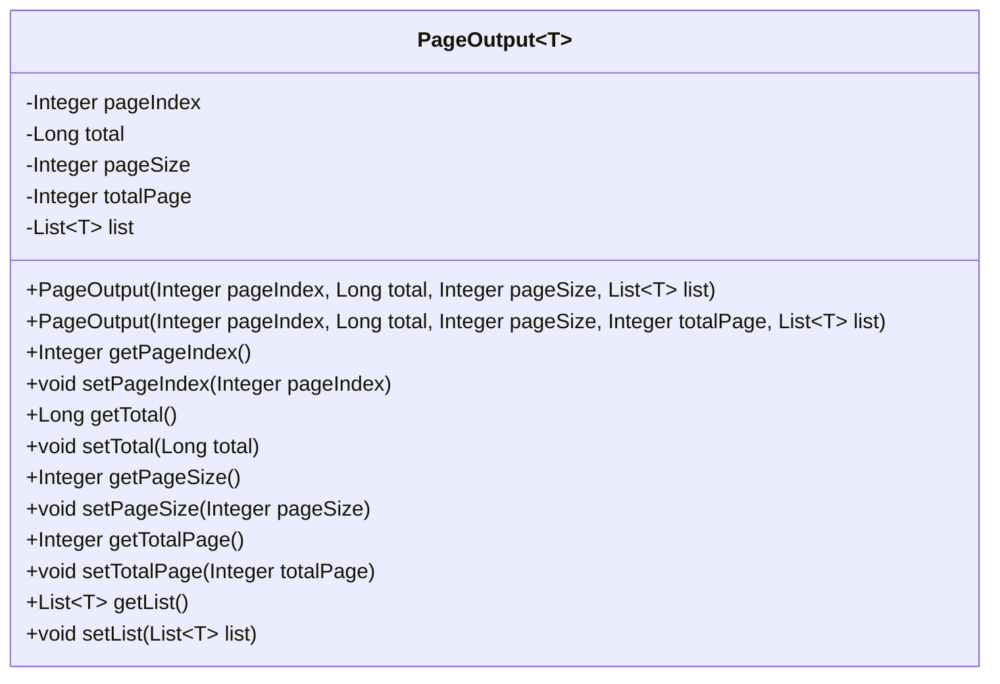

# 基础信息

|      |      |
|------|------|
| 名称 | PageOutput |
| 编码语言 | .java |
| 代码路径 | WeFe/common/java/common-data-mongodb/src/main/java/com/welab/wefe/common/data/mongodb/dto/PageOutput.java |
| 包名 | com.welab.wefe.common.data.mongodb.dto |
| 依赖项 | ['java.util.List'] |
| 概述说明 | 分页输出类，包含页码、总数、页大小、总页数和数据列表，提供构造方法和getter/setter。 |

# 说明

PageOutput是一个泛型类，用于封装分页查询结果。它包含五个核心属性：pageIndex表示当前页码，total表示总记录数，pageSize表示每页大小，totalPage表示总页数，list存储当前页的数据列表。类提供两个构造函数，一个自动计算总页数，另一个允许手动指定总页数。所有属性均配有getter和setter方法以便访问和修改。该类适用于任何需要分页展示数据的场景。

# 类列表 Class Summary

| 名称   | 类型  | 说明 |
|-------|------|-------------|
| PageOutput | class | 分页输出类，包含页码、总数、页大小、总页数和数据列表，提供构造方法和getter/setter。 |

## 类 PageOutput

|      |      |
|------|------|
| 访问范围 | public |
| 类型 | class |
| 名称 | PageOutput |
| 说明 | 分页输出类，包含页码、总数、页大小、总页数和数据列表，提供构造方法和getter/setter。 |

### UML类图

这段代码定义了一个泛型类`PageOutput<T>`，用于封装分页查询结果。它包含页码、总记录数、每页大小、总页数和数据列表等核心属性，提供两种构造方法（自动计算总页数或手动指定）以及标准的getter/setter方法。该类通过泛型`T`支持任意类型的数据列表，适用于各种分页场景，其计算总页数的逻辑采用`(total + pageSize - 1) / pageSize`公式确保向上取整。

### 内部方法调用关系图

```mermaid
graph TD
    A["类PageOutput<T>"]
    B["属性: Integer pageIndex"]
    C["属性: Long total"]
    D["属性: Integer pageSize"]
    E["属性: Integer totalPage"]
    F["属性: List<T> list"]
    G["构造方法1: PageOutput(pageIndex, total, pageSize, list)"]
    H["构造方法2: PageOutput(pageIndex, total, pageSize, totalPage, list)"]
    I["方法: getPageIndex()"]
    J["方法: setPageIndex(Integer)"]
    K["方法: getTotal()"]
    L["方法: setTotal(Long)"]
    M["方法: getPageSize()"]
    N["方法: setPageSize(Integer)"]
    O["方法: getTotalPage()"]
    P["方法: setTotalPage(Integer)"]
    Q["方法: getList()"]
    R["方法: setList(List<T>)"]

    A --> B
    A --> C
    A --> D
    A --> E
    A --> F
    A --> G
    A --> H
    A --> I
    A --> J
    A --> K
    A --> L
    A --> M
    A --> N
    A --> O
    A --> P
    A --> Q
    A --> R
```

这段代码定义了一个泛型类`PageOutput<T>`，用于封装分页查询结果。类包含五个核心属性：当前页码(pageIndex)、总记录数(total)、每页大小(pageSize)、总页数(totalPage)和数据列表(list)。提供两个构造方法，其中一个自动计算总页数，另一个允许手动指定。所有属性均配有getter/setter方法，支持灵活的数据存取。该设计常用于后端分页接口返回结构化数据，确保客户端能获取完整的分页信息和当前页数据列表。

### 字段列表 Field List

| 名称  | 类型  | 说明 |
|-------|-------|------|
| totalPage | Integer | 私有整型变量，表示总页数。 |
| pageIndex | Integer | 私有整型变量pageIndex，用于存储页码索引。 |
| pageSize | Integer | 定义私有整型变量pageSize，用于存储分页大小。 |
| total | Long | 私有长整型变量total，用于存储总数。 |
| list | List<T> | 私有泛型列表变量list。 |

### 方法列表

| 名称  | 类型  | 说明 |
|-------|-------|------|
| setPageIndex | void | 设置当前页码值。 |
| getPageSize | Integer | 获取当前页大小的方法，返回整型数值pageSize。 |
| getPageIndex | Integer | 方法getPageIndex返回整型变量pageIndex的值。 |
| setTotal | void | 这是一个Java方法，用于设置类成员变量total的值。方法接收一个Long类型参数，并将其赋值给类的total属性。 |
| setTotalPage | void | 设置总页数方法，参数为整型totalPage，赋值给类变量totalPage。 |
| getTotalPage | Integer | 获取总页数的方法，返回整型值totalPage。 |
| getTotal | Long | 方法返回total的长整型值。 |
| setPageSize | void | 设置每页显示数量的方法，参数为整数类型pageSize。 |
| setList | void | 这是一个Java方法，用于设置类的List类型成员变量list。方法接受一个List参数，并将其赋值给当前对象的list属性。 |
| getList | List<T> | 返回列表对象list。 |

