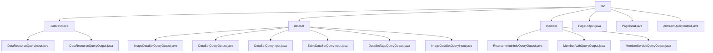

# 基础信息

|      |      |
|------|------|
| 名称 | dto |
| 编码语言 | .java |
| 代码路径 | WeFe/common/java/common-data-mongodb/src/main/java/com/welab/wefe/common/data/mongodb/dto |
| 包名 | docs.common.java.common-data-mongodb.src.main.java.com.welab.wefe.common.data.mongodb.dto |
| 概述说明 | 数据查询模块提供多条件筛选和结果封装功能，支持图像/表格等数据类型的分页查询，包含输入参数封装、权限过滤和结果聚合展示，应用于联邦学习资源检索等场景。依赖MongoDB，通过DTO实现CRUD操作。 |

# 说明

## 概述  
该模块核心职责是提供联邦学习环境下的数据资源统一查询与管理功能，涵盖数据集、成员认证和服务配置等多维度数据。核心接口规范采用分层设计：基础分页通过PageInput/PageInput实现，业务DTO如DataResourceQueryInput扩展分页参数，抽象类AbstractQueryOutput定义时间戳公共字段。关键数据结构包括图像/表格数据集的类型专有字段（如forJobType、containsY）、成员认证的FileInfo嵌套结构，以及服务管理的extJSON扩展字段。外部依赖集中于MongoDB驱动和基础分页组件。例如图像查询通过样本数量等扩展字段增强检索能力，成员认证通过typeId实现状态流转。

## 主要业务场景  
模块支持三大典型场景：1)多条件数据集检索（类似电商筛选项，如按标签+资源类型+分页组合查询）；2)成员资质审核链（通过实名文件列表和状态字段实现认证流程）；3)联邦服务路由管理（类似API网关，基于baseUrl和extJson动态配置）。交互模式统一采用DTO传输，例如表格数据通过containsY标志快速过滤，服务发现通过扩展字段实现灵活配置。功能完整性体现在覆盖数据全生命周期（元数据查询、使用统计、类型专有操作），典型应用包括联邦任务配置时的资源选择器、节点注册时的资质校验等。API类型以查询类为主，集成案例可见深度学习任务初始化时的图像数据集按任务类型筛选。

### 包内部结构视图

该流程图展示了MongoDB数据访问层的DTO结构，包含三个主要子目录：dataresource、dataset和member，以及根目录下的通用分页和抽象类文件。每个子目录下包含多个具体的DTO类文件，用于处理不同类型的数据查询和传输需求。

# 文件列表

| 名称   | 类型  | 说明 |
|-------|------|-------------|
| [PageOutput.java](PageOutput.md) | file | 分页输出类，包含页码、总数、页大小、总页数和数据列表，提供构造方法和getter/setter。 |
| [PageInput.java](PageInput.md) | file | 分页输入类，包含页大小和页索引属性及get/set方法。 |
| [AbstractQueryOutput.java](AbstractQueryOutput.md) | file | AbstractQueryOutput类包含创建时间和更新时间属性，提供对应的getter和setter方法。 |
| [dataresource](dataresource/_module.md) | package | DataResourceQueryInput类继承PageInput，含多个查询字段如ID、名称、类型等，提供getter/setter。DataResourceQueryOutput类封装查询结果，含资源详情、状态、类型及三种数据集引用，提供getter/setter。 |
| [dataset](dataset/_module.md) | package | ImageDataSetQueryOutput类存储图像数据集查询结果，包含ID、名称、标签等属性和对应方法。DataSetQueryOutput类表示数据集查询输出，含ID、名称、特征等属性和方法。DataSetQueryInput类继承PageInput，含数据集ID、成员信息等查询条件。TableDataSetQueryInput类继承DataResourceQueryInput，关注containsY标志。DataSetTagsQueryOutput类封装标签查询结果。ImageDataSetQueryInput类继承DataResourceQueryInput，含forJobType属性。 |
| [member](member/_module.md) | package | RealnameAuthInfoQueryOutput类存储实名认证查询结果，含状态、名称、证书等字段及文件信息。MemberAuthQueryOutput类定义成员认证查询输出，含类型标识、名称和状态。MemberServiceQueryOutput类继承AbstractQueryOutput，包含服务相关字段和扩展JSON。 |

