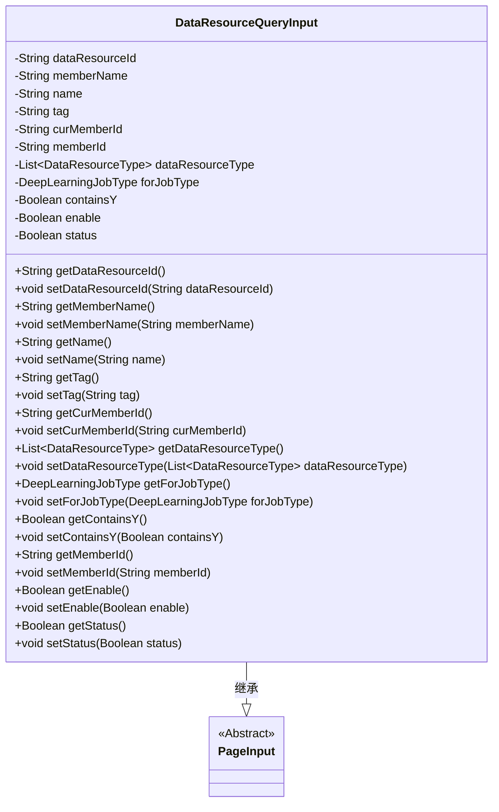

# 基础信息

|      |      |
|------|------|
| 名称 | DataResourceQueryInput |
| 编码语言 | .java |
| 代码路径 | WeFe/common/java/common-data-mongodb/src/main/java/com/welab/wefe/common/data/mongodb/dto/dataresource/DataResourceQueryInput.java |
| 包名 | com.welab.wefe.common.data.mongodb.dto.dataresource |
| 依赖项 | ['com.welab.wefe.common.data.mongodb.dto.PageInput', 'com.welab.wefe.common.wefe.enums.DataResourceType', 'com.welab.wefe.common.wefe.enums.DeepLearningJobType', 'java.util.List'] |
| 概述说明 | DataResourceQueryInput类继承PageInput，包含数据资源ID、成员名称、标签、当前成员ID、资源类型列表、深度学习任务类型、是否包含Y、启用状态等字段及其getter/setter方法。 |

# 说明

DataResourceQueryInput类继承自PageInput，包含多个用于查询数据资源的字段：dataResourceId、memberName、name、tag、curMemberId、memberId、dataResourceType列表、forJobType枚举、containsY布尔值、enable布尔值和status布尔值。每个字段都有对应的getter和setter方法，用于获取和设置属性值。

# 类列表 Class Summary

| 名称   | 类型  | 说明 |
|-------|------|-------------|
| DataResourceQueryInput | class | DataResourceQueryInput类继承PageInput，包含数据资源ID、成员名、名称、标签、当前成员ID、资源类型列表、深度学习任务类型、是否含Y、启用状态等字段及其getter/setter方法。 |

## 类 DataResourceQueryInput

|      |      |
|------|------|
| 访问范围 | public |
| 类型 | class |
| 名称 | DataResourceQueryInput |
| 说明 | DataResourceQueryInput类继承PageInput，包含数据资源ID、成员名、名称、标签、当前成员ID、资源类型列表、深度学习任务类型、是否含Y、启用状态等字段及其getter/setter方法。 |

### UML类图

该代码定义了一个数据资源查询输入类`DataResourceQueryInput`，继承自`PageInput`抽象类。类中包含多个私有字段用于存储查询条件，如资源ID、成员名称、标签等，并提供了对应的getter和setter方法。这些字段支持对数据资源进行多条件筛选，包括资源类型、深度学习任务类型、状态标志等。类图清晰地展示了继承关系和所有属性方法。

### 内部方法调用关系图

```mermaid
graph TD
    A["类DataResourceQueryInput"]
    B["继承自: PageInput"]
    C["属性: String dataResourceId"]
    D["属性: String memberName"]
    E["属性: String name"]
    F["属性: String tag"]
    G["属性: String curMemberId"]
    H["属性: String memberId"]
    I["属性: List<DataResourceType> dataResourceType"]
    J["属性: DeepLearningJobType forJobType"]
    K["属性: Boolean containsY"]
    L["属性: Boolean enable"]
    M["属性: Boolean status"]
    N["方法: getDataResourceId()"]
    O["方法: setDataResourceId(String)"]
    P["方法: getMemberName()"]
    Q["方法: setMemberName(String)"]
    R["方法: getName()"]
    S["方法: setName(String)"]
    T["方法: getTag()"]
    U["方法: setTag(String)"]
    V["方法: getCurMemberId()"]
    W["方法: setCurMemberId(String)"]
    X["方法: getDataResourceType()"]
    Y["方法: setDataResourceType(List<DataResourceType>)"]
    Z["方法: getForJobType()"]
    AA["方法: setForJobType(DeepLearningJobType)"]
    AB["方法: getContainsY()"]
    AC["方法: setContainsY(Boolean)"]
    AD["方法: getMemberId()"]
    AE["方法: setMemberId(String)"]
    AF["方法: getEnable()"]
    AG["方法: setEnable(Boolean)"]
    AH["方法: getStatus()"]
    AI["方法: setStatus(Boolean)"]

    A --> B
    A --> C
    A --> D
    A --> E
    A --> F
    A --> G
    A --> H
    A --> I
    A --> J
    A --> K
    A --> L
    A --> M
    A --> N
    A --> O
    A --> P
    A --> Q
    A --> R
    A --> S
    A --> T
    A --> U
    A --> V
    A --> W
    A --> X
    A --> Y
    A --> Z
    A --> AA
    A --> AB
    A --> AC
    A --> AD
    A --> AE
    A --> AF
    A --> AG
    A --> AH
    A --> AI
```

这段代码定义了一个名为DataResourceQueryInput的类，该类继承自PageInput。它包含多个私有属性，如dataResourceId、memberName、name等，以及对应的getter和setter方法。这些属性主要用于存储和查询数据资源的相关信息，包括资源ID、成员名称、标签、成员ID等。类中还包含一些布尔类型的属性，如containsY、enable和status，用于表示资源的状态和特性。整体来看，这个类是一个典型的数据传输对象（DTO），用于封装查询数据资源时的输入参数。

### 字段列表 Field List

| 名称  | 类型  | 说明 |
|-------|-------|------|
| tag | String | 私有字符串变量tag。 |
| dataResourceType | List<DataResourceType> | 私有数据资源类型列表。 |
| name | String | 私有字符串类型变量name |
| status | Boolean | 私有布尔类型状态变量。 |
| dataResourceId | String | 声明一个私有字符串变量dataResourceId。 |
| curMemberId | String | 当前成员ID字符串变量。 |
| enable | Boolean | 布尔类型私有变量enable，用于控制功能开关状态。 |
| memberId | String | 声明一个私有字符串变量memberId。 |
| forJobType | DeepLearningJobType | 私有深度学习任务类型变量forJobType。 |
| containsY | Boolean | 布尔变量，标识是否包含字母Y。 |
| memberName | String | 声明一个私有字符串变量memberName。 |

### 方法列表

| 名称  | 类型  | 说明 |
|-------|-------|------|
| setMemberName | void | 设置成员变量memberName的方法，参数为字符串类型。 |
| getContainsY | Boolean | 方法getContainsY返回布尔值containsY。 |
| setContainsY | void | 设置布尔值containsY的方法。 |
| setForJobType | void | 这是一个Java方法，用于设置深度学习任务类型属性。方法接受一个DeepLearningJobType参数，并将其赋值给类的成员变量forJobType。 |
| setCurMemberId | void | 设置当前成员ID的方法，参数为字符串类型。 |
| setTag | void | 设置对象标签的方法，将输入字符串赋值给成员变量tag。 |
| getForJobType | DeepLearningJobType | 获取当前深度学习任务类型的方法。 |
| setName | void | 这是一个Java方法，用于设置对象的name属性，接受一个字符串参数name并将其赋值给当前对象的name字段。 |
| getDataResourceType | List<DataResourceType> | 获取数据资源类型列表的方法。 |
| getName | String | 这是一个Java方法，返回字符串类型的name变量值。 |
| setDataResourceId | void | 设置数据资源ID的方法，将输入参数赋值给类的成员变量dataResourceId。 |
| getDataResourceId | String | 获取数据资源ID的方法，返回字符串类型。 |
| getTag | String | 获取标签字符串的方法。 |
| getCurMemberId | String | 获取当前成员ID的方法，返回字符串类型的curMemberId。 |
| getMemberName | String | 获取成员名称的方法，返回成员变量memberName的值。 |
| setDataResourceType | void | 设置数据资源类型列表的方法，将输入参数赋值给类的成员变量。 |
| getMemberId | String | 获取成员ID的方法，返回字符串类型的memberId。 |
| setMemberId | void | 设置成员ID的方法，将输入参数赋值给类的成员变量memberId。 |
| getEnable | Boolean | 获取enable布尔值的公共方法。 |
| setEnable | void | 设置布尔型启用状态的方法。 |
| getStatus | Boolean | 获取布尔状态值的方法。 |
| setStatus | void | 这是一个Java方法，用于设置布尔类型的status属性值。方法接受一个布尔参数，并将其赋值给类的status成员变量。 |

