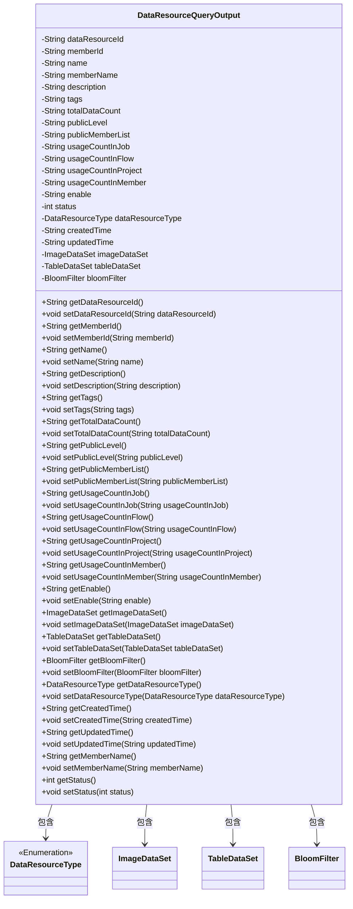

# 基础信息

|      |      |
|------|------|
| 名称 | DataResourceQueryOutput |
| 编码语言 | .java |
| 代码路径 | WeFe/common/java/common-data-mongodb/src/main/java/com/welab/wefe/common/data/mongodb/dto/dataresource/DataResourceQueryOutput.java |
| 包名 | com.welab.wefe.common.data.mongodb.dto.dataresource |
| 依赖项 | ['com.welab.wefe.common.data.mongodb.entity.union.BloomFilter', 'com.welab.wefe.common.data.mongodb.entity.union.ImageDataSet', 'com.welab.wefe.common.data.mongodb.entity.union.TableDataSet', 'com.welab.wefe.common.wefe.enums.DataResourceType'] |
| 概述说明 | DataResourceQueryOutput类包含数据资源ID、成员信息、名称、描述、标签、数据量、公开级别、使用统计、状态、类型、时间戳及数据集属性。 |

# 说明

DataResourceQueryOutput类是一个用于封装数据资源查询结果的Java类，包含数据资源ID、成员ID、名称、描述、标签、数据总量、公开级别、公开成员列表、各类使用计数、启用状态、状态码、资源类型、创建和更新时间等属性。此外，它还包含三种特定数据集类型（图像数据集、表格数据集和布隆过滤器）的引用，以及对应的getter和setter方法。

# 类列表 Class Summary

| 名称   | 类型  | 说明 |
|-------|------|-------------|
| DataResourceQueryOutput | class | DataResourceQueryOutput类包含数据资源ID、成员信息、名称、描述、标签、数据量、公开级别、使用统计、状态、类型、时间戳及数据集属性。 |

## 类 DataResourceQueryOutput

|      |      |
|------|------|
| 访问范围 | public |
| 类型 | class |
| 名称 | DataResourceQueryOutput |
| 说明 | DataResourceQueryOutput类包含数据资源ID、成员信息、名称、描述、标签、数据量、公开级别、使用统计、状态、类型、时间戳及数据集属性。 |

### UML类图

这段代码定义了一个名为DataResourceQueryOutput的类，用于表示数据资源查询的输出结果。该类包含多个私有字段，如dataResourceId、memberId、name等，以及对应的getter和setter方法。此外，该类还引用了其他四个类：DataResourceType（枚举类型）、ImageDataSet、TableDataSet和BloomFilter，分别表示数据资源类型、图像数据集、表格数据集和布隆过滤器。这些引用关系通过依赖箭头表示，展示了DataResourceQueryOutput类与其他类之间的关联。整体而言，这个类是一个复杂的数据传输对象，用于封装和传递数据资源的相关信息。

### 内部方法调用关系图

```mermaid
graph TD
    A["类DataResourceQueryOutput"]
    B["属性: String dataResourceId"]
    C["属性: String memberId"]
    D["属性: String name"]
    E["属性: String memberName"]
    F["属性: String description"]
    G["属性: String tags"]
    H["属性: String totalDataCount"]
    I["属性: String publicLevel"]
    J["属性: String publicMemberList"]
    K["属性: String usageCountInJob"]
    L["属性: String usageCountInFlow"]
    M["属性: String usageCountInProject"]
    N["属性: String usageCountInMember"]
    O["属性: String enable"]
    P["属性: int status"]
    Q["属性: DataResourceType dataResourceType"]
    R["属性: String createdTime"]
    S["属性: String updatedTime"]
    T["属性: ImageDataSet imageDataSet"]
    U["属性: TableDataSet tableDataSet"]
    V["属性: BloomFilter bloomFilter"]

    A --> B
    A --> C
    A --> D
    A --> E
    A --> F
    A --> G
    A --> H
    A --> I
    A --> J
    A --> K
    A --> L
    A --> M
    A --> N
    A --> O
    A --> P
    A --> Q
    A --> R
    A --> S
    A --> T
    A --> U
    A --> V
```

这段代码定义了一个名为DataResourceQueryOutput的类，包含21个私有属性和对应的getter/setter方法。该类用于封装数据资源查询的输出结果，包含资源ID、成员信息、名称、描述、标签、数据统计量、公开级别、使用计数、状态标记、资源类型、时间戳以及三种特定数据集（图像、表格和布隆过滤器）的引用。所有属性都通过公共方法提供访问和修改接口，体现了Java Bean的设计模式。

### 字段列表 Field List

| 名称  | 类型  | 说明 |
|-------|-------|------|
| usageCountInFlow | String | 私有字符串变量usageCountInFlow，用于记录流程中的使用次数。 |
| usageCountInJob | String | 私有字符串变量，记录作业中的使用次数。 |
| tableDataSet | TableDataSet | 私有TableDataSet类型变量tableDataSet。 |
| publicLevel | String | 私有字符串变量publicLevel，用于存储公开级别信息。 |
| updatedTime | String | 更新时间的字符串变量。 |
| enable | String | 私有字符串变量enable。 |
| usageCountInMember | String | 类成员变量usageCountInMember，字符串类型，私有访问权限。 |
| tags | String | 私有字符串变量tags |
| createdTime | String | 定义字符串类型变量createdTime，用于记录创建时间。 |
| memberName | String | 成员变量名称为memberName，类型为String。 |
| status | int | 私有整型变量status，用于表示状态。 |
| dataResourceId | String | 私有字符串类型变量dataResourceId，用于标识数据资源。 |
| totalDataCount | String | 私有字符串变量，用于存储总数据量计数。 |
| name | String | 私有字符串变量name |
| imageDataSet | ImageDataSet | 私有图像数据集对象。 |
| usageCountInProject | String | 项目中的使用次数字符串变量。 |
| dataResourceType | DataResourceType | 私有数据资源类型变量dataResourceType。 |
| bloomFilter | BloomFilter | 私有布隆过滤器变量bloomFilter。 |
| publicMemberList | String | 私有字符串变量publicMemberList |
| description | String | 私有字符串类型变量description。 |
| memberId | String | 成员ID字符串类型私有变量。 |

### 方法列表

| 名称  | 类型  | 说明 |
|-------|-------|------|
| setUsageCountInMember | void | 这是一个Java方法，用于设置成员变量usageCountInMember的值。方法接受一个字符串参数，并将其赋值给类中的同名变量。 |
| setTotalDataCount | void | Java方法：设置总数据计数字符串值。 |
| getUsageCountInProject | String | 获取项目内使用次数的字符串值。 |
| setUsageCountInFlow | void | Java方法：设置流程中的使用次数变量值。 |
| getUsageCountInMember | String | 获取成员使用次数字符串方法。 |
| getTags | String | 方法getTags返回字符串类型的tags变量值。 |
| setName | void | 设置对象名称的方法，将参数name赋值给对象的name属性。 |
| getMemberId | String | 方法返回成员ID字符串。 |
| setPublicMemberList | void | 设置公共成员列表的方法，将输入字符串赋值给类的publicMemberList变量。 |
| getPublicMemberList | String | 获取公共成员列表的方法，返回publicMemberList字符串。 |
| setUsageCountInProject | void | 设置项目内使用次数的公共方法，参数为字符串类型。 |
| setDataResourceId | void | 设置数据资源ID的方法，将输入参数赋值给类的成员变量dataResourceId。 |
| getDataResourceId | String | 获取数据资源ID的方法，返回字符串类型值dataResourceId。 |
| getPublicLevel | String | 方法getPublicLevel返回字符串类型的publicLevel变量值。 |
| getTableDataSet | TableDataSet | 获取表格数据集的公共方法，返回tableDataSet对象。 |
| setTags | void | 这是一个Java方法，用于设置对象的tags属性。方法接受一个字符串参数tags，并将其赋值给当前对象的tags字段。 |
| getImageDataSet | ImageDataSet | 获取图像数据集方法，返回imageDataSet对象。 |
| getBloomFilter | BloomFilter | 获取布隆过滤器实例的方法。 |
| setImageDataSet | void | 设置图像数据集方法，将输入参数赋值给当前对象的imageDataSet属性。 |
| getUsageCountInJob | String | 获取作业中的使用计数方法，返回字符串类型的usageCountInJob值。 |
| getDataResourceType | DataResourceType | 这是一个Java方法，返回名为dataResourceType的DataResourceType类型对象。 |
| getDescription | String | 获取描述信息的字符串方法。 |
| setMemberId | void | 设置成员ID的方法，将输入参数memberId赋值给类的成员变量memberId。 |
| setTableDataSet | void | 设置表格数据集方法，将输入参数赋值给当前对象的tableDataSet属性。 |
| getUsageCountInFlow | String | 获取流程中的使用次数。 |
| getName | String | 这是一个Java方法，返回字符串类型的name变量值。 |
| setDataResourceType | void | 设置数据资源类型的方法，将输入参数赋值给类的成员变量dataResourceType。 |
| getCreatedTime | String | 获取创建时间的方法，返回字符串类型的createdTime变量值。 |
| setCreatedTime | void | 这是一个Java方法，用于设置对象的创建时间属性。方法接受一个字符串参数createdTime，并将其赋值给类的成员变量createdTime。 |
| getUpdatedTime | String | 获取更新时间的方法，返回字符串类型的updatedTime变量值。 |
| setUpdatedTime | void | 设置更新时间的方法，将参数updatedTime赋值给类的成员变量updatedTime。 |
| getMemberName | String | 获取成员名称的方法，返回成员变量memberName的值。 |
| setMemberName | void | 设置成员变量memberName的方法，参数为字符串类型。 |
| getStatus | int | 方法返回状态值status。 |
| setStatus | void | 这是一个Java方法，用于设置对象的status属性值。方法接收一个整数参数status，并将其赋值给当前对象的status字段。 |
| setDescription | void | 设置对象描述的方法，将输入字符串赋值给对象的description属性。 |
| getEnable | String | 获取enable值的公共方法，返回字符串类型。 |
| setUsageCountInJob | void | 方法setUsageCountInJob用于设置作业中的使用次数，参数为字符串类型。 |
| setEnable | void | 这是一个Java方法，用于设置enable属性的值。方法接收一个字符串参数enable，并将其赋值给类的同名成员变量。 |
| setPublicLevel | void | 定义公共方法setPublicLevel，用于设置publicLevel属性的值。 |
| getTotalDataCount | String | 这是一个Java方法，返回字符串类型的totalDataCount变量值。 |
| setBloomFilter | void | 设置布隆过滤器实例到当前对象。 |

