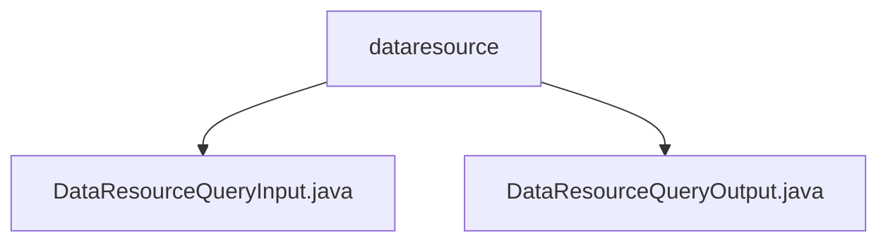

# 基础信息

|      |      |
|------|------|
| 名称 | dataresource |
| 编码语言 | .java |
| 代码路径 | WeFe/common/java/common-data-mongodb/src/main/java/com/welab/wefe/common/data/mongodb/dto/dataresource |
| 包名 | docs.common.java.common-data-mongodb.src.main.java.com.welab.wefe.common.data.mongodb.dto.dataresource |
| 概述说明 | DataResourceQueryInput类继承PageInput，含多个查询字段如ID、名称、类型等，提供getter/setter。DataResourceQueryOutput类封装查询结果，含资源详情、状态、类型及三种数据集引用，提供getter/setter。 |

# 说明

## 概述  
该模块核心职责是提供数据资源的查询功能，包括输入参数封装和结果集封装。接口规范包含DataResourceQueryInput（继承分页参数）和DataResourceQueryOutput两类DTO，前者支持ID/名称/标签等多条件筛选，后者扩展了资源详情和统计字段。  

关键数据结构包括DataResourceQueryInput中的枚举型forJobType、布尔型状态标记，以及Output中三种数据集类型（图像/表格/布隆过滤器）的嵌套结构。外部依赖仅涉及基础分页类PageInput。例如Input通过curMemberId实现权限过滤，Output通过publicMemberList管理可见性。  

## 主要业务场景  
典型应用为联邦学习中的数据资源检索，支持组合查询（例如按标签+资源类型筛选）和结果聚合展示（如统计使用计数）。交互模式类似CRUD的Read操作，通过布尔字段实现精细化状态管理。功能完整性体现在覆盖资源全属性（元数据+使用数据+类型专有字段），例如Output同时包含基础描述和图像数据集特有引用。  

API类型属于查询类接口，集成案例包括联邦任务配置时的资源选择器。业务流程分为：构造多条件Input→执行查询→解析Output中的复合数据，例如通过containsY字段快速识别含Y值的数据集。

### 包内部结构视图

该流程图展示了dataresource目录下的两个Java文件结构关系。dataresource作为父节点，包含DataResourceQueryInput.java和DataResourceQueryOutput.java两个子节点，清晰地反映了MongoDB数据资源查询相关的输入输出DTO文件在项目中的层级位置。

# 文件列表

| 名称   | 类型  | 说明 |
|-------|------|-------------|
| [DataResourceQueryInput.java](DataResourceQueryInput.md) | file | DataResourceQueryInput类继承PageInput，包含数据资源ID、成员名称、标签、当前成员ID、资源类型列表、深度学习任务类型、是否包含Y、启用状态等字段及其getter/setter方法。 |
| [DataResourceQueryOutput.java](DataResourceQueryOutput.md) | file | DataResourceQueryOutput类包含数据资源ID、成员信息、名称、描述、标签、数据量、公开级别、使用统计、状态、类型、时间戳及数据集属性。 |

