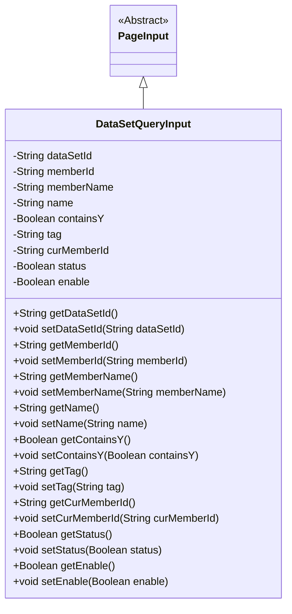

# 基础信息

|      |      |
|------|------|
| 名称 | DataSetQueryInput |
| 编码语言 | .java |
| 代码路径 | WeFe/common/java/common-data-mongodb/src/main/java/com/welab/wefe/common/data/mongodb/dto/dataset/DataSetQueryInput.java |
| 包名 | com.welab.wefe.common.data.mongodb.dto.dataset |
| 依赖项 | ['com.welab.wefe.common.data.mongodb.dto.PageInput'] |
| 概述说明 | DataSetQueryInput类继承PageInput，包含数据集ID、成员ID、名称、标签等查询字段及状态控制字段。 |

# 说明

DataSetQueryInput类继承自PageInput，包含多个私有字段用于数据集查询条件：dataSetId标识数据集，memberId和memberName表示成员信息，name为名称，containsY判断是否包含Y，tag为标签，curMemberId记录当前成员ID，status和enable表示状态与启用标志。每个字段均有对应的getter和setter方法。

# 类列表 Class Summary

| 名称   | 类型  | 说明 |
|-------|------|-------------|
| DataSetQueryInput | class | DataSetQueryInput类继承PageInput，包含数据集ID、成员ID、名称、标签、状态等查询参数及对应getter/setter方法。 |

## 类 DataSetQueryInput

|      |      |
|------|------|
| 访问范围 | public |
| 类型 | class |
| 名称 | DataSetQueryInput |
| 说明 | DataSetQueryInput类继承PageInput，包含数据集ID、成员ID、名称、标签、状态等查询参数及对应getter/setter方法。 |

### UML类图

这段代码定义了一个`DataSetQueryInput`类，继承自抽象类`PageInput`。该类包含多个私有字段，如`dataSetId`、`memberId`、`memberName`等，用于存储数据集查询的输入参数，并为每个字段提供了对应的getter和setter方法。这些方法允许外部代码访问和修改这些私有字段的值。类图清晰地展示了`DataSetQueryInput`与`PageInput`之间的继承关系，以及`DataSetQueryInput`自身的属性和方法结构。

### 内部方法调用关系图

```mermaid
graph TD
    A["类DataSetQueryInput"]
    B["继承自: PageInput"]
    C["属性: String dataSetId"]
    D["属性: String memberId"]
    E["属性: String memberName"]
    F["属性: String name"]
    G["属性: Boolean containsY"]
    H["属性: String tag"]
    I["属性: String curMemberId"]
    J["属性: Boolean status"]
    K["属性: Boolean enable"]
    L["方法: getDataSetId()/setDataSetId()"]
    M["方法: getMemberId()/setMemberId()"]
    N["方法: getMemberName()/setMemberName()"]
    O["方法: getName()/setName()"]
    P["方法: getContainsY()/setContainsY()"]
    Q["方法: getTag()/setTag()"]
    R["方法: getCurMemberId()/setCurMemberId()"]
    S["方法: getStatus()/setStatus()"]
    T["方法: getEnable()/setEnable()"]

    A --> B
    A --> C
    A --> D
    A --> E
    A --> F
    A --> G
    A --> H
    A --> I
    A --> J
    A --> K
    A --> L
    A --> M
    A --> N
    A --> O
    A --> P
    A --> Q
    A --> R
    A --> S
    A --> T
```

这段代码定义了一个DataSetQueryInput类，继承自PageInput类，包含9个私有属性和对应的getter/setter方法。该类主要用于封装数据集查询的输入参数，包括数据集ID、成员信息、名称标志、状态标记等字段。每个属性都通过标准的JavaBean规范提供访问方法，便于在其他模块中获取或修改这些查询条件参数。

### 字段列表 Field List

| 名称  | 类型  | 说明 |
|-------|-------|------|
| tag | String | 私有字符串变量tag |
| memberId | String | 成员ID字符串类型私有变量。 |
| dataSetId | String | 数据集ID字符串变量声明 |
| curMemberId | String | 当前成员ID的私有字符串变量。 |
| enable | Boolean | 私有布尔类型变量，表示启用状态。 |
| name | String | 私有字符串类型变量name |
| status | Boolean | 布尔类型状态变量 |
| containsY | Boolean | 私有布尔变量，标识是否包含Y。 |
| memberName | String | 成员变量：memberName，类型为String，私有访问权限。 |

### 方法列表

| 名称  | 类型  | 说明 |
|-------|-------|------|
| getStatus | Boolean | 获取状态值的布尔类型方法。 |
| getCurMemberId | String | 获取当前成员ID的方法，返回值为字符串类型的curMemberId。 |
| setMemberId | void | 设置成员ID的方法，将输入参数赋给类的成员变量memberId。 |
| setStatus | void | 设置布尔状态值的方法。 |
| getDataSetId | String | 获取数据集ID的方法，返回dataSetId字段值。 |
| getTag | String | 方法返回字符串类型的tag变量值。 |
| setName | void | 这是一个Java方法，用于设置对象的名称属性。方法接受一个字符串参数name，并将其赋值给当前对象的name字段。 |
| getName | String | 获取名称的方法，返回字符串类型的name变量值。 |
| getMemberName | String | 获取成员名称的方法，返回成员变量memberName的值。 |
| getMemberId | String | 这是一个Java方法，返回成员ID字符串。方法名为getMemberId，无参数，直接返回成员变量memberId的值。 |
| setEnable | void | 设置布尔值enable的方法，用于控制功能开关。 |
| setTag | void | 方法setTag用于设置对象的tag属性，参数为字符串类型。 |
| getContainsY | Boolean | 方法getContainsY返回布尔值containsY。 |
| setMemberName | void | 设置成员变量memberName的值。 |
| setCurMemberId | void | 设置当前成员ID的方法，参数为字符串类型。 |
| getEnable | Boolean | 获取enable布尔值的公共方法。 |
| setContainsY | void | 这是一个Java方法，用于设置布尔类型变量containsY的值。方法名为setContainsY，接受一个Boolean参数。 |
| setDataSetId | void | 设置数据集ID的方法，将输入参数赋值给类的dataSetId成员变量。 |

