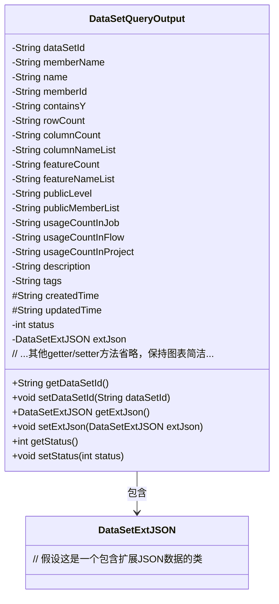

# 基础信息

|      |      |
|------|------|
| 名称 | DataSetQueryOutput |
| 编码语言 | .java |
| 代码路径 | WeFe/common/java/common-data-mongodb/src/main/java/com/welab/wefe/common/data/mongodb/dto/dataset/DataSetQueryOutput.java |
| 包名 | com.welab.wefe.common.data.mongodb.dto.dataset |
| 依赖项 | ['com.welab.wefe.common.data.mongodb.entity.union.ext.DataSetExtJSON'] |
| 概述说明 | DataSetQueryOutput类包含数据集ID、成员信息、行列数、特征列表、公开级别、使用统计、描述、标签、创建更新时间及状态等属性，提供对应getter和setter方法。 |

# 说明

DataSetQueryOutput类是一个用于表示数据集查询输出的Java类，包含数据集的各类属性和对应的getter和setter方法。主要属性包括数据集ID、成员名称、名称、成员ID、是否包含Y标志、行数、列数、列名列表、特征数量、特征名列表、公开级别、公开成员列表、在作业、流程和项目中的使用次数、描述、标签、创建时间、更新时间、状态以及扩展JSON数据。每个属性都有对应的访问和修改方法，确保数据的封装性和可操作性。

# 类列表 Class Summary

| 名称   | 类型  | 说明 |
|-------|------|-------------|
| DataSetQueryOutput | class | DataSetQueryOutput类包含数据集ID、名称、成员信息、行列数、特征列表、公开级别、使用统计、描述、标签、创建更新时间及状态等属性。 |

## 类 DataSetQueryOutput

|      |      |
|------|------|
| 访问范围 | public |
| 类型 | class |
| 名称 | DataSetQueryOutput |
| 说明 | DataSetQueryOutput类包含数据集ID、名称、成员信息、行列数、特征列表、公开级别、使用统计、描述、标签、创建更新时间及状态等属性。 |

### UML类图

这段代码定义了一个`DataSetQueryOutput`类，用于封装数据集查询结果的输出信息。该类包含20多个私有字段，主要记录数据集的元信息（如ID、名称、行列数）、使用统计（如作业/流程/项目中的使用次数）、权限控制（公开级别、成员列表）以及时间戳等。其中`extJson`字段通过关联`DataSetExtJSON`类实现扩展数据的存储。所有字段都通过标准的getter/setter方法进行访问，符合JavaBean规范，适合作为DTO在系统间传递结构化数据。

### 内部方法调用关系图

```mermaid
graph TD
    A["类DataSetQueryOutput"]
    B["私有属性: String dataSetId"]
    C["私有属性: String memberName"]
    D["私有属性: String name"]
    E["私有属性: String memberId"]
    F["私有属性: String containsY"]
    G["私有属性: String rowCount"]
    H["私有属性: String columnCount"]
    I["私有属性: String columnNameList"]
    J["私有属性: String featureCount"]
    K["私有属性: String featureNameList"]
    L["私有属性: String publicLevel"]
    M["私有属性: String publicMemberList"]
    N["私有属性: String usageCountInJob"]
    O["私有属性: String usageCountInFlow"]
    P["私有属性: String usageCountInProject"]
    Q["私有属性: String description"]
    R["私有属性: String tags"]
    S["保护属性: String createdTime"]
    T["保护属性: String updatedTime"]
    U["私有属性: int status"]
    V["私有属性: DataSetExtJSON extJson"]
    W["Getter/Setter方法: dataSetId/memberName/name/memberId"]
    X["Getter/Setter方法: containsY/rowCount/columnCount/columnNameList"]
    Y["Getter/Setter方法: featureCount/featureNameList/publicLevel/publicMemberList"]
    Z["Getter/Setter方法: usageCountInJob/usageCountInFlow/usageCountInProject"]
    AA["Getter/Setter方法: description/tags/createdTime/updatedTime"]
    AB["Getter/Setter方法: status/extJson"]

    A --> B
    A --> C
    A --> D
    A --> E
    A --> F
    A --> G
    A --> H
    A --> I
    A --> J
    A --> K
    A --> L
    A --> M
    A --> N
    A --> O
    A --> P
    A --> Q
    A --> R
    A --> S
    A --> T
    A --> U
    A --> V
    A --> W
    A --> X
    A --> Y
    A --> Z
    A --> AA
    A --> AB
```

这段代码定义了一个DataSetQueryOutput类，包含20个属性和对应的Getter/Setter方法。属性主要分为三类：私有字符串类型(如dataSetId、name等)、保护的时间类型(createdTime/updatedTime)和特殊类型(status为整型，extJson为DataSetExtJSON对象)。所有属性都通过标准访问器方法暴露，实现了数据封装。该类设计用于封装数据集查询结果，包含数据集标识、元数据、使用统计和扩展信息等完整属性集。

### 字段列表 Field List

| 名称  | 类型  | 说明 |
|-------|-------|------|
| containsY | String | 声明一个私有字符串变量containsY。 |
| rowCount | String | 私有字符串变量rowCount，用于存储行数信息。 |
| memberName | String | 声明一个私有字符串变量memberName。 |
| columnCount | String | 私有字符串变量columnCount，用于存储列数信息。 |
| extJson | DataSetExtJSON | 私有数据集扩展JSON对象。 |
| description | String | 私有字符串类型变量description。 |
| status | int | 私有整型变量status，用于表示状态。 |
| dataSetId | String | 数据集ID的私有字符串变量。 |
| createdTime | String | 定义字符串类型变量createdTime，用于存储创建时间。 |
| usageCountInProject | String | 项目内使用次数统计变量 |
| updatedTime | String | 更新时间的保护字符串变量 |
| columnNameList | String | 私有字符串变量columnNameList，用于存储列名列表。 |
| publicMemberList | String | 私有字符串变量publicMemberList |
| usageCountInFlow | String | 私有字符串变量，记录流程中的使用次数。 |
| featureCount | String | 私有字符串变量featureCount，用于存储特征数量。 |
| publicLevel | String | 私有字符串变量publicLevel |
| memberId | String | 声明一个私有字符串类型变量memberId。 |
| name | String | 私有字符串变量name |
| tags | String | 私有字符串变量tags，用于存储标签信息。 |
| featureNameList | String | 私有字符串变量，用于存储特征名称列表。 |
| usageCountInJob | String | 私有字符串变量，记录作业中的使用次数。 |

### 方法列表

| 名称  | 类型  | 说明 |
|-------|-------|------|
| getUsageCountInProject | String | 获取项目内使用次数的字符串方法。 |
| getUsageCountInFlow | String | 获取流程使用次数的字符串方法。 |
| getDescription | String | 获取描述信息的方法，返回字符串类型的描述内容。 |
| getRowCount | String | 方法返回行计数值。 |
| setContainsY | void | Java方法：设置containsY字符串属性值。 |
| getMemberId | String | 获取成员ID的方法，返回成员ID字符串。 |
| getUsageCountInJob | String | 方法返回作业中的使用计数。 |
| setFeatureCount | void | 这是一个Java方法，用于设置featureCount属性的值。方法接收一个字符串参数featureCount，并将其赋值给类的同名成员变量。 |
| setColumnNameList | void | 设置列名列表的方法，将参数columnNameList赋值给类的同名成员变量。 |
| getPublicLevel | String | 方法getPublicLevel返回字符串类型的publicLevel值。 |
| setFeatureNameList | void | 这是一个Java方法，用于设置featureNameList属性的值。方法接收一个字符串参数，并将其赋值给类的成员变量featureNameList。 |
| setPublicMemberList | void | 设置公共成员列表的方法，将输入字符串赋值给类的publicMemberList变量。 |
| getTags | String | 方法返回字符串类型的tags变量值。 |
| setUsageCountInJob | void | Java方法：设置作业中的使用次数，参数为字符串类型。 |
| getName | String | 获取名称的方法，返回字符串类型的name变量值。 |
| setUsageCountInProject | void | 设置项目内使用次数的公共方法，参数为字符串类型。 |
| getMemberName | String | 获取成员名称的方法，返回成员变量memberName的值。 |
| setMemberId | void | 设置成员ID的方法，将输入参数赋值给类的成员变量memberId。 |
| getFeatureCount | String | 获取featureCount值的公共方法。 |
| setPublicLevel | void | 这是一个Java方法，用于设置对象的publicLevel属性值。方法接收一个字符串参数并将其赋值给成员变量publicLevel。 |
| getColumnCount | String | 获取列数的方法，返回columnCount值。 |
| getColumnNameList | String | 获取列名列表的方法，返回字符串类型columnNameList。 |
| getPublicMemberList | String | 获取公共成员列表的方法，返回字符串变量publicMemberList。 |
| setDescription | void | 设置描述信息的方法，将输入参数赋值给对象的description属性。 |
| setMemberName | void | 这是一个Java方法，用于设置成员变量memberName的值。方法接收一个字符串参数memberName，并将其赋值给当前对象的同名成员变量。 |
| setTags | void | 设置标签方法，将输入字符串赋值给对象的tags属性。 |
| getCreatedTime | String | 获取创建时间的方法，返回字符串类型的createdTime变量值。 |
| setCreatedTime | void | 设置创建时间的方法，参数为字符串类型，赋值给成员变量createdTime。 |
| getUpdatedTime | String | 获取更新时间的方法，返回字符串类型的updatedTime变量值。 |
| setUpdatedTime | void | 这是一个Java方法，用于设置对象的updatedTime属性值。方法接收一个字符串参数updatedTime，并将其赋值给对象的同名成员变量。 |
| getExtJson | DataSetExtJSON | 获取扩展JSON数据集。 |
| setExtJson | void | 设置外部JSON数据对象。 |
| getStatus | int | 方法返回状态值status。 |
| setStatus | void | 设置状态值的方法，将输入参数status赋值给当前对象的status属性。 |
| setUsageCountInFlow | void | 设置流程内使用次数的字符串值方法。 |
| setName | void | 这是一个Java方法，用于设置对象的名称属性，将传入的字符串参数赋值给成员变量name。 |
| getContainsY | String | 获取containsY字符串值的方法。 |
| getDataSetId | String | 获取数据集ID的方法，返回字符串类型的数据集ID。 |
| getFeatureNameList | String | 方法返回特征名称列表字符串。 |
| setColumnCount | void | 这是一个Java方法，用于设置对象的columnCount属性值。方法接收一个字符串参数columnCount，并将其赋值给当前对象的同名属性。 |
| setDataSetId | void | 设置数据集ID的方法，将输入参数赋值给类的dataSetId成员变量。 |
| setRowCount | void | 设置行数的方法，将输入字符串赋值给类的rowCount变量。 |

