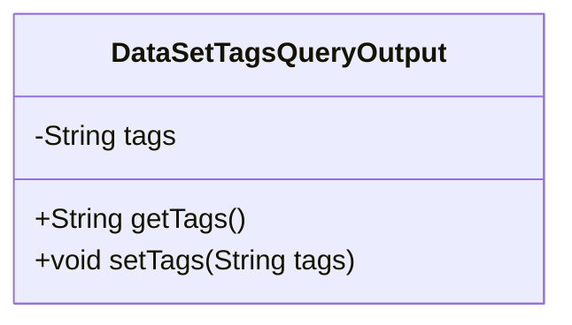
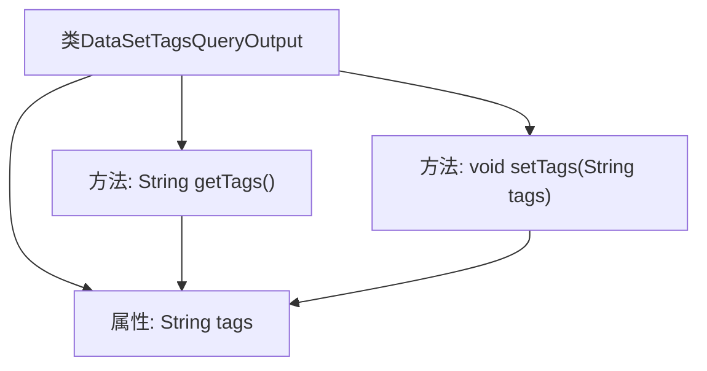

# 基础信息

|      |      |
|------|------|
| 名称 | DataSetTagsQueryOutput |
| 编码语言 | .java |
| 代码路径 | WeFe/common/java/common-data-mongodb/src/main/java/com/welab/wefe/common/data/mongodb/dto/dataset/DataSetTagsQueryOutput.java |
| 包名 | com.welab.wefe.common.data.mongodb.dto.dataset |
| 依赖项 | [] |
| 概述说明 | DataSetTagsQueryOutput类包含tags属性和对应的getter/setter方法。 |

# 说明

这是一个名为DataSetTagsQueryOutput的Java类，用于封装数据集标签查询的输出结果。该类包含一个私有字符串类型成员变量tags，用于存储标签数据。提供了标准的getter和setter方法：getTags()用于获取标签值，setTags(String tags)用于设置标签值。这个类实现了简单的数据封装功能，便于在程序中进行标签数据的传递和处理。

# 类列表 Class Summary

| 名称   | 类型  | 说明 |
|-------|------|-------------|
| DataSetTagsQueryOutput | class | DataSetTagsQueryOutput类包含私有字段tags及其getter和setter方法。 |

## 类 DataSetTagsQueryOutput

|      |      |
|------|------|
| 访问范围 | public |
| 类型 | class |
| 名称 | DataSetTagsQueryOutput |
| 说明 | DataSetTagsQueryOutput类包含私有字段tags及其getter和setter方法。 |

### UML类图

这段代码定义了一个简单的Java类`DataSetTagsQueryOutput`，用于封装数据集标签查询的输出结果。该类包含一个私有字符串字段`tags`，以及对应的getter和setter方法。getter方法用于获取标签字符串，setter方法用于设置标签字符串。这是一个典型的数据传输对象(DTO)设计，用于在不同层之间传递标签数据。类结构简单清晰，符合JavaBean规范，便于序列化和反序列化操作。

### 内部方法调用关系图

该流程图描述了DataSetTagsQueryOutput类的结构，包含一个私有属性tags和两个公有方法getTags()与setTags()。getTags()用于获取tags的值，setTags()用于设置tags的值，两者均直接操作tags属性。类设计简单清晰，符合JavaBean规范，适用于存储和操作标签数据。

### 字段列表 Field List

| 名称  | 类型  | 说明 |
|-------|-------|------|
| tags | String | 声明一个私有字符串变量tags。 |

### 方法列表

| 名称  | 类型  | 说明 |
|-------|-------|------|
| getTags | String | 方法getTags返回字符串tags的值。 |
| setTags | void | 这是一个Java方法，用于设置对象的tags属性，接受一个字符串参数tags并将其赋值给对象的成员变量tags。 |

