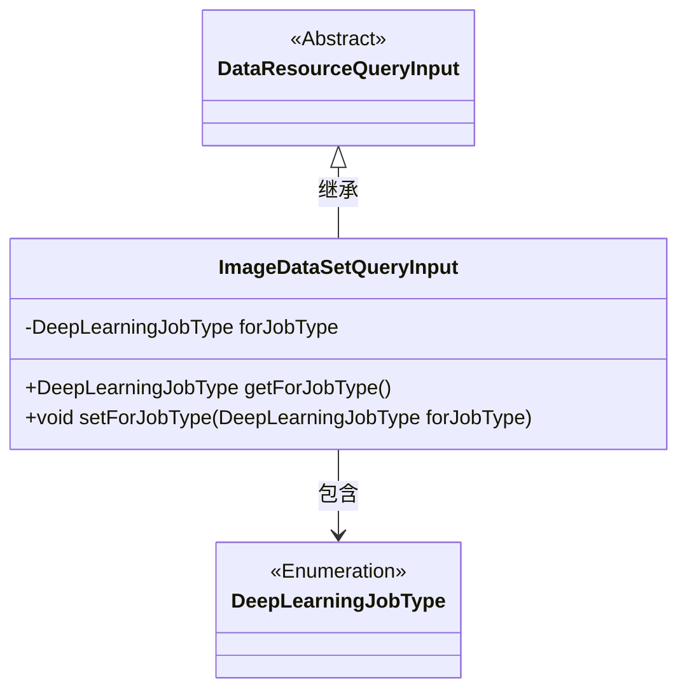
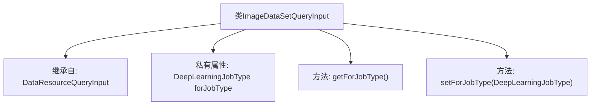

# 基础信息

|      |      |
|------|------|
| 名称 | ImageDataSetQueryInput |
| 编码语言 | .java |
| 代码路径 | WeFe/common/java/common-data-mongodb/src/main/java/com/welab/wefe/common/data/mongodb/dto/dataset/ImageDataSetQueryInput.java |
| 包名 | com.welab.wefe.common.data.mongodb.dto.dataset |
| 依赖项 | ['com.welab.wefe.common.data.mongodb.dto.dataresource.DataResourceQueryInput', 'com.welab.wefe.common.wefe.enums.DeepLearningJobType'] |
| 概述说明 | ImageDataSetQueryInput继承DataResourceQueryInput，包含DeepLearningJobType类型的forJobType属性及其getter和setter方法。 |

# 说明

ImageDataSetQueryInput类继承自DataResourceQueryInput，包含一个私有属性forJobType，类型为DeepLearningJobType。该类提供了getForJobType和setForJobType方法，分别用于获取和设置forJobType属性的值。

# 类列表 Class Summary

| 名称   | 类型  | 说明 |
|-------|------|-------------|
| ImageDataSetQueryInput | class | ImageDataSetQueryInput继承DataResourceQueryInput，包含DeepLearningJobType类型的forJobType属性及其getter和setter方法。 |

## 类 ImageDataSetQueryInput

|      |      |
|------|------|
| 访问范围 | public |
| 类型 | class |
| 名称 | ImageDataSetQueryInput |
| 说明 | ImageDataSetQueryInput继承DataResourceQueryInput，包含DeepLearningJobType类型的forJobType属性及其getter和setter方法。 |

### UML类图

这段类图展示了ImageDataSetQueryInput继承自抽象类DataResourceQueryInput，并包含一个DeepLearningJobType枚举类型的私有字段forJobType。该类通过公有getter和setter方法操作该字段，体现了对深度学习任务类型的封装。继承关系表明图像数据集查询输入具有基础数据资源查询的通用特性，同时扩展了特定于深度学习任务的类型属性。

### 内部方法调用关系图

这段代码展示了一个名为ImageDataSetQueryInput的类，它继承自DataResourceQueryInput。该类包含一个私有属性forJobType，类型为DeepLearningJobType，以及对应的getter和setter方法。流程图清晰地呈现了类的继承关系和内部结构，包括属性声明和方法定义，体现了面向对象编程中封装和继承的基本特性。

### 字段列表 Field List

| 名称  | 类型  | 说明 |
|-------|-------|------|
| forJobType | DeepLearningJobType | 私有深度学习任务类型变量forJobType。 |

### 方法列表

| 名称  | 类型  | 说明 |
|-------|-------|------|
| getForJobType | DeepLearningJobType | 获取当前深度学习任务类型的方法，返回forJobType字段值。 |
| setForJobType | void | 这是一个Java方法，用于设置深度学习任务类型属性。方法接受一个DeepLearningJobType参数，并将其赋值给类的成员变量forJobType。 |

