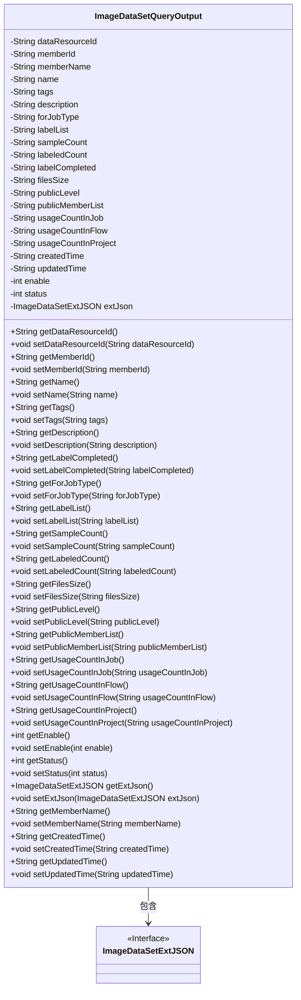

# 基础信息

|      |      |
|------|------|
| 名称 | ImageDataSetQueryOutput |
| 编码语言 | .java |
| 代码路径 | WeFe/common/java/common-data-mongodb/src/main/java/com/welab/wefe/common/data/mongodb/dto/dataset/ImageDataSetQueryOutput.java |
| 包名 | com.welab.wefe.common.data.mongodb.dto.dataset |
| 依赖项 | ['com.welab.wefe.common.data.mongodb.entity.union.ext.ImageDataSetExtJSON'] |
| 概述说明 | ImageDataSetQueryOutput类包含图像数据集的属性和方法，涵盖资源ID、成员信息、标签、描述、样本统计、使用计数、状态及扩展JSON等字段。 |

# 说明

ImageDataSetQueryOutput类是一个用于存储和操作图像数据集查询结果的Java类。该类包含多个私有字段，用于记录数据集的各种属性，如数据资源ID、成员ID、名称、标签、描述、适用任务类型、标签列表、样本数量、已标注数量、标注完成状态、文件大小、公开级别、公开成员列表、在不同场景下的使用次数、创建和更新时间、启用状态、状态码以及扩展JSON信息。每个字段都有对应的getter和setter方法，用于获取和设置字段值。该类主要用于管理和传递图像数据集的详细信息。

# 类列表 Class Summary

| 名称   | 类型  | 说明 |
|-------|------|-------------|
| ImageDataSetQueryOutput | class | ImageDataSetQueryOutput类包含图像数据集的资源ID、成员信息、名称、标签、描述、标注状态、样本数量、文件大小、公开级别、使用统计、创建更新时间及状态等属性。 |

## 类 ImageDataSetQueryOutput

|      |      |
|------|------|
| 访问范围 | public |
| 类型 | class |
| 名称 | ImageDataSetQueryOutput |
| 说明 | ImageDataSetQueryOutput类包含图像数据集的资源ID、成员信息、名称、标签、描述、标注状态、样本数量、文件大小、公开级别、使用统计、创建更新时间及状态等属性。 |

### UML类图

这段代码定义了一个名为ImageDataSetQueryOutput的类，主要用于封装图像数据集查询结果的输出信息。该类包含大量私有字符串字段（如数据资源ID、成员信息、标签、描述等）和两个整型字段（enable和status），以及一个ImageDataSetExtJSON类型的扩展JSON对象。为每个字段提供了标准的getter和setter方法，实现了对数据的封装和访问控制。该类与ImageDataSetExtJSON接口存在关联关系，表明输出结果可能包含扩展的JSON数据。整体设计符合JavaBean规范，适合用于数据传递和序列化操作。

### 内部方法调用关系图

```mermaid
graph TD
    A["类ImageDataSetQueryOutput"]
    B["属性: String dataResourceId"]
    C["属性: String memberId"]
    D["属性: String memberName"]
    E["属性: String name"]
    F["属性: String tags"]
    G["属性: String description"]
    H["属性: String forJobType"]
    I["属性: String labelList"]
    J["属性: String sampleCount"]
    K["属性: String labeledCount"]
    L["属性: String labelCompleted"]
    M["属性: String filesSize"]
    N["属性: String publicLevel"]
    O["属性: String publicMemberList"]
    P["属性: String usageCountInJob"]
    Q["属性: String usageCountInFlow"]
    R["属性: String usageCountInProject"]
    S["属性: String createdTime"]
    T["属性: String updatedTime"]
    U["属性: int enable"]
    V["属性: int status"]
    W["属性: ImageDataSetExtJSON extJson"]
    X["Getter/Setter方法组"]

    A --> B
    A --> C
    A --> D
    A --> E
    A --> F
    A --> G
    A --> H
    A --> I
    A --> J
    A --> K
    A --> L
    A --> M
    A --> N
    A --> O
    A --> P
    A --> Q
    A --> R
    A --> S
    A --> T
    A --> U
    A --> V
    A --> W
    A -.-> X
    X -->|对应| B
    X -->|对应| C
    X -->|对应| D
    X -->|对应| E
    X -->|对应| F
    X -->|对应| G
    X -->|对应| H
    X -->|对应| I
    X -->|对应| J
    X -->|对应| K
    X -->|对应| L
    X -->|对应| M
    X -->|对应| N
    X -->|对应| O
    X -->|对应| P
    X -->|对应| Q
    X -->|对应| R
    X -->|对应| S
    X -->|对应| T
    X -->|对应| U
    X -->|对应| V
    X -->|对应| W
```

该流程图展示了ImageDataSetQueryOutput类的完整结构，包含23个属性和对应的getter/setter方法组。类主要管理图像数据集的元信息，包括资源标识、成员信息、标签、描述、使用统计、时间戳等字段，并通过extJson属性扩展存储JSON格式的附加数据。所有属性均为私有字段，通过公共访问器方法进行封装，符合JavaBean规范。

### 字段列表 Field List

| 名称  | 类型  | 说明 |
|-------|-------|------|
| name | String | 私有字符串变量name |
| usageCountInFlow | String | 私有字符串变量，记录流程中的使用次数。 |
| filesSize | String | 定义私有字符串变量filesSize，用于存储文件大小信息。 |
| memberId | String | 成员ID字符串类型私有变量。 |
| publicMemberList | String | 私有字符串变量publicMemberList，用于存储公共成员列表。 |
| updatedTime | String | 字段updatedTime用于记录更新时间。 |
| extJson | ImageDataSetExtJSON | 定义了一个私有变量extJson，类型为ImageDataSetExtJSON。 |
| sampleCount | String | 私有字符串变量sampleCount。 |
| createdTime | String | 声明一个私有字符串变量createdTime，用于存储创建时间。 |
| usageCountInJob | String | 私有字符串变量，记录作业中的使用次数。 |
| labeledCount | String | 私有字符串变量labeledCount，用于存储标记数量。 |
| publicLevel | String | 私有字符串变量publicLevel |
| status | int | 私有整型变量status，用于存储状态信息。 |
| forJobType | String | 私有字符串变量，用于存储工作类型信息。 |
| description | String | 私有字符串类型变量description |
| enable | int | 私有整型变量enable，用于控制功能启用状态。 |
| memberName | String | 成员变量memberName，类型为String，私有访问权限。 |
| dataResourceId | String | 私有字符串变量dataResourceId，用于标识数据资源。 |
| labelCompleted | String | 私有字符串变量，用于标记完成状态。 |
| labelList | String | 私有字符串变量labelList，用于存储标签列表。 |
| usageCountInProject | String | 项目内使用次数统计变量 |
| tags | String | 私有字符串变量tags |

### 方法列表

| 名称  | 类型  | 说明 |
|-------|-------|------|
| getMemberName | String | 获取成员名称的方法，返回成员变量memberName的值。 |
| getPublicLevel | String | 方法getPublicLevel返回publicLevel字符串值。 |
| getUsageCountInProject | String | 获取项目中的使用计数。 |
| setLabeledCount | void | 设置标签计数方法，将参数labeledCount赋值给类的同名成员变量。 |
| setFilesSize | void | 这是一个Java方法，用于设置filesSize属性的值。方法接受一个字符串参数filesSize，并将其赋值给类的同名成员变量。 |
| getLabelList | String | 这是一个Java方法，返回名为labelList的字符串变量。 |
| setTags | void | 设置标签字符串的方法。 |
| setForJobType | void | 设置工作类型的方法，将输入参数赋值给类的成员变量forJobType。 |
| setUsageCountInFlow | void | 设置流程中的使用次数变量值。 |
| getUsageCountInFlow | String | 获取流程中的使用次数。 |
| setExtJson | void | 设置图像数据集的扩展JSON数据。 |
| getLabeledCount | String | 获取labeledCount值的公开方法。 |
| setStatus | void | 设置对象状态的方法，参数为整型状态值。 |
| setUsageCountInProject | void | 设置项目内使用次数的公共方法。 |
| getPublicMemberList | String | 获取公共成员列表的方法，返回字符串类型变量publicMemberList。 |
| getDataResourceId | String | 获取数据资源ID的方法，返回字符串类型的dataResourceId。 |
| setLabelList | void | 这是一个Java方法，用于设置labelList属性的值。方法接收一个字符串参数，并将其赋值给类的成员变量labelList。 |
| setName | void | 设置对象名称的方法，将输入参数name赋值给对象的name属性。 |
| getFilesSize | String | 获取文件大小的方法，返回filesSize变量值。 |
| getUpdatedTime | String | 获取更新时间的方法，返回字符串类型的updatedTime变量值。 |
| setCreatedTime | void | 这是一个Java方法，用于设置对象的创建时间属性，接受字符串参数createdTime并赋值给成员变量。 |
| setMemberName | void | 设置成员变量memberName的方法，参数为字符串类型。 |
| setUsageCountInJob | void | 这是一个Java方法，用于设置作业中的使用次数属性。方法接受一个字符串参数，并将其赋值给类的成员变量usageCountInJob。 |
| setDataResourceId | void | 设置数据资源ID的方法，将输入参数赋值给类的成员变量dataResourceId。 |
| getEnable | int | 获取enable变量的整型值。 |
| getDescription | String | 这是一个Java方法，返回字符串类型的description属性值。 |
| setMemberId | void | 这是一个Java方法，用于设置成员变量memberId的值。方法接受一个字符串参数memberId，并将其赋值给当前对象的memberId属性。 |
| getTags | String | 该方法返回字符串类型的tags变量值。 |
| setLabelCompleted | void | 方法设置完成标签的值。 |
| getLabelCompleted | String | 获取已完成标签的字符串值。 |
| getExtJson | ImageDataSetExtJSON | 获取ImageDataSetExtJSON类型的extJson对象。 |
| setEnable | void | 方法setEnable设置enable的值。参数为整数enable。 |
| setPublicMemberList | void | 设置公共成员列表的方法，将输入字符串赋值给类的publicMemberList变量。 |
| setUpdatedTime | void | 设置更新时间的方法，将参数updatedTime赋值给类的成员变量updatedTime。 |
| getStatus | int | 获取当前状态值的方法。 |
| setSampleCount | void | 定义方法setSampleCount，用于设置sampleCount属性的值。 |
| getUsageCountInJob | String | 这是一个Java方法，返回字符串类型的usageCountInJob变量值。 |
| setPublicLevel | void | 设置公共级别的方法，将输入参数publicLevel赋值给当前对象的同名属性。 |
| getName | String | 这是一个Java方法，返回字符串类型的name变量值。 |
| getMemberId | String | 获取成员ID的方法，返回字符串类型的memberId。 |
| getCreatedTime | String | 获取创建时间的方法，返回字符串类型的createdTime。 |
| getSampleCount | String | 获取样本数量的方法，返回字符串类型的样本计数值。 |
| getForJobType | String | 获取工作类型的方法，返回字符串类型值。 |
| setDescription | void | 这是一个Java方法，用于设置对象的描述属性。方法接收一个字符串参数description，并将其赋值给对象的description成员变量。 |

