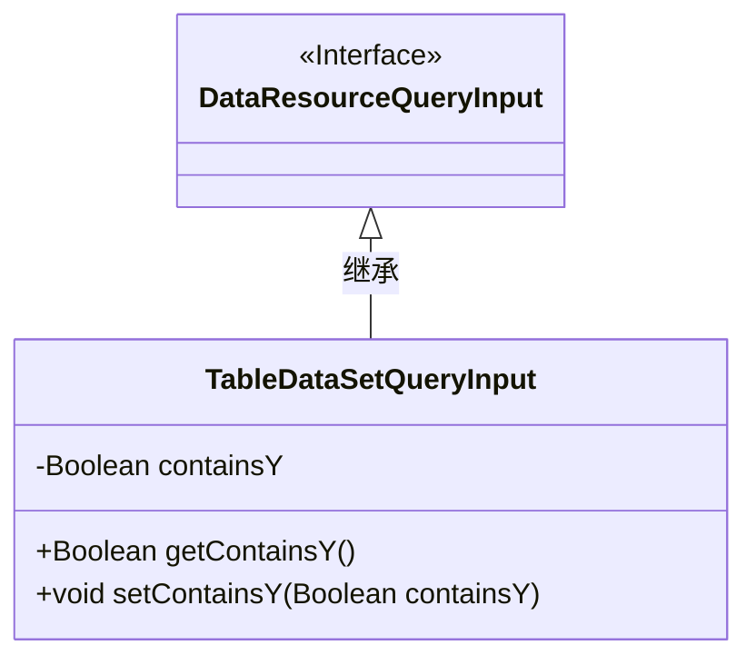
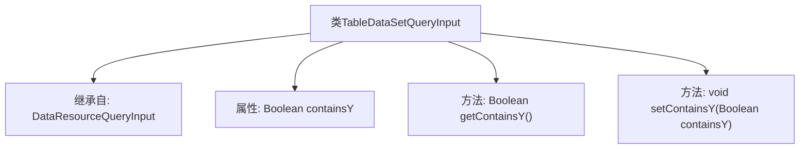

# 基础信息

|      |      |
|------|------|
| 名称 | TableDataSetQueryInput |
| 编码语言 | .java |
| 代码路径 | WeFe/common/java/common-data-mongodb/src/main/java/com/welab/wefe/common/data/mongodb/dto/dataset/TableDataSetQueryInput.java |
| 包名 | com.welab.wefe.common.data.mongodb.dto.dataset |
| 依赖项 | ['com.welab.wefe.common.data.mongodb.dto.dataresource.DataResourceQueryInput'] |
| 概述说明 | TableDataSetQueryInput继承DataResourceQueryInput，包含布尔属性containsY及其getter和setter方法。 |

# 说明

TableDataSetQueryInput类继承自DataResourceQueryInput，包含一个Boolean类型属性containsY及其对应的getter和setter方法。该类用于处理数据资源查询输入，特别关注是否包含Y元素的布尔标志。

# 类列表 Class Summary

| 名称   | 类型  | 说明 |
|-------|------|-------------|
| TableDataSetQueryInput | class | TableDataSetQueryInput类继承DataResourceQueryInput，包含布尔属性containsY及其getter和setter方法。 |

## 类 TableDataSetQueryInput

|      |      |
|------|------|
| 访问范围 | public |
| 类型 | class |
| 名称 | TableDataSetQueryInput |
| 说明 | TableDataSetQueryInput类继承DataResourceQueryInput，包含布尔属性containsY及其getter和setter方法。 |

### UML类图

这段类图展示了TableDataSetQueryInput类继承自DataResourceQueryInput接口的结构。TableDataSetQueryInput包含一个私有Boolean类型字段containsY，以及对应的公有getter和setter方法。类图清晰地体现了接口与实现类之间的继承关系，符合面向对象设计中"实现类继承接口"的规范。DataResourceQueryInput作为接口用<<Interface>>标注，而TableDataSetQueryInput作为具体实现类通过空心三角箭头指向接口，表示其实现了该接口的所有契约。

### 内部方法调用关系图

这段代码展示了一个名为TableDataSetQueryInput的类，它继承自DataResourceQueryInput类。该类包含一个Boolean类型的属性containsY，以及对应的getter和setter方法。流程图清晰地呈现了类的继承关系和内部结构，包括属性声明和方法定义。这种结构是典型的Java Bean模式，用于封装数据和提供访问控制。

### 字段列表 Field List

| 名称  | 类型  | 说明 |
|-------|-------|------|
| containsY | Boolean | 布尔变量，表示是否包含Y。 |

### 方法列表

| 名称  | 类型  | 说明 |
|-------|-------|------|
| getContainsY | Boolean | 方法getContainsY返回布尔值containsY，表示是否包含Y。 |
| setContainsY | void | 设置布尔值containsY的方法。 |

