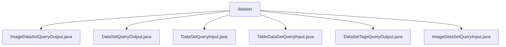

# 基础信息

|      |      |
|------|------|
| 名称 | dataset |
| 编码语言 | .java |
| 代码路径 | WeFe/common/java/common-data-mongodb/src/main/java/com/welab/wefe/common/data/mongodb/dto/dataset |
| 包名 | docs.common.java.common-data-mongodb.src.main.java.com.welab.wefe.common.data.mongodb.dto.dataset |
| 概述说明 | ImageDataSetQueryOutput类存储图像数据集查询结果，包含ID、名称、标签等属性和对应方法。DataSetQueryOutput类表示数据集查询输出，含ID、名称、特征等属性和方法。DataSetQueryInput类继承PageInput，含数据集ID、成员信息等查询条件。TableDataSetQueryInput类继承DataResourceQueryInput，关注containsY标志。DataSetTagsQueryOutput类封装标签查询结果。ImageDataSetQueryInput类继承DataResourceQueryInput，含forJobType属性。 |

# 说明

## 概述  
该模块核心职责是提供数据集查询的输入输出封装，支持图像和表格数据的条件筛选与结果传递。接口规范统一采用Java Bean模式，包含私有字段及对应getter/setter方法，例如`DataSetQueryInput`继承`PageInput`实现分页查询。关键数据结构包括数据集ID、成员信息、标签、状态标志等通用属性，以及图像特有的`DeepLearningJobType`和表格特有的`containsY`标志。外部依赖仅为MongoDB数据访问层。例如`ImageDataSetQueryOutput`扩展了图像数据集特有属性如样本数量、标注状态等。

## 主要业务场景  
模块支持两类典型场景：通用数据集查询（如`DataSetQueryInput`分页过滤）和特定类型数据集操作（如`ImageDataSetQueryInput`按任务类型筛选）。交互模式类似DTO传输，通过输入类封装查询条件（例如`containsY`标志过滤表格数据），输出类返回带状态的结果集（如`DataSetTagsQueryOutput`仅封装标签数据）。API类型涵盖基础CRUD和扩展查询，例如通过`forJobType`指定深度学习任务类型获取图像数据集。所有场景均通过属性标志实现灵活过滤，如公开级别、使用次数等。

### 包内部结构视图

该流程图展示了MongoDB数据集中DTO类的层级关系，所有文件都位于dataset目录下，包含6个不同的Java类文件，分别处理不同类型的数据集查询输入输出操作。这些类包括图像数据集查询、表格数据集查询和数据集标签查询等相关功能。

# 文件列表

| 名称   | 类型  | 说明 |
|-------|------|-------------|
| [ImageDataSetQueryOutput.java](ImageDataSetQueryOutput.md) | file | ImageDataSetQueryOutput类包含图像数据集的属性和方法，涵盖资源ID、成员信息、标签、描述、样本统计、使用计数、状态及扩展JSON等字段。 |
| [DataSetQueryOutput.java](DataSetQueryOutput.md) | file | DataSetQueryOutput类包含数据集ID、成员信息、行列数、特征列表、公开级别、使用统计、描述、标签、创建更新时间及状态等属性，提供对应getter和setter方法。 |
| [DataSetQueryInput.java](DataSetQueryInput.md) | file | DataSetQueryInput类继承PageInput，包含数据集ID、成员ID、名称、标签等查询字段及状态控制字段。 |
| [TableDataSetQueryInput.java](TableDataSetQueryInput.md) | file | TableDataSetQueryInput继承DataResourceQueryInput，包含布尔属性containsY及其getter和setter方法。 |
| [DataSetTagsQueryOutput.java](DataSetTagsQueryOutput.md) | file | DataSetTagsQueryOutput类包含tags属性和对应的getter/setter方法。 |
| [ImageDataSetQueryInput.java](ImageDataSetQueryInput.md) | file | ImageDataSetQueryInput继承DataResourceQueryInput，包含DeepLearningJobType类型的forJobType属性及其getter和setter方法。 |

