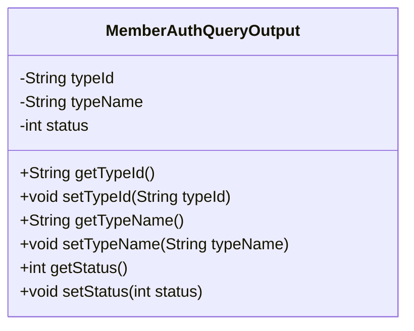
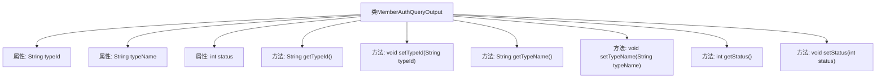

# 基础信息

|      |      |
|------|------|
| 名称 | MemberAuthQueryOutput |
| 编码语言 | .java |
| 代码路径 | WeFe/common/java/common-data-mongodb/src/main/java/com/welab/wefe/common/data/mongodb/dto/member/MemberAuthQueryOutput.java |
| 包名 | com.welab.wefe.common.data.mongodb.dto.member |
| 依赖项 | [] |
| 概述说明 | MemberAuthQueryOutput类包含typeId、typeName和status属性，提供对应的getter和setter方法。 |

# 说明

MemberAuthQueryOutput类定义了成员认证查询的输出数据结构，包含三个私有字段：typeId表示类型标识符，typeName表示类型名称，status表示状态值。类中为每个字段提供了对应的getter和setter方法，用于获取和设置字段值。

# 类列表 Class Summary

| 名称   | 类型  | 说明 |
|-------|------|-------------|
| MemberAuthQueryOutput | class | 类MemberAuthQueryOutput包含三个属性：typeId、typeName和status，分别有对应的getter和setter方法。 |

## 类 MemberAuthQueryOutput

|      |      |
|------|------|
| 访问范围 | public |
| 类型 | class |
| 名称 | MemberAuthQueryOutput |
| 说明 | 类MemberAuthQueryOutput包含三个属性：typeId、typeName和status，分别有对应的getter和setter方法。 |

### UML类图

这段代码定义了一个名为`MemberAuthQueryOutput`的类，用于表示成员授权查询的输出结果。该类包含三个私有属性：`typeId`（类型ID）、`typeName`（类型名称）和`status`（状态），并为每个属性提供了对应的getter和setter方法。这个类主要用于封装和传递成员授权相关的查询结果数据，通过getter和setter方法可以安全地访问和修改这些属性值。

### 内部方法调用关系图

该流程图展示了MemberAuthQueryOutput类的完整结构，包含三个私有属性(typeId、typeName、status)及其对应的getter/setter方法。每个方法都通过箭头与主类连接，清晰地反映了类成员之间的从属关系。这是一个典型的数据传输对象(DTO)设计，用于封装会员认证查询结果的状态信息，通过访问器方法提供对私有属性的安全读写操作。

### 字段列表 Field List

| 名称  | 类型  | 说明 |
|-------|-------|------|
| typeId | String | 定义私有字符串变量typeId。 |
| typeName | String | 私有字符串类型名称变量。 |
| status | int | 私有整型变量status，用于存储状态信息。 |

### 方法列表

| 名称  | 类型  | 说明 |
|-------|-------|------|
| getTypeId | String | 获取类型ID的方法，返回字符串类型的typeId。 |
| setStatus | void | 设置状态值的方法，将输入参数status赋值给类成员变量status。 |
| setTypeName | void | 这是一个Java方法，用于设置类成员变量typeName的值。方法接收一个字符串参数，并将其赋值给当前对象的typeName属性。 |
| getTypeName | String | 获取类型名称的方法，返回字符串typeName。 |
| setTypeId | void | 设置类型ID的方法，将输入参数typeId赋值给当前对象的typeId属性。 |
| getStatus | int | 获取状态值的方法，返回整型变量status。 |

