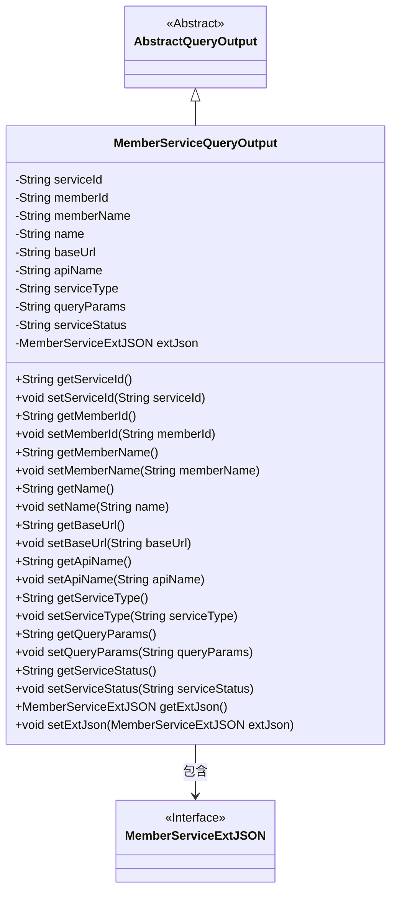

# 基础信息

|      |      |
|------|------|
| 名称 | MemberServiceQueryOutput |
| 编码语言 | .java |
| 代码路径 | WeFe/common/java/common-data-mongodb/src/main/java/com/welab/wefe/common/data/mongodb/dto/member/MemberServiceQueryOutput.java |
| 包名 | com.welab.wefe.common.data.mongodb.dto.member |
| 依赖项 | ['com.welab.wefe.common.data.mongodb.dto.AbstractQueryOutput', 'com.welab.wefe.common.data.mongodb.entity.union.ext.MemberServiceExtJSON'] |
| 概述说明 | MemberServiceQueryOutput类继承AbstractQueryOutput，包含服务ID、成员ID、名称、基础URL、API名称、服务类型、查询参数、状态及扩展JSON属性。 |

# 说明

MemberServiceQueryOutput类继承自AbstractQueryOutput，包含服务ID、成员ID、成员名称、名称、基础URL、API名称、服务类型、查询参数、服务状态等字符串类型字段，以及一个MemberServiceExtJSON类型的扩展JSON字段。每个字段都有对应的getter和setter方法用于访问和修改属性值。

# 类列表 Class Summary

| 名称   | 类型  | 说明 |
|-------|------|-------------|
| MemberServiceQueryOutput | class | MemberServiceQueryOutput类继承AbstractQueryOutput，包含服务ID、成员ID、名称、基础URL、API名称、服务类型、查询参数、状态及扩展JSON等属性及其getter/setter方法。 |

## 类 MemberServiceQueryOutput

|      |      |
|------|------|
| 访问范围 | public |
| 类型 | class |
| 名称 | MemberServiceQueryOutput |
| 说明 | MemberServiceQueryOutput类继承AbstractQueryOutput，包含服务ID、成员ID、名称、基础URL、API名称、服务类型、查询参数、状态及扩展JSON等属性及其getter/setter方法。 |

### UML类图

类图描述：MemberServiceQueryOutput继承自抽象类AbstractQueryOutput，包含多个字符串类型属性用于存储服务相关信息，以及一个MemberServiceExtJSON类型的扩展JSON对象。该类提供了完整的getter/setter方法用于属性访问，体现了标准JavaBean的设计模式。MemberServiceExtJSON作为接口类型，由MemberServiceQueryOutput通过组合关系持有。

### 内部方法调用关系图

```mermaid
graph TD
    A["类MemberServiceQueryOutput"]
    B["继承自: AbstractQueryOutput"]
    C["属性: String serviceId"]
    D["属性: String memberId"]
    E["属性: String memberName"]
    F["属性: String name"]
    G["属性: String baseUrl"]
    H["属性: String apiName"]
    I["属性: String serviceType"]
    J["属性: String queryParams"]
    K["属性: String serviceStatus"]
    L["属性: MemberServiceExtJSON extJson"]
    M["方法: get/setServiceId"]
    N["方法: get/setMemberId"]
    O["方法: get/setMemberName"]
    P["方法: get/setName"]
    Q["方法: get/setBaseUrl"]
    R["方法: get/setApiName"]
    S["方法: get/setServiceType"]
    T["方法: get/setQueryParams"]
    U["方法: get/setServiceStatus"]
    V["方法: get/setExtJson"]

    A --> B
    A --> C
    A --> D
    A --> E
    A --> F
    A --> G
    A --> H
    A --> I
    A --> J
    A --> K
    A --> L
    A --> M
    A --> N
    A --> O
    A --> P
    A --> Q
    A --> R
    A --> S
    A --> T
    A --> U
    A --> V
```

该流程图展示了MemberServiceQueryOutput类的结构，包含11个私有属性和对应的getter/setter方法。该类继承自AbstractQueryOutput，主要封装了会员服务查询相关的数据字段，如serviceId、memberId、apiName等，并通过extJson属性扩展存储JSON格式的附加信息。每个属性都配有标准的数据访问方法，形成完整的数据封装结构。

### 字段列表 Field List

| 名称  | 类型  | 说明 |
|-------|-------|------|
| serviceType | String | 私有字符串变量serviceType |
| apiName | String | 私有字符串变量apiName |
| memberId | String | 成员ID字符串变量 |
| queryParams | String | 私有字符串变量queryParams，用于存储查询参数。 |
| extJson | MemberServiceExtJSON | 成员服务扩展JSON对象。 |
| serviceStatus | String | 定义字符串变量serviceStatus，用于存储服务状态信息。 |
| name | String | 声明一个私有字符串变量name。 |
| memberName | String | 成员变量名称为memberName，类型为String。 |
| baseUrl | String | 声明一个私有字符串变量baseUrl。 |
| serviceId | String | 私有字符串类型变量serviceId |

### 方法列表

| 名称  | 类型  | 说明 |
|-------|-------|------|
| setServiceType | void | 这是一个Java方法，用于设置类中的serviceType属性值。方法接收一个字符串参数serviceType，并将其赋值给类的同名成员变量。 |
| getMemberName | String | 方法getMemberName返回成员变量memberName的值。 |
| getApiName | String | 获取API名称的方法，返回字符串类型的apiName变量。 |
| setName | void | 设置对象名称的方法，将参数name赋值给对象的name属性。 |
| setBaseUrl | void | 设置基础URL的方法，将输入参数baseUrl赋值给类的成员变量this.baseUrl。 |
| getQueryParams | String | 获取查询参数字符串的方法。 |
| setQueryParams | void | 设置查询参数的方法，将输入参数赋值给类的成员变量queryParams。 |
| setApiName | void | Java方法：设置API名称，将参数值赋给类变量apiName。 |
| getServiceStatus | String | 获取服务状态的方法，返回字符串类型的状态值。 |
| getServiceId | String | 获取serviceId的方法，直接返回成员变量serviceId的值。 |
| setMemberName | void | 定义公共方法setMemberName，接收字符串参数memberName并赋值给当前对象的同名成员变量。 |
| setServiceStatus | void | 这是一个Java方法，用于设置类中的serviceStatus属性值。方法接收一个字符串参数serviceStatus，并将其赋值给类的同名成员变量。 |
| getExtJson | MemberServiceExtJSON | 获取成员服务的扩展JSON数据。 |
| setExtJson | void | 设置成员服务的扩展JSON数据。 |
| getServiceType | String | 获取服务类型的方法，返回字符串变量serviceType。 |
| getName | String | 这是一个Java方法，返回字符串类型的成员变量name的值。 |
| setMemberId | void | 设置成员ID的方法，将输入字符串赋值给类的成员变量memberId。 |
| setServiceId | void | 设置服务ID的方法，将输入参数赋值给类的serviceId成员变量。 |
| getMemberId | String | 方法返回成员ID字符串。 |
| getBaseUrl | String | 方法返回baseUrl字符串值。 |

