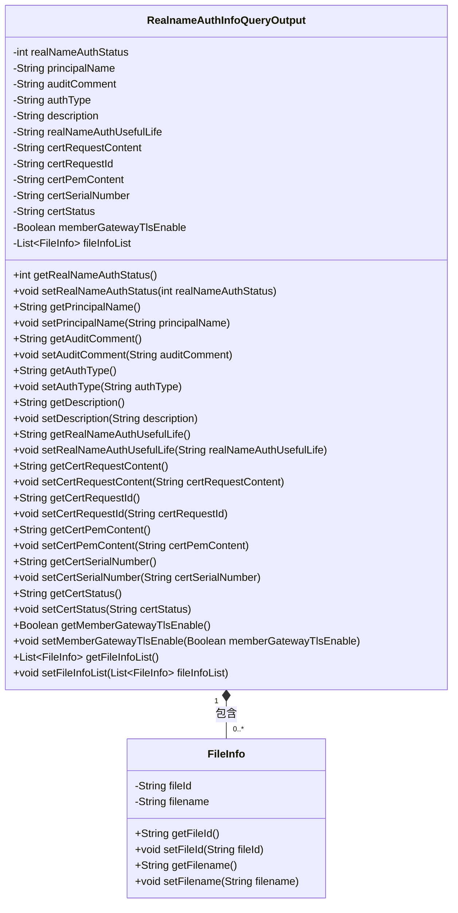
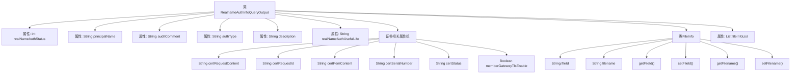

# 基础信息

|      |      |
|------|------|
| 名称 | RealnameAuthInfoQueryOutput |
| 编码语言 | .java |
| 代码路径 | WeFe/common/java/common-data-mongodb/src/main/java/com/welab/wefe/common/data/mongodb/dto/member/RealnameAuthInfoQueryOutput.java |
| 包名 | com.welab.wefe.common.data.mongodb.dto.member |
| 依赖项 | ['java.util.List'] |
| 概述说明 | RealnameAuthInfoQueryOutput类包含实名认证状态、主体名称、审核意见、认证类型、描述、有效期等字段，以及证书相关信息和文件列表。FileInfo类包含文件ID和文件名。 |

# 说明

RealnameAuthInfoQueryOutput类用于存储实名认证查询结果信息，包含认证状态、主体名称、审核意见、认证类型、描述和有效期等基本信息。此外还包含证书相关字段，如证书请求内容、请求ID、PEM内容、序列号、状态及是否启用TLS通信。类中还定义了FileInfo嵌套类，用于存储文件ID和文件名信息，并通过fileInfoList字段保存多个文件信息。所有字段均提供对应的getter和setter方法。

# 类列表 Class Summary

| 名称   | 类型  | 说明 |
|-------|------|-------------|
| RealnameAuthInfoQueryOutput | class | RealnameAuthInfoQueryOutput类包含实名认证状态、主体名称、审核意见、认证类型、描述、有效期等字段，以及证书相关信息和文件列表。 |

## 类 RealnameAuthInfoQueryOutput

|      |      |
|------|------|
| 访问范围 | public |
| 类型 | class |
| 名称 | RealnameAuthInfoQueryOutput |
| 说明 | RealnameAuthInfoQueryOutput类包含实名认证状态、主体名称、审核意见、认证类型、描述、有效期等字段，以及证书相关信息和文件列表。 |

### UML类图

该类图展示了一个实名认证信息查询输出类(RealnameAuthInfoQueryOutput)及其内部文件信息类(FileInfo)的结构。主类包含认证状态、主体名称、审核意见等基础字段，以及证书请求内容、序列号等证书相关字段，并通过列表关联多个文件信息对象。FileInfo类则封装了文件ID和文件名两个属性。整体设计采用典型的JavaBean风格，所有字段私有并通过getter/setter方法访问，适合作为DTO传输数据。

### 内部方法调用关系图

这段代码定义了一个实名认证信息查询输出类RealnameAuthInfoQueryOutput，包含认证状态、主体名称、审核意见等基础字段，以及证书相关字段和文件信息列表。其中FileInfo作为内部类，用于存储文件ID和文件名信息。主类通过getter/setter方法提供所有属性的访问接口，结构清晰地区分了基础认证信息和证书相关数据，适合用于处理包含多种认证信息的复杂响应数据结构。

### 字段列表 Field List

| 名称  | 类型  | 说明 |
|-------|-------|------|
| memberGatewayTlsEnable | Boolean | 成员网关是否启用TLS的布尔配置项。 |
| certPemContent | String | 私有字符串变量certPemContent，用于存储证书PEM格式内容。 |
| authType | String | 声明私有字符串变量authType，用于存储认证类型信息。 |
| certSerialNumber | String | 私有字符串变量certSerialNumber，用于存储证书序列号。 |
| certRequestId | String | 私有字符串变量certRequestId，用于存储证书请求ID。 |
| certStatus | String | 私有字符串变量certStatus，用于存储证书状态。 |
| certRequestContent | String | 私有字符串变量certRequestContent，用于存储证书请求内容。 |
| realNameAuthUsefulLife | String | 字段realNameAuthUsefulLife存储实名认证有效期信息。 |
| fileInfoList | List<FileInfo> | 私有文件信息列表变量fileInfoList。 |
| principalName | String | 声明一个私有字符串变量principalName。 |
| realNameAuthStatus | int | 私有整型变量，表示实名认证状态。 |
| auditComment | String | 私有字符串变量auditComment，用于存储审核意见。 |
| description | String | 私有字符串类型变量，用于存储描述信息。 |

### 方法列表

| 名称  | 类型  | 说明 |
|-------|-------|------|
| setCertPemContent | void | 设置证书PEM内容的方法，将输入字符串赋值给类成员变量certPemContent。 |
| setCertRequestContent | void | 设置证书请求内容的方法，将输入参数赋值给类成员变量certRequestContent。 |
| setCertSerialNumber | void | 设置证书序列号的方法，将输入参数赋值给成员变量certSerialNumber。 |
| getAuthType | String | 获取认证类型的方法，返回字符串authType。 |
| getRealNameAuthUsefulLife | String | 获取实名认证有效期的字符串方法。 |
| setRealNameAuthStatus | void | 设置实名认证状态的方法，参数为认证状态整数值。 |
| getDescription | String | 这是一个Java方法，返回字符串类型的description属性值。 |
| getCertRequestContent | String | 方法返回证书请求内容字符串。 |
| getRealNameAuthStatus | int | 获取实名认证状态的方法，返回整型状态值。 |
| getCertRequestId | String | 获取证书请求ID的方法，返回字符串类型变量certRequestId。 |
| getPrincipalName | String | 方法返回principalName字符串值。 |
| getAuditComment | String | 获取审计评语的方法，返回auditComment字符串。 |
| setDescription | void | 这是一个Java方法，用于设置对象的描述信息。方法接收一个字符串参数，并将其赋值给对象的description属性。 |
| setRealNameAuthUsefulLife | void | 设置实名认证有效期的公共方法。 |
| getCertPemContent | String | 获取证书PEM内容的方法，返回certPemContent字符串。 |
| getCertSerialNumber | String | 获取证书序列号的方法，返回字符串类型变量certSerialNumber。 |
| getFileInfoList | List<FileInfo> | 该方法返回一个文件信息列表。 |
| setFileInfoList | void | 设置文件信息列表的方法，将传入的fileInfoList赋值给当前对象的同名属性。 |
| setCertRequestId | void | 设置证书请求ID的方法，将参数certRequestId赋值给当前对象的同名属性。 |
| setAuditComment | void | 设置审核评语的方法，将参数auditComment赋值给类的auditComment属性。 |
| setAuthType | void | 这是一个Java方法，用于设置认证类型（authType）。方法接受一个字符串参数authType，并将其赋值给类的成员变量this.authType。 |
| getCertStatus | String | 获取证书状态的方法，返回字符串类型的状态值。 |
| setCertStatus | void | 设置证书状态的方法，将输入参数certStatus赋值给当前对象的certStatus属性。 |
| getMemberGatewayTlsEnable | Boolean | 获取成员网关TLS启用状态的布尔值方法。 |
| setMemberGatewayTlsEnable | void | 设置成员网关TLS启用状态的方法。 |
| setPrincipalName | void | 设置成员变量principalName的值。 |

