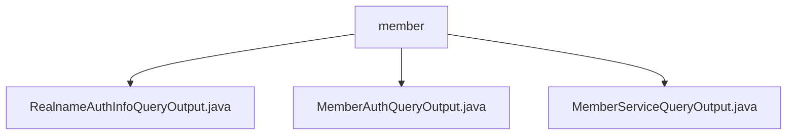

# 基础信息

|      |      |
|------|------|
| 名称 | member |
| 编码语言 | .java |
| 代码路径 | WeFe/common/java/common-data-mongodb/src/main/java/com/welab/wefe/common/data/mongodb/dto/member |
| 包名 | docs.common.java.common-data-mongodb.src.main.java.com.welab.wefe.common.data.mongodb.dto.member |
| 概述说明 | RealnameAuthInfoQueryOutput类存储实名认证查询结果，含状态、名称、证书等字段及文件信息。MemberAuthQueryOutput类定义成员认证查询输出，含类型标识、名称和状态。MemberServiceQueryOutput类继承AbstractQueryOutput，包含服务相关字段和扩展JSON。 |

# 说明

## 概述  
该模块核心职责是管理成员认证和服务查询相关的数据输出，包含实名认证信息、成员认证状态及服务配置等结构化数据。接口规范统一采用私有字段+公共Getter/Setter模式，例如RealnameAuthInfoQueryOutput提供证书PEM内容存取，MemberServiceQueryOutput支持扩展JSON字段操作。  

关键数据结构包括实名认证的FileInfo嵌套类（含文件ID/名）、服务查询的MemberServiceExtJSON扩展字段。外部依赖仅为MongoDB数据库驱动，通过common-data-mongodb子模块实现持久化。例如MemberAuthQueryOutput用typeId/status字段实现状态机模式的状态追踪。  

## 主要业务场景  
模块支持三类典型流程：实名认证结果查询（如校验TLS证书状态）、成员资质审核（通过typeName/status字段联动）、联邦服务管理（类似API网关的URL/参数配置）。交互模式均采用POJO数据传输，例如MemberServiceQueryOutput用baseUrl字段实现服务路由发现。  

功能完整性体现在覆盖认证-授权-服务全链条，如RealnameAuthInfoQueryOutput同时处理主体资质和证书生命周期。典型应用包括联邦学习节点注册时自动关联实名文件（通过fileInfoList）、服务状态同步时解析extJson扩展字段等。API类型均为查询类输出，集成案例可见成员加入联邦时的级联信息校验。

### 包内部结构视图

该流程图展示了WeFe项目中common-data-mongodb模块下member目录的结构关系。member作为父节点，包含三个DTO类文件：RealnameAuthInfoQueryOutput、MemberAuthQueryOutput和MemberServiceQueryOutput，这些文件都位于member目录下，属于同一层级的数据传输对象实现。

# 文件列表

| 名称   | 类型  | 说明 |
|-------|------|-------------|
| [RealnameAuthInfoQueryOutput.java](RealnameAuthInfoQueryOutput.md) | file | RealnameAuthInfoQueryOutput类包含实名认证状态、主体名称、审核意见、认证类型、描述、有效期等字段，以及证书相关信息和文件列表。FileInfo类包含文件ID和文件名。 |
| [MemberAuthQueryOutput.java](MemberAuthQueryOutput.md) | file | MemberAuthQueryOutput类包含typeId、typeName和status属性，提供对应的getter和setter方法。 |
| [MemberServiceQueryOutput.java](MemberServiceQueryOutput.md) | file | MemberServiceQueryOutput类继承AbstractQueryOutput，包含服务ID、成员ID、名称、基础URL、API名称、服务类型、查询参数、状态及扩展JSON属性。 |

